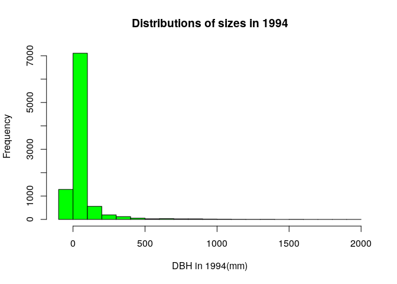
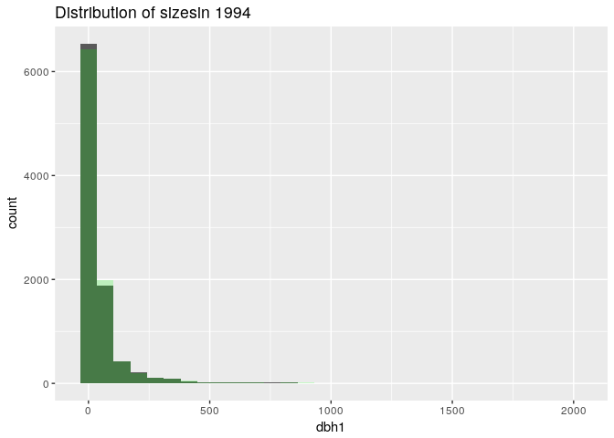

    cocoli_dat <- read.table("~/Desktop/eeb-177/class-assignments/tues-2-21-2017/cocoli.txt", header = TRUE)
    head(cocoli_dat)

    ##      tag spcode   x   y dbh1 dbh2 dbh3 recr1 recr2 recr3 pom1 pom2 pom3
    ## 1 000001 PROTTE 3.0 0.9  171  267  277     A     A     A    1    2    2
    ## 2 000002 COCCPA 0.1 0.6   13   14   17     A     A     A    1    1    1
    ## 3 000003 EUGEPR 1.3 2.3   26   33   39     A     A     A    1    2    2
    ## 4 000004 PROTTE 2.2 3.4   10   17   19     A     A     A    1    1    1
    ## 5 000005 CLAVME 3.5 3.7   14   15   15     A     A     A    1    1    1
    ## 6 000006 PROTTE 4.3 4.7   12   26   25     A     A     A    1    2    2
    ##   code1 code2 code3 mult1 mult2 mult3      date1      date2      date3
    ## 1     *     *     *     1     1     1 11/02/1994 11/11/1997 11/23/1998
    ## 2     *     *     *     1     1     1 11/02/1994 11/11/1997 11/23/1998
    ## 3     M     M     M     2     2     2 11/02/1994 11/11/1997 11/23/1998
    ## 4     *     *     *     1     1     1 11/02/1994 11/11/1997 11/23/1998
    ## 5    ML    ML     M     2     2     2 11/02/1994 11/11/1997 11/23/1998
    ## 6     *     *     M     1     1     2 11/02/1994 11/11/1997 11/23/1998

    str(cocoli_dat)

    ## 'data.frame':    9466 obs. of  22 variables:
    ##  $ tag   : Factor w/ 9466 levels "-47493","000001",..: 2 3 4 5 6 7 8 9 10 11 ...
    ##  $ spcode: Factor w/ 177 levels "*","ACACME","ACALDI",..: 131 49 67 131 48 131 129 154 139 49 ...
    ##  $ x     : num  3 0.1 1.3 2.2 3.5 4.3 3.7 4.1 1.5 0.9 ...
    ##  $ y     : num  0.9 0.6 2.3 3.4 3.7 4.7 7 6.3 11 14 ...
    ##  $ dbh1  : int  171 13 26 10 14 12 15 78 29 28 ...
    ##  $ dbh2  : int  267 14 33 17 15 26 19 78 30 29 ...
    ##  $ dbh3  : int  277 17 39 19 15 25 19 78 29 33 ...
    ##  $ recr1 : Factor w/ 3 levels "*","A","P": 2 2 2 2 2 2 2 2 2 2 ...
    ##  $ recr2 : Factor w/ 5 levels "*","A","B","D",..: 2 2 2 2 2 2 2 2 2 2 ...
    ##  $ recr3 : Factor w/ 4 levels "*","A","B","D": 2 2 2 2 2 2 2 2 2 2 ...
    ##  $ pom1  : int  1 1 1 1 1 1 1 1 1 1 ...
    ##  $ pom2  : int  2 1 2 1 1 2 1 1 1 1 ...
    ##  $ pom3  : int  2 1 2 1 1 2 1 1 1 1 ...
    ##  $ code1 : Factor w/ 8 levels "*","B","L","M",..: 1 1 4 1 5 1 4 5 4 1 ...
    ##  $ code2 : Factor w/ 25 levels "*","B","BL","BQ",..: 1 1 14 1 15 1 14 15 14 1 ...
    ##  $ code3 : Factor w/ 19 levels "*","B","BM","D",..: 1 1 13 1 13 13 13 13 13 1 ...
    ##  $ mult1 : int  1 1 2 1 2 1 2 2 2 1 ...
    ##  $ mult2 : int  1 1 2 1 2 1 2 2 2 1 ...
    ##  $ mult3 : int  1 1 2 1 2 2 2 2 2 1 ...
    ##  $ date1 : Factor w/ 23 levels "11/02/1994","11/04/1994",..: 1 1 1 1 1 1 1 1 1 1 ...
    ##  $ date2 : Factor w/ 18 levels "11/10/1997","11/11/1997",..: 2 2 2 2 2 2 2 2 2 2 ...
    ##  $ date3 : Factor w/ 30 levels "11/04/1998","11/23/1998",..: 2 2 2 2 2 2 2 2 2 2 ...

    View(cocoli_dat)

    sizes_in_1994 <- cocoli_dat$dbh1
    names(sizes_in_1994) <-cocoli_dat$tag
    sizes_in_1994[1] #subset a vectir by position

    ## 000001 
    ##    171

    sizes_in_1994["00001"] #subset a vector by name

    ## <NA> 
    ##   NA

    sizes_in_1997 <- cocoli_dat$dbh1
    names(sizes_in_1997) <-cocoli_dat$tag

    sizes_in_1998 <- cocoli_dat$dbh1
    names(sizes_in_1998) <-cocoli_dat$tag

    # find all instances of dbh = 171
    sizes_in_1994 = 171

    #we want to know the fate of all trees that began with dbh 171
    #first, we makes a list of trees that have 171 dbh in 1994
    trees_171_1994= which(sizes_in_1994 == 171)
    trees_171_1994

    ## [1] 1

    #in the 1997 list, find these individuals that used to eb 171mm
    sizes_in_1997[trees_171_1994]

    ## 000001 
    ##    171

    #calculate RGR between 1997 - 1994
    # (size in 1997 - size in 1994 )/ size in 1994
    yearly_RGR_1 = ((cocoli_dat$dbh2-cocoli_dat$dbh1)/(cocoli_dat$dbh1))/3
    yearly_RGR_1

    ##    [1]  1.871345e-01  2.564103e-02  8.974359e-02  2.333333e-01
    ##    [5]  2.380952e-02  3.888889e-01  8.888889e-02  0.000000e+00
    ##    [9]  1.149425e-02  1.190476e-02  0.000000e+00  0.000000e+00
    ##   [13]  5.050505e-02  7.383966e-03  0.000000e+00  1.851852e-02
    ##   [17]  0.000000e+00  3.030303e-01  1.111111e-01  1.666667e-01
    ##   [21] -1.282051e-02 -2.564103e-02 -3.333333e-01  4.081633e-02
    ##   [25] -1.911765e-01  0.000000e+00  3.095238e-01  1.369863e-02
    ##   [29] -3.555556e-01  4.166667e-01  6.633499e-03  4.938272e-02
    ##   [33]  6.504065e-02  1.777778e-01  1.724138e-02  3.333333e-02
    ##   [37] -4.444444e-02  5.263158e-02  3.436426e-03  0.000000e+00
    ##   [41]  3.703704e-02  8.695652e-03  5.376344e-02  2.380952e-02
    ##   [45]  6.140351e-02  1.403509e-02  1.111111e-01  3.571429e-02
    ##   [49]  9.722222e-02  9.469697e-03  1.960784e-02  4.358974e-01
    ##   [53]  0.000000e+00 -9.523810e-02  5.555556e-02  8.888889e-02
    ##   [57]  9.677419e-02  2.439024e-02  9.259259e-02  0.000000e+00
    ##   [61] -1.754386e-02  9.259259e-02  1.025641e-01  1.111111e-01
    ##   [65]  7.692308e-02  2.351314e-02  2.666667e-02  0.000000e+00
    ##   [69]  7.936508e-02  3.333333e-02  6.250000e-02  1.304348e-01
    ##   [73]  3.333333e-02  1.076076e-02 -1.785714e-01  2.688172e-02
    ##   [77]  7.407407e-02  1.666667e-01 -2.222222e-02  4.166667e-02
    ##   [81] -3.333333e-01 -1.768707e-01  3.174603e-02  2.666667e-01
    ##   [85]  2.222222e-01  1.515152e-02  1.666667e-01  3.571429e-02
    ##   [89]  1.929825e-01  7.142857e-02  6.306306e-02  1.363636e-01
    ##   [93]  1.666667e-01  9.090909e-02  2.083333e-02 -3.333333e-01
    ##   [97]  8.333333e-02  3.333333e-03  5.376344e-03  5.882353e-02
    ##  [101]  4.901961e-03  1.944444e-01  8.333333e-02 -1.234568e-02
    ##  [105]  1.025641e-01  1.200000e-01  4.166667e-02  0.000000e+00
    ##  [109]  5.128205e-02  4.273504e-02  3.571429e-02  0.000000e+00
    ##  [113] -8.888889e-02  2.941176e-02  9.259259e-03  5.333333e-02
    ##  [117] -3.030303e-02  7.552083e-02  3.030303e-02  1.515152e-02
    ##  [121]  4.545455e-02  1.111111e-01  1.449275e-01  9.259259e-03
    ##  [125]  1.666667e-02  1.851852e-02  1.449275e-02  5.555556e-02
    ##  [129] -3.333333e-01  2.222222e-02  4.347826e-02 -1.956469e-03
    ##  [133]  1.289134e-02  2.197802e-02  1.661130e-02  1.282051e-02
    ##  [137]  3.921569e-02  2.976190e-02  3.015873e-01  2.941176e-02
    ##  [141]  5.641026e-02  2.121212e-01 -2.506460e-01  1.025641e-01
    ##  [145]  7.575758e-02 -1.149425e-01  0.000000e+00  1.515152e-02
    ##  [149]  1.944444e-01  0.000000e+00  0.000000e+00  1.142857e-01
    ##  [153]  1.228070e-01  3.174603e-02  1.777778e-02  1.555556e-01
    ##  [157]  3.333333e-02  7.692308e-02  6.666667e-03  2.424242e-01
    ##  [161]  0.000000e+00 -2.150538e-02  1.333333e-01  1.572327e-02
    ##  [165]  0.000000e+00  1.010101e-02  2.222222e-02 -5.128205e-02
    ##  [169]  4.597701e-02  1.833333e-01  2.688172e-02 -3.000000e+00
    ##  [173]  1.754386e-02  5.376344e-03 -2.811245e-02  2.777778e-02
    ##  [177]  2.604167e-02  7.207207e-02  0.000000e+00  6.526807e-02
    ##  [181]  1.033592e-02  5.084746e-02  5.797101e-02  5.151515e-01
    ##  [185]  5.128205e-02  1.200000e-01  2.150538e-02 -3.636364e-01
    ##  [189] -2.450980e-02  9.090909e-02 -8.333333e-02 -3.333333e-01
    ##  [193] -3.794872e-01  1.465201e-02  6.060606e-02  7.017544e-02
    ##  [197]  3.508772e-02  0.000000e+00 -3.286385e-02  0.000000e+00
    ##  [201]  1.282051e-02  5.555556e-02  3.921569e-02 -5.476190e-01
    ##  [205]  1.025641e-01  2.564103e-02  0.000000e+00  5.128205e-02
    ##  [209]  0.000000e+00  6.666667e-02  0.000000e+00 -1.010101e-02
    ##  [213]  7.936508e-02  2.222222e-02  4.761905e-02  3.278689e-02
    ##  [217]  1.721612e-02  2.380952e-02 -4.000000e+00  2.142857e-01
    ##  [221]  5.952381e-02  2.083333e-01  6.666667e-02  3.030303e-02
    ##  [225]  4.761905e-02  1.609195e-01  4.166667e-02  5.405405e-02
    ##  [229]  1.851852e-02 -2.298851e-02  1.208791e-01 -1.875000e-01
    ##  [233]  4.444444e-02 -3.252033e-02 -1.960784e-02  0.000000e+00
    ##  [237] -2.380952e-02 -1.010101e-02  5.128205e-02  7.246377e-02
    ##  [241]  1.465201e-02  8.108108e-02 -4.533333e-01 -6.060606e-01
    ##  [245] -1.333333e-02  4.166667e-02  0.000000e+00 -1.777778e-01
    ##  [249] -2.564103e-02  2.407407e-01 -4.144144e-01 -9.401709e-02
    ##  [253]  1.190476e-01  3.174603e-02  4.000000e-02  1.481481e-01
    ##  [257]  1.212121e-01  1.960784e-02  0.000000e+00  2.702703e-02
    ##  [261]  0.000000e+00  1.388889e-02  3.252033e-02  0.000000e+00
    ##  [265]  1.111111e-01  2.898551e-02  3.703704e-02  0.000000e+00
    ##  [269]  6.666667e-02  0.000000e+00  0.000000e+00 -3.416667e-01
    ##  [273]  0.000000e+00  9.523810e-02  3.921569e-02  1.111111e-01
    ##  [277]  4.242424e-02 -5.208333e-01  0.000000e+00  1.388889e-02
    ##  [281]  1.111111e-01  1.333333e-01 -2.083333e-02 -3.030303e-02
    ##  [285]  3.333333e-02  9.523810e-02  2.424242e-01  4.255319e-02
    ##  [289]  3.333333e-01  2.068966e-01  0.000000e+00 -5.476190e-01
    ##  [293]  1.282051e-01  5.555556e-02  4.166667e-02 -2.666667e-02
    ##  [297]  3.703704e-01  5.847953e-03  1.904762e-01  2.033898e-01
    ##  [301]  5.128205e-02 -7.142857e-02  4.000000e-02  3.995006e-02
    ##  [305]  4.385965e-02  3.921569e-02  2.222222e-02  3.030303e-02
    ##  [309]  1.818182e-01  3.571429e-01  9.523810e-02  2.456140e-01
    ##  [313] -1.333333e-02  7.692308e-02  4.545455e-01  1.234568e-02
    ##  [317]  7.575758e-02  5.555556e-02 -1.851852e-02  0.000000e+00
    ##  [321]  2.554278e-03  1.190476e-01  5.128205e-02  9.950249e-03
    ##  [325]  4.093567e-02  4.761905e-02  3.921569e-02  7.246377e-02
    ##  [329]  1.363636e-01  1.034483e-01  0.000000e+00  5.555556e-02
    ##  [333]  4.938272e-02  3.809524e-02  5.555556e-02  1.363636e-01
    ##  [337]  3.921569e-02  5.797101e-02  9.803922e-02  2.777778e-02
    ##  [341]  1.269841e-01  3.058104e-03  8.333333e-02  1.000000e-01
    ##  [345]  2.777778e-02  1.250000e-01  0.000000e+00  4.313725e-01
    ##  [349]  1.200000e-02  1.304348e-01  1.568627e-01  8.695652e-02
    ##  [353]  1.025641e-01  8.333333e-02 -3.333333e-01  0.000000e+00
    ##  [357] -1.111111e-02  1.041667e-01  4.444444e-01  1.200000e-01
    ##  [361]  1.333333e-01  2.424242e-01 -3.571429e-01  2.666667e-01
    ##  [365]  2.777778e-02  9.285714e-01  1.085271e-01  1.159420e-01
    ##  [369]  1.416667e-01  1.500000e-01  2.777778e-02 -3.333333e-01
    ##  [373]  7.575758e-03  2.500000e-02  8.771930e-03  3.703704e-02
    ##  [377]  1.960784e-02  2.339181e-02  5.333333e-02  7.142857e-02
    ##  [381]  1.428571e-01  8.888889e-02  1.034483e-01  2.333333e-01
    ##  [385]  6.547619e-02 -2.083333e-02  2.222222e-02  8.571429e-02
    ##  [389]  3.100775e-02  1.515152e-01  1.307190e-02 -3.745318e-03
    ##  [393]  9.895833e-02  1.666667e-01 -3.333333e-01  1.449275e-02
    ##  [397]  0.000000e+00  8.333333e-02  9.132420e-03  4.166667e-02
    ##  [401]  7.692308e-02  8.176101e-02  2.439024e-02  1.010101e-02
    ##  [405]  0.000000e+00  0.000000e+00  3.174603e-02  0.000000e+00
    ##  [409]  1.587302e-02  1.666667e-01  2.000000e-01  3.030303e-02
    ##  [413]  1.562500e-01  1.666667e-02  1.666667e-01  1.794872e-01
    ##  [417]  3.333333e-02  1.290323e-01  2.469136e-02  2.888889e-01
    ##  [421]  2.222222e-02  1.875000e-01  1.388889e-02 -3.555556e-01
    ##  [425]  1.176471e-01  5.333333e-02  5.128205e-02  7.692308e-02
    ##  [429]  1.562500e-02  0.000000e+00  2.037037e-01  4.761905e-02
    ##  [433]  1.990050e-02  4.040404e-02  1.034483e-01  8.496732e-02
    ##  [437]  3.030303e-02  4.452467e-02  2.222222e-02  1.000000e-01
    ##  [441]  2.564103e-02  5.128205e-02  4.761905e-02  0.000000e+00
    ##  [445]  2.380952e-02  0.000000e+00  4.504505e-03 -2.150538e-02
    ##  [449]  1.666667e-02  5.477308e-02  3.333333e-02  1.960784e-02
    ##  [453]  0.000000e+00  3.030303e-02  3.338102e-03  0.000000e+00
    ##  [457]  3.003003e-03 -3.030303e-02  2.564103e-02  0.000000e+00
    ##  [461]  0.000000e+00  9.090909e-02  3.333333e-02  4.761905e-02
    ##  [465]  1.960784e-02 -1.136364e-02  7.407407e-03  3.333333e-02
    ##  [469]  0.000000e+00  5.128205e-02  6.060606e-02  4.166667e-02
    ##  [473]  3.333333e-01 -3.333333e-01  5.952381e-02  0.000000e+00
    ##  [477]  1.481481e-01  3.859649e-02  7.692308e-02  1.333333e-02
    ##  [481]  9.195402e-02  6.410256e-02  4.219409e-03  0.000000e+00
    ##  [485]  1.851852e-02  0.000000e+00  2.469136e-02  9.259259e-03
    ##  [489]  8.333333e-02  6.060606e-02  5.128205e-02  5.555556e-02
    ##  [493]  7.692308e-02  1.851852e-02  3.030303e-02 -2.222222e-02
    ##  [497]  1.388889e-02 -3.478261e-01  1.333333e-02  1.333333e-01
    ##  [501]  0.000000e+00 -1.025641e-01  2.083333e-02  2.380952e-02
    ##  [505]  3.809524e-02  9.523810e-02  5.050505e-03 -1.851852e-02
    ##  [509]  4.385965e-02  3.968254e-02  4.761905e-02  3.030303e-02
    ##  [513]  4.444444e-02  4.597701e-02  0.000000e+00  1.388889e-02
    ##  [517]  2.298851e-02 -2.083333e-02  0.000000e+00 -3.440860e-01
    ##  [521]  3.921569e-02  2.083333e-02  5.263158e-02  1.727116e-03
    ##  [525]  0.000000e+00  0.000000e+00  3.787879e-03  2.469136e-02
    ##  [529] -1.234568e-02 -3.611111e-01  0.000000e+00  0.000000e+00
    ##  [533]  3.809524e-02  2.777778e-02  1.587302e-02  1.388889e-02
    ##  [537]  8.474576e-03  8.333333e-02 -3.456790e-01  5.128205e-02
    ##  [541]  0.000000e+00  5.797101e-02  4.301075e-02 -2.564103e-02
    ##  [545] -5.128205e-02 -3.541667e-01  1.851852e-02  2.857143e-01
    ##  [549]  1.354167e-01  5.952381e-02  9.259259e-02 -9.523810e-03
    ##  [553]  9.803922e-02  3.125000e-02 -3.348765e-01 -5.555556e-02
    ##  [557]  8.974359e-02  0.000000e+00  1.041667e-01  0.000000e+00
    ##  [561]  4.065041e-03  5.128205e-02  2.614379e-02  3.785311e-01
    ##  [565] -2.380952e-02  1.360544e-02  4.901961e-02 -6.172840e-03
    ##  [569] -7.751938e-03  2.777778e-02  5.490196e-03  7.575758e-03
    ##  [573]  6.693440e-03 -3.333333e-01  1.190476e-02  1.190476e-01
    ##  [577]  1.025641e-01  1.000000e-01 -1.666667e-02 -3.333333e-01
    ##  [581]  6.666667e-02  2.469136e-02  5.555556e-02 -1.666667e-02
    ##  [585]  1.212121e-01  1.527778e-01  1.555556e-01 -1.449275e-02
    ##  [589] -9.661836e-03  2.873563e-02  9.259259e-02  2.222222e-02
    ##  [593]  1.060606e-01  2.777778e-02 -6.250000e-02  2.777778e-02
    ##  [597] -4.533333e-01  1.754386e-02  0.000000e+00  6.633499e-03
    ##  [601]  1.851852e-03  0.000000e+00  1.182033e-02  0.000000e+00
    ##  [605]  6.166667e-01 -3.333333e-01  2.666667e-02  3.030303e-02
    ##  [609] -1.075269e-02  2.985075e-02  5.084746e-02  1.190476e-01
    ##  [613] -1.666667e-02  0.000000e+00  3.703704e-03  4.861111e-02
    ##  [617]  2.898551e-02  4.744958e-03  0.000000e+00 -2.857143e-02
    ##  [621]  3.030303e-02  1.257862e-02  1.111111e-02  6.060606e-02
    ##  [625]  1.010101e-02  1.010101e-02  0.000000e+00  3.030303e-02
    ##  [629]  7.142857e-02  0.000000e+00  8.771930e-02  7.692308e-02
    ##  [633]  3.921569e-02  2.564103e-02  1.228070e-01  4.938272e-02
    ##  [637]  6.060606e-02  6.666667e-02  9.090909e-02  2.777778e-02
    ##  [641]  1.996008e-03  1.515152e-02  6.289308e-03  0.000000e+00
    ##  [645]  3.603604e-02  1.754386e-02  7.142857e-02  0.000000e+00
    ##  [649]  6.666667e-02  7.017544e-02  0.000000e+00  6.535948e-03
    ##  [653] -3.030303e-02  0.000000e+00  2.564103e-02  1.851852e-02
    ##  [657]  2.890173e-02 -1.878788e-01  1.639344e-02 -3.402778e-01
    ##  [661]  3.030303e-02 -1.333333e-02 -8.333333e-03 -2.898551e-02
    ##  [665]  8.888889e-02 -3.611111e-01  5.319149e-03  2.252252e-03
    ##  [669]  2.285714e-02  1.282051e-01  2.564103e-02 -2.941176e-02
    ##  [673]  8.333333e-02  4.545455e-02  3.225806e-02  0.000000e+00
    ##  [677]  1.111111e-02  6.666667e-02 -1.010101e-02  0.000000e+00
    ##  [681] -7.936508e-03  4.402516e-02  1.960784e-02 -3.478261e-01
    ##  [685]  1.538462e-01  5.882353e-02  0.000000e+00  5.555556e-02
    ##  [689]  0.000000e+00  1.851852e-02 -4.761905e-02  8.333333e-02
    ##  [693]  3.743961e-02  3.030303e-02  1.666667e-02  0.000000e+00
    ##  [697]  2.222222e-02  0.000000e+00  1.096491e-02  0.000000e+00
    ##  [701]  0.000000e+00  6.666667e-02  2.564103e-02  3.030303e-02
    ##  [705]  1.851852e-02 -5.291005e-03  0.000000e+00  2.777778e-02
    ##  [709]  9.523810e-03  3.333333e-02  0.000000e+00  2.083333e-02
    ##  [713]  6.666667e-02  0.000000e+00  0.000000e+00  0.000000e+00
    ##  [717]  4.761905e-02  2.222222e-02 -6.250000e-02  1.587302e-02
    ##  [721]  1.687764e-02 -9.523810e-03  4.444444e-02  2.849003e-03
    ##  [725]  7.692308e-02  1.777778e-02 -2.325581e-02  6.666667e-02
    ##  [729]  3.333333e-02  2.777778e-02  1.333333e-02  0.000000e+00
    ##  [733]  5.747126e-02  2.222222e-02 -4.404762e-01  1.190476e-01
    ##  [737]  3.508772e-02 -1.720430e-01 -3.472222e-01  1.010101e-02
    ##  [741]  5.128205e-02 -5.000000e-01  1.709402e-02  5.263158e-02
    ##  [745]  0.000000e+00  9.132420e-03  7.326007e-03  1.348039e-02
    ##  [749]  3.703704e-02  0.000000e+00  5.000000e-02  0.000000e+00
    ##  [753]  8.695652e-03  3.300330e-02  9.259259e-03 -1.111111e-02
    ##  [757]  5.050505e-03  3.333333e-02  2.666667e-02  7.017544e-02
    ##  [761]  0.000000e+00 -3.333333e-01  1.041667e-02  0.000000e+00
    ##  [765]  6.818182e-02 -4.761905e-02  1.801802e-02  2.666667e-02
    ##  [769]  1.025641e-02  1.111111e-01  1.851852e-02  0.000000e+00
    ##  [773]  2.941176e-02  7.331378e-03  8.547009e-03  1.851852e-02
    ##  [777]  8.771930e-02  1.418440e-02  4.166667e-02 -6.666667e-02
    ##  [781]  1.250000e-01  1.960784e-02  3.773585e-02  0.000000e+00
    ##  [785] -8.888889e-02 -1.984127e-03  6.289308e-03  1.168310e-02
    ##  [789] -8.130081e-03 -2.564103e-02  6.944444e-02  0.000000e+00
    ##  [793]  2.666667e-02 -3.508772e-01 -3.636364e-01  9.523810e-03
    ##  [797] -3.425926e-01 -2.083333e-02  1.754386e-02  4.444444e-02
    ##  [801]  0.000000e+00 -3.370370e-01  0.000000e+00  2.469136e-02
    ##  [805]  0.000000e+00  2.222222e-02  2.525253e-03  0.000000e+00
    ##  [809]  1.440329e-02  2.836879e-02  1.169591e-02  5.555556e-02
    ##  [813]  2.409639e-03 -3.437500e-01  1.681416e-02 -1.666667e-02
    ##  [817]  1.960784e-02  2.777778e-02  2.469136e-02  1.250000e-01
    ##  [821]  3.571429e-02  8.333333e-02  0.000000e+00  2.380952e-02
    ##  [825]  1.687764e-02  0.000000e+00  1.328904e-02  1.503759e-02
    ##  [829] -1.388889e-02  5.555556e-02 -3.383085e-01  3.401361e-02
    ##  [833] -1.754386e-02  8.680556e-03  0.000000e+00  3.488372e-02
    ##  [837]  2.057613e-02  0.000000e+00  1.851852e-02  1.234568e-02
    ##  [841]  5.376344e-02  0.000000e+00 -1.111111e-02  2.222222e-02
    ##  [845]  2.666667e-02  1.877934e-02  6.666667e-02  3.333333e-02
    ##  [849]  2.777778e-02  1.794872e-01 -1.149425e-02  1.777778e-01
    ##  [853]  3.030303e-02  2.380952e-02 -5.217391e-02  9.090909e-02
    ##  [857]  8.333333e-02  5.128205e-02  2.564103e-02  3.333333e-02
    ##  [861]  0.000000e+00 -5.128205e-02  1.944444e-01  2.325581e-02
    ##  [865]  5.367232e-02  8.158508e-03  8.333333e-02  5.246914e-02
    ##  [869]  5.988024e-03 -1.149425e-02  3.412073e-02  0.000000e+00
    ##  [873]  1.190476e-01 -3.333333e-01  0.000000e+00  7.751938e-03
    ##  [877]  1.190476e-02  0.000000e+00  4.566210e-03 -1.190476e-02
    ##  [881]  7.092199e-03  1.550388e-02  1.481481e-02  3.333333e-02
    ##  [885]  1.666667e-02  5.185185e-02  1.111111e-01  2.777778e-02
    ##  [889]  5.291005e-03  6.410256e-03  5.128205e-02 -3.466667e-01
    ##  [893]  2.102178e-01  3.030303e-02 -3.333333e-01  2.824859e-03
    ##  [897]  2.564103e-02  1.515152e-02  8.333333e-03  1.000000e-01
    ##  [901]  2.222222e-02  7.843137e-02  1.388889e-02  0.000000e+00
    ##  [905]  2.564103e-02  6.666667e-02  2.258065e-01  0.000000e+00
    ##  [909] -3.416667e-01  1.052632e-01  3.333333e-02  2.666667e-02
    ##  [913]  0.000000e+00 -1.449275e-02  0.000000e+00  1.388889e-02
    ##  [917] -3.333333e-01  0.000000e+00  2.222222e-02  6.802721e-03
    ##  [921] -6.872852e-03  2.168022e-02 -7.407407e-02  0.000000e+00
    ##  [925]  6.079027e-03  3.846154e-02  0.000000e+00 -8.333333e-03
    ##  [929]  3.333333e-02  6.250000e-02  4.444444e-02  0.000000e+00
    ##  [933]  1.960784e-02  6.250000e-02  4.000000e-02  6.060606e-02
    ##  [937]  7.017544e-02 -3.333333e-01  1.904762e-02  8.888889e-02
    ##  [941]  2.149437e-02  0.000000e+00  4.040404e-02  0.000000e+00
    ##  [945]  0.000000e+00  0.000000e+00  1.939765e-02  5.050505e-03
    ##  [949]  2.173913e-01  1.754386e-02  1.754386e-02  0.000000e+00
    ##  [953]  0.000000e+00  1.025641e-01  4.444444e-03  2.027027e-02
    ##  [957]  1.333333e-02  0.000000e+00 -1.666667e-02  2.380952e-02
    ##  [961]  0.000000e+00  3.030303e-02  2.083333e-02  1.471670e-03
    ##  [965]  7.462687e-03  1.185185e-02  0.000000e+00  8.888889e-02
    ##  [969]  8.333333e-02  1.587302e-02 -2.380952e-02  7.843137e-02
    ##  [973]  1.111111e-01  1.010101e-02  0.000000e+00  0.000000e+00
    ##  [977]  2.333333e-02  0.000000e+00  0.000000e+00 -2.142857e-02
    ##  [981] -2.298851e-02  1.428571e-01  1.333333e-02  1.550388e-02
    ##  [985]  3.418803e-02  9.523810e-02  1.449275e-02  4.301075e-02
    ##  [989]  1.333333e-02  2.898551e-03  7.724990e-04  9.259259e-03
    ##  [993] -3.333333e-01  4.761905e-02  0.000000e+00  1.618123e-02
    ##  [997]  1.587302e-02  7.936508e-03  1.282051e-02  2.150538e-02
    ## [1001]  7.575758e-03  0.000000e+00  0.000000e+00  0.000000e+00
    ## [1005]  6.578947e-03  4.444444e-03  0.000000e+00  5.899705e-03
    ## [1009] -2.525253e-02  2.500000e-02  1.388889e-02  0.000000e+00
    ## [1013]  2.666667e-02  2.777778e-02  9.433962e-03  2.631579e-02
    ## [1017]  0.000000e+00  2.631579e-02  2.564103e-02 -1.666667e-02
    ## [1021] -3.174603e-02  5.555556e-02 -3.333333e-01 -1.745201e-03
    ## [1025]  1.111111e-01 -3.583333e-01  2.222222e-02  1.388889e-02
    ## [1029]  6.944444e-02  7.017544e-02 -1.515152e-02  7.843137e-02
    ## [1033]  6.250000e-02  6.060606e-02 -1.851852e-02 -1.851852e-02
    ## [1037]  5.000000e-02  5.333333e-02  0.000000e+00  0.000000e+00
    ## [1041]  5.797101e-02  2.222222e-02  2.564103e-02 -4.629630e-03
    ## [1045]  5.747126e-02  1.234568e-02  2.020202e-02  5.291005e-03
    ## [1049]  3.508772e-02  0.000000e+00  0.000000e+00  5.649718e-03
    ## [1053]  2.083333e-02  8.888889e-02  5.050505e-03  9.259259e-03
    ## [1057]  1.851852e-02  0.000000e+00  0.000000e+00  9.333333e-02
    ## [1061]  2.456140e-02 -2.564103e-02  2.222222e-02 -4.301075e-01
    ## [1065]  2.469136e-02  2.380952e-02  2.083333e-02  1.960784e-02
    ## [1069] -2.298851e-02  1.111111e-02  0.000000e+00 -4.833333e-01
    ## [1073]  1.851852e-02  4.545455e-02  5.263158e-02  3.030303e-02
    ## [1077]  2.811245e-02  1.282051e-02  2.469136e-02  3.030303e-02
    ## [1081]  8.695652e-02 -4.166667e-03 -9.523810e-03  0.000000e+00
    ## [1085]  1.760429e-02  8.230453e-03  2.380952e-02  6.666667e-02
    ## [1089]  7.142857e-02 -3.636364e-01 -3.666667e-01 -3.518519e-01
    ## [1093] -3.636364e-01 -3.589744e-01  8.333333e-02  3.016591e-03
    ## [1097] -3.703704e-02 -3.603604e-02 -6.060606e-03 -3.418803e-01
    ## [1101]  0.000000e+00  5.263158e-02  1.333333e-01  8.333333e-02
    ## [1105] -1.572327e-03  2.556818e-02 -1.041667e-02  6.666667e-02
    ## [1109]  0.000000e+00  9.333333e-02  3.921569e-02  3.703704e-02
    ## [1113]  0.000000e+00  3.921569e-02  4.761905e-02  1.612903e-02
    ## [1117] -3.414634e-01 -1.923077e-02  0.000000e+00  1.190476e-02
    ## [1121] -8.547009e-03 -2.298851e-02  0.000000e+00 -3.508772e-02
    ## [1125]  1.851852e-02  4.901961e-02  0.000000e+00  5.622490e-02
    ## [1129]  0.000000e+00  3.030303e-02  4.674797e-02  3.333333e-02
    ## [1133]  1.754386e-02  3.846154e-02  0.000000e+00  1.190476e-02
    ## [1137] -2.380952e-02 -3.541667e-01  1.282051e-02 -2.083333e-02
    ## [1141] -3.386243e-01  0.000000e+00 -1.851852e-02 -3.376068e-01
    ## [1145]  1.333333e-02  0.000000e+00  4.761905e-02  2.037037e-01
    ## [1149]  2.222222e-02  2.083333e-02 -2.298851e-02 -3.921569e-02
    ## [1153]  1.666667e-02  0.000000e+00  1.388889e-01  0.000000e+00
    ## [1157] -3.333333e-01  9.186352e-03  1.333333e-02  0.000000e+00
    ## [1161]  6.060606e-02 -2.083333e-02  2.160494e-02 -1.010101e-02
    ## [1165]  1.990050e-02 -3.492063e-01  1.960784e-02  2.991453e-02
    ## [1169] -3.391813e-01  1.075269e-02  4.136253e-02  1.234568e-02
    ## [1173]  3.921569e-02  8.771930e-03  5.714286e-02  2.564103e-02
    ## [1177] -1.000000e-01  0.000000e+00  3.030303e-02 -4.329004e-03
    ## [1181] -3.380282e-01  1.041667e-02  2.564103e-02 -3.333333e-01
    ## [1185]  6.140351e-02  0.000000e+00  0.000000e+00  4.761905e-02
    ## [1189]  2.222222e-02  7.575758e-02  2.380952e-02 -3.500000e-01
    ## [1193] -3.389831e-01 -1.360544e-02  1.709402e-02 -1.092896e-02
    ## [1197]  5.394191e-02  7.142857e-02  3.363914e-02  2.439024e-02
    ## [1201] -1.052632e-01  2.564103e-02  2.777778e-02  1.777778e-01
    ## [1205]  2.243590e-02  9.482759e-02  0.000000e+00  2.631579e-02
    ## [1209]  2.477477e-02 -1.333333e-02  2.777778e-02 -3.350168e-01
    ## [1213]  2.777778e-02  3.240741e-02  0.000000e+00 -2.777778e-02
    ## [1217]  7.936508e-03  1.666667e-01  1.960784e-02  0.000000e+00
    ## [1221]  0.000000e+00 -3.500000e-01  1.333333e-02 -2.564103e-02
    ## [1225]  8.888889e-02  5.555556e-02 -1.515152e-02  0.000000e+00
    ## [1229] -3.358779e-01  0.000000e+00  0.000000e+00  7.843137e-02
    ## [1233] -4.385965e-02  0.000000e+00  5.952381e-02  6.296296e-02
    ## [1237]  2.380952e-02  3.174603e-02  2.564103e-02  0.000000e+00
    ## [1241] -3.333333e-01  5.797101e-02  5.128205e-02  4.000000e-01
    ## [1245]  1.333333e-01  2.291667e-01  2.564103e-02  8.193669e-02
    ## [1249]  1.169591e-02  1.212121e-02  2.602740e-02  6.944444e-03
    ## [1253]  7.189542e-02  2.702703e-02  0.000000e+00  1.333333e-02
    ## [1257]  2.054795e-02  0.000000e+00  9.259259e-02  0.000000e+00
    ## [1261] -1.587302e-02  2.230259e-02  4.292929e-02  1.149425e-01
    ## [1265]  1.851852e-02  7.142857e-02  1.915709e-03  3.030303e-02
    ## [1269]  1.111111e-01  4.444444e-02 -3.484848e-01  0.000000e+00
    ## [1273]  1.111111e-02  1.025641e-02  0.000000e+00  2.898551e-03
    ## [1277] -3.402778e-01  3.508772e-02 -3.500000e-01  2.777778e-02
    ## [1281]  3.333333e-02  0.000000e+00  7.207207e-02  0.000000e+00
    ## [1285] -3.333333e-01  6.980803e-03  6.060606e-02  5.747126e-02
    ## [1289] -4.166667e-02  1.555556e-01  1.190476e-01  6.666667e-02
    ## [1293]  0.000000e+00 -3.541667e-01  0.000000e+00 -2.380952e-02
    ## [1297]  3.252033e-02  8.563900e-03  0.000000e+00 -2.222222e-02
    ## [1301]  1.212121e-01  9.523810e-03  0.000000e+00  1.996008e-03
    ## [1305]  4.166667e-02 -3.350427e-01  2.777778e-02  2.891156e-02
    ## [1309]  6.666667e-02  1.851852e-02  9.310987e-03  2.702703e-02
    ## [1313]  0.000000e+00  5.050505e-03  8.148148e-02  7.936508e-02
    ## [1317]  3.252033e-02  3.333333e-01  9.523810e-02  4.347826e-02
    ## [1321]  3.541667e-01  3.809524e-01  9.929078e-02  2.666667e-01
    ## [1325]  6.333333e-01  2.962963e-02  8.771930e-02  9.090909e-02
    ## [1329]  8.333333e-02  1.269841e-01  2.272727e-02  9.803922e-02
    ## [1333] -3.402778e-01 -3.434343e-01 -5.263158e-02 -5.263158e-02
    ## [1337]  0.000000e+00 -3.348910e-01  7.407407e-02 -2.068966e-01
    ## [1341] -3.611111e-01 -2.395833e-01  0.000000e+00  3.125000e-02
    ## [1345] -3.555556e-01  4.761905e-02 -5.555556e-02  8.888889e-02
    ## [1349]  6.060606e-02  2.923977e-02 -3.333333e-01 -1.388889e-02
    ## [1353]  3.580247e-01  0.000000e+00  1.212121e-02  5.333333e-02
    ## [1357]  6.060606e-02  6.060606e-02  0.000000e+00  9.876543e-02
    ## [1361]  0.000000e+00  3.799020e-02  1.030928e-02 -6.349206e-02
    ## [1365]  0.000000e+00  3.333333e-02  7.246377e-02  2.083333e-02
    ## [1369]  4.938272e-02  4.975124e-02  1.851852e-02  2.083333e-02
    ## [1373]  0.000000e+00  5.263158e-02  5.128205e-02  2.864583e-02
    ## [1377]  2.763385e-02  1.680672e-02 -2.083333e-02  3.333333e-02
    ## [1381]  1.666667e-02  8.730159e-02  1.166667e-01 -2.666667e-02
    ## [1385] -3.333333e-01  8.333333e-02  0.000000e+00  3.508772e-02
    ## [1389]  1.481481e-02  0.000000e+00  8.547009e-03 -2.298851e-02
    ## [1393]  1.754386e-02 -1.282051e-02  6.666667e-03  1.111111e-02
    ## [1397]  1.111111e-01  0.000000e+00  2.749141e-02  5.555556e-02
    ## [1401]  0.000000e+00  3.030303e-02  8.333333e-02  9.009009e-03
    ## [1405] -5.555556e-02  1.149425e-02  1.025641e-02  1.515152e-02
    ## [1409]  2.564103e-02  3.703704e-02  0.000000e+00  2.222222e-02
    ## [1413]  1.818182e-01  3.617571e-02  0.000000e+00  0.000000e+00
    ## [1417]  5.555556e-02  9.523810e-03  0.000000e+00  0.000000e+00
    ## [1421]  5.128205e-02  2.777778e-02  0.000000e+00  0.000000e+00
    ## [1425]  1.111111e-01  5.128205e-02  1.212121e-02  0.000000e+00
    ## [1429]  4.993758e-03  4.444444e-02  1.333333e-01  0.000000e+00
    ## [1433]  1.872659e-02  0.000000e+00 -1.111111e-02  1.190476e-02
    ## [1437]  0.000000e+00  2.777778e-02  2.777778e-02  0.000000e+00
    ## [1441]  1.666667e-02  1.666667e-02  5.128205e-02  0.000000e+00
    ## [1445] -3.405797e-01  0.000000e+00 -3.492063e-01  0.000000e+00
    ## [1449]  0.000000e+00  4.040404e-02  3.030303e-02  1.190476e-02
    ## [1453]  2.653400e-02  2.508961e-02  4.347826e-02  0.000000e+00
    ## [1457]  1.190476e-02  3.341688e-03  4.950495e-02  6.451613e-03
    ## [1461]  2.046784e-02  1.025641e-01  4.761905e-02  4.040404e-02
    ## [1465]  1.000000e-01  3.278689e-02  1.041667e-02  0.000000e+00
    ## [1469]  1.587302e-02  0.000000e+00  0.000000e+00  3.666667e-02
    ## [1473] -3.434343e-01  8.849558e-03  7.751938e-03  2.930403e-02
    ## [1477]  1.898734e-02  9.523810e-02  4.644809e-02  6.137184e-02
    ## [1481]  0.000000e+00  1.851852e-02  0.000000e+00  4.049844e-02
    ## [1485] -1.503759e-02  0.000000e+00  1.159420e-02  2.777778e-02
    ## [1489]  4.545455e-02  2.111614e-02  1.111111e-01  1.333333e-02
    ## [1493]  1.851852e-02  0.000000e+00  1.515152e-02  0.000000e+00
    ## [1497]  5.555556e-02  1.212121e-01  2.564103e-02  3.061224e-02
    ## [1501]  8.333333e-02  2.083333e-02  2.487562e-03  2.508961e-02
    ## [1505]  1.216545e-02  8.680556e-03  4.868914e-02  2.413273e-02
    ## [1509] -1.403509e-01  0.000000e+00  1.666667e-02 -3.354167e-01
    ## [1513]  4.266667e-02  4.115226e-03  3.105590e-02  0.000000e+00
    ## [1517]  3.497942e-02  0.000000e+00  3.252033e-02  0.000000e+00
    ## [1521]  3.921569e-02  1.666667e-02 -3.466667e-01  1.587302e-02
    ## [1525] -3.333333e-01  0.000000e+00  4.761905e-02  2.222222e-02
    ## [1529]  0.000000e+00  6.410256e-02  2.564103e-02  0.000000e+00
    ## [1533]  0.000000e+00  2.539683e-02  0.000000e+00  3.846154e-02
    ## [1537]  0.000000e+00  0.000000e+00  6.521739e-02 -3.333333e-01
    ## [1541]  8.196721e-02 -3.333333e-01  8.333333e-02  3.921569e-02
    ## [1545]  1.833333e-02  6.000000e-02 -1.818182e-01  0.000000e+00
    ## [1549] -1.403509e-01  1.960784e-02  3.030303e-02  6.635802e-02
    ## [1553]  0.000000e+00  0.000000e+00  1.960784e-02  2.439024e-02
    ## [1557]  5.555556e-03  1.000000e-01  7.017544e-02 -5.890228e-02
    ## [1561]  3.544190e-02 -3.333333e-01  2.222222e-02  2.027027e-02
    ## [1565]  7.575758e-03  9.523810e-03  0.000000e+00 -2.222222e-02
    ## [1569]  8.333333e-02  6.666667e-02 -1.300813e-01  0.000000e+00
    ## [1573]  3.448276e-02  1.149425e-02  0.000000e+00  4.656863e-02
    ## [1577]  3.508772e-02  9.090909e-02  2.222222e-02  9.803922e-02
    ## [1581]  6.485084e-03  0.000000e+00  0.000000e+00  9.345794e-03
    ## [1585]  1.282051e-01  5.238095e-02  4.320988e-02 -3.347398e-01
    ## [1589] -3.437500e-01 -1.388889e-02  1.754386e-02  6.666667e-02
    ## [1593]  5.555556e-02 -1.296296e-01 -3.571429e-01  3.448276e-02
    ## [1597]  0.000000e+00  0.000000e+00  3.968254e-02  1.000000e-01
    ## [1601]  1.754386e-02  0.000000e+00  1.234568e-02  1.587302e-02
    ## [1605]  8.527132e-02  1.587302e-02  1.813110e-02  0.000000e+00
    ## [1609]  4.166667e-02  0.000000e+00  0.000000e+00  2.640264e-02
    ## [1613] -3.500000e-01  7.142857e-02  1.449275e-02  3.333333e-02
    ## [1617]  0.000000e+00  8.000000e-03 -3.589744e-01  1.041667e-02
    ## [1621]  4.444444e-02  2.222222e-02  5.263158e-02  1.904762e-01
    ## [1625]  1.257862e-02  1.111111e-02  1.960784e-02  2.564103e-02
    ## [1629]  7.777778e-02  1.767677e-02  1.111111e-02  2.000000e-01
    ## [1633]  0.000000e+00  6.666667e-02  0.000000e+00  0.000000e+00
    ## [1637]  1.372549e-01 -1.481481e-01 -3.343195e-01 -2.597403e-02
    ## [1641]  3.231293e-02  3.174603e-02  8.333333e-02  2.083333e-02
    ## [1645]  0.000000e+00 -6.172840e-03  2.852050e-02  9.009009e-03
    ## [1649]  0.000000e+00  2.777778e-02  6.349206e-02  9.722222e-02
    ## [1653]  1.333333e-01  8.771930e-03  5.291005e-03  4.390847e-02
    ## [1657]  6.060606e-02  2.083333e-01  1.960784e-02  1.515152e-01
    ## [1661]  1.960784e-02  6.581741e-02  6.060606e-02  6.666667e-02
    ## [1665]  2.564103e-02 -3.448276e-01 -3.333333e-01  3.921569e-02
    ## [1669]  7.526882e-02 -3.333333e-01 -3.444444e-01  1.960784e-02
    ## [1673]  7.407407e-02 -1.666667e-01  6.172840e-02  4.901961e-02
    ## [1677] -1.333333e-02  5.333333e-02  1.190476e-02  1.666667e-02
    ## [1681]  0.000000e+00  1.333333e-02  2.500000e-01  2.222222e-02
    ## [1685]  2.732240e-02  3.333333e-02  0.000000e+00  1.014493e-01
    ## [1689]  0.000000e+00  0.000000e+00 -1.428571e-01  4.000000e-02
    ## [1693]  6.060606e-02  0.000000e+00  1.111111e-02  1.052632e-01
    ## [1697] -3.333333e-01  1.333333e-01 -3.333333e-01  8.333333e-02
    ## [1701]  2.000000e-01  3.666667e-02 -3.529412e-01  5.194805e-02
    ## [1705]  3.225806e-02 -3.405797e-01  0.000000e+00  0.000000e+00
    ## [1709]  0.000000e+00  8.974359e-02  8.974359e-02  4.571429e-02
    ## [1713]  8.333333e-02  0.000000e+00  8.108108e-02  2.614379e-02
    ## [1717]  9.523810e-02  6.666667e-02 -3.376623e-01  2.702703e-02
    ## [1721]  6.060606e-02  6.172840e-03  7.407407e-02  0.000000e+00
    ## [1725]  0.000000e+00  1.851852e-02  0.000000e+00  2.572016e-03
    ## [1729] -3.345281e-01  1.515152e-02  2.727273e-01  7.692308e-02
    ## [1733]  1.388889e-01  5.050505e-02 -3.377778e-01  1.515152e-02
    ## [1737]  9.090909e-02  1.333333e-02  1.388889e-02  2.564103e-02
    ## [1741]  3.205128e-03  9.523810e-02  1.333333e-02  3.333333e-02
    ## [1745]  1.383126e-02  5.555556e-02  3.426791e-02  1.262626e-02
    ## [1749]  1.145038e-02  6.382979e-02  0.000000e+00  0.000000e+00
    ## [1753]  1.734104e-02  7.575758e-02  0.000000e+00  1.060606e-01
    ## [1757]  6.666667e-02  3.000000e-01  9.090909e-02  7.692308e-02
    ## [1761]  6.250000e-02  2.380952e-02  5.340700e-02  2.469136e-02
    ## [1765]  0.000000e+00  4.761905e-02  2.469136e-02  1.626016e-02
    ## [1769]  6.250000e-02  7.490637e-03  2.189781e-02  1.149425e-02
    ## [1773]  3.333333e-02  6.172840e-03  3.154574e-03  6.329114e-03
    ## [1777]  6.060606e-02  1.010101e-02 -2.333333e+00  1.904762e-01
    ## [1781]  1.212121e-01 -3.030303e-02  3.333333e-02 -1.851852e-02
    ## [1785] -3.333333e-01 -3.492063e-01  2.192982e-02  1.149425e-02
    ## [1789]  0.000000e+00  1.000000e-01  2.898551e-02  0.000000e+00
    ## [1793]  4.166667e-02  0.000000e+00  0.000000e+00  2.536232e-02
    ## [1797]  2.754821e-03  0.000000e+00 -3.518519e-01 -3.456790e-01
    ## [1801]  4.761905e-02  2.544529e-03 -9.009009e-03 -3.541667e-01
    ## [1805] -3.333333e-01 -3.333333e-01  2.996255e-02 -3.529412e-01
    ## [1809]  2.777778e-02  2.239789e-02  0.000000e+00  1.333333e-02
    ## [1813]  9.090909e-02  6.756757e-03  0.000000e+00  6.172840e-03
    ## [1817] -4.347826e-02  1.851852e-03  0.000000e+00  0.000000e+00
    ## [1821]  1.041667e-02  7.692308e-03  3.333333e-02  0.000000e+00
    ## [1825]  0.000000e+00  0.000000e+00  0.000000e+00  4.694836e-03
    ## [1829]  0.000000e+00  8.045977e-02  0.000000e+00  7.575758e-03
    ## [1833]  6.666667e-02 -3.387978e-01  1.111111e-01  0.000000e+00
    ## [1837]  8.333333e-03  4.385965e-02 -1.587302e-02  1.388889e-02
    ## [1841]  5.096840e-04 -3.333333e-01  0.000000e+00  1.234568e-02
    ## [1845]  0.000000e+00  0.000000e+00  4.964539e-02  3.703704e-02
    ## [1849]  7.142857e-02  6.666667e-02  0.000000e+00  1.075269e-02
    ## [1853]  4.761905e-02  2.564103e-02 -3.333333e-01  1.212121e-01
    ## [1857]  0.000000e+00  6.060606e-02 -4.761905e-01  9.661836e-03
    ## [1861] -3.333333e-01  2.777778e-02  2.325581e-02  2.531646e-02
    ## [1865]  0.000000e+00  0.000000e+00  2.222222e-02  0.000000e+00
    ## [1869]  2.777778e-02  6.259781e-03  9.259259e-02  0.000000e+00
    ## [1873]  7.017544e-02  0.000000e+00  1.282051e-02  2.500000e-02
    ## [1877]  4.761905e-02 -3.333333e-01  2.898551e-02  0.000000e+00
    ## [1881]  2.255932e-02  0.000000e+00  1.718213e-03  2.000000e-01
    ## [1885]  1.282051e-02  3.431373e-02  2.857143e-02  0.000000e+00
    ## [1889]  6.535948e-03  2.666667e-02 -3.340774e-01  4.629630e-03
    ## [1893]  0.000000e+00  5.263158e-02  2.380952e-02 -3.333333e-01
    ## [1897]  0.000000e+00 -1.052632e-01  0.000000e+00  0.000000e+00
    ## [1901]  2.380952e-02 -1.190476e-02 -2.953586e-02 -2.150538e-02
    ## [1905]  7.575758e-03  0.000000e+00 -3.333333e-01  0.000000e+00
    ## [1909] -1.075269e-02  2.083333e-02  2.666667e-02  1.754386e-02
    ## [1913] -1.666667e-01  1.111111e-02  0.000000e+00 -3.434343e-01
    ## [1917] -1.149425e-02  0.000000e+00  0.000000e+00  2.666667e-02
    ## [1921]  9.803922e-03  3.125000e-02  0.000000e+00  0.000000e+00
    ## [1925]  7.751938e-03  4.761905e-02 -2.691358e-01  2.564103e-02
    ## [1929]  2.614379e-02  2.564103e-02  3.571429e-02  2.000000e-01
    ## [1933]  1.948052e-02  0.000000e+00  2.037037e-01  7.017544e-02
    ## [1937]  5.479452e-03  3.030303e-02  0.000000e+00  0.000000e+00
    ## [1941]  0.000000e+00 -3.333333e-01 -2.380952e-02  0.000000e+00
    ## [1945]  0.000000e+00  6.535948e-02  7.692308e-02 -1.709402e-02
    ## [1949]  7.619048e-02  5.234160e-02  0.000000e+00  7.407407e-02
    ## [1953]  2.222222e-02  8.843537e-02  4.081633e-02  4.504505e-03
    ## [1957]  1.212121e-01  2.000000e-01  1.083333e-01  9.677419e-02
    ## [1961]  1.754386e-02  1.111111e-01 -1.372549e-01  8.771930e-03
    ## [1965]  8.571429e-02  2.666667e-02  1.388889e-02  1.767677e-02
    ## [1969]  0.000000e+00  8.888889e-02  3.030303e-02  0.000000e+00
    ## [1973] -1.149425e-02  1.400560e-02 -1.794872e-01  2.564103e-02
    ## [1977] -8.333333e-02  0.000000e+00  1.025641e-01  4.444444e-02
    ## [1981]  1.515152e-02  2.898551e-02  5.703422e-03 -1.025641e-02
    ## [1985]  3.125000e-02  5.555556e-02  5.617978e-03 -3.333333e-01
    ## [1989]  1.000000e-01  2.521008e-02  8.403361e-03  3.132832e-04
    ## [1993]  5.263158e-02  0.000000e+00  6.666667e-02  4.761905e-02
    ## [1997]  0.000000e+00  3.333333e-02  1.190476e-02  0.000000e+00
    ## [2001]  4.761905e-02  0.000000e+00  0.000000e+00  3.144654e-02
    ## [2005]  0.000000e+00  1.587302e-02 -3.333333e-01  2.666667e-02
    ## [2009] -1.449275e-02  0.000000e+00  0.000000e+00 -1.960784e-02
    ## [2013] -3.541667e-01  0.000000e+00  0.000000e+00  0.000000e+00
    ## [2017]  6.250000e-02  3.030303e-02  5.263158e-02  1.360544e-02
    ## [2021]  1.515152e-01  7.692308e-02  5.555556e-02  5.291005e-03
    ## [2025]  3.418803e-02  3.418803e-02  2.564103e-02  5.263158e-02
    ## [2029]  0.000000e+00  1.822917e-02  9.523810e-03  6.201550e-02
    ## [2033] -1.754386e-02  1.228070e-01  2.564103e-02  5.555556e-02
    ## [2037]  9.090909e-02  1.515152e-02  4.385965e-02 -2.083333e-02
    ## [2041]  3.333333e-02 -3.666667e-01  1.960784e-02  3.333333e-02
    ## [2045]  2.252252e-02  5.128205e-02  7.168459e-03  5.555556e-02
    ## [2049]  9.009009e-03 -3.333333e-01  4.861111e-02  0.000000e+00
    ## [2053] -3.333333e-01  1.388889e-02  3.333333e-02  0.000000e+00
    ## [2057]  0.000000e+00  2.564103e-02  7.692308e-02  1.388889e-01
    ## [2061]  3.030303e-02  4.444444e-02  2.000000e-01  2.508961e-02
    ## [2065]  1.970443e-02  1.612903e-02  5.333333e-02  1.000000e-01
    ## [2069] -3.346614e-01 -1.257862e-02  1.960784e-02  6.349206e-02
    ## [2073]  1.282051e-01  5.128205e-02  2.683264e-02  7.142857e-02
    ## [2077] -3.333333e-01  1.449275e-02  1.219512e-02  1.111111e-02
    ## [2081] -3.350254e-01  0.000000e+00  4.618938e-03  0.000000e+00
    ## [2085]  3.030303e-02  0.000000e+00 -3.174603e-02  4.166667e-02
    ## [2089]  3.571429e-03  0.000000e+00 -3.611111e-01 -1.851852e-02
    ## [2093] -7.742461e-03  8.130081e-03  3.100775e-02  2.564103e-02
    ## [2097]  1.666667e-01  7.142857e-02  1.041667e-03  2.380952e-02
    ## [2101] -8.602151e-02  1.666667e-02  5.555556e-02  0.000000e+00
    ## [2105]  1.372549e-01 -5.555556e-02  0.000000e+00  5.303030e-02
    ## [2109]  6.666667e-02  1.060606e-01  0.000000e+00  1.391788e-03
    ## [2113]  0.000000e+00  1.851852e-02  3.333333e-02 -8.771930e-03
    ## [2117]  1.960784e-02  4.761905e-02  0.000000e+00  5.555556e-02
    ## [2121]  0.000000e+00  0.000000e+00  3.546099e-02  2.500000e-03
    ## [2125]  1.915709e-02  2.222222e-02  5.555556e-02  7.692308e-02
    ## [2129]  8.032129e-03  0.000000e+00  2.777778e-03  4.201681e-03
    ## [2133]  1.176471e-02  1.037736e-01  1.165501e-02  1.960784e-02
    ## [2137]  0.000000e+00  3.316750e-03  0.000000e+00  4.545455e-02
    ## [2141]  6.944444e-03  0.000000e+00  0.000000e+00  0.000000e+00
    ## [2145]  0.000000e+00  1.687764e-02  3.333333e-02  3.021719e-02
    ## [2149]  6.666667e-02  3.333333e-02  0.000000e+00  2.564103e-02
    ## [2153]  2.898551e-02  0.000000e+00  0.000000e+00  2.222222e-02
    ## [2157]  2.298851e-02 -3.508772e-01  0.000000e+00 -3.333333e-02
    ## [2161] -4.166667e-02 -2.222222e-02 -6.250000e-02  0.000000e+00
    ## [2165]  0.000000e+00  0.000000e+00  3.030303e-02  0.000000e+00
    ## [2169]  1.153846e-01  6.535948e-03  1.282051e-02  1.951220e-02
    ## [2173]  1.041667e-02  1.153846e-01  1.515152e-02  9.803922e-02
    ## [2177]  4.273504e-02  1.388889e-02  0.000000e+00 -1.282051e-02
    ## [2181]  2.710027e-03  1.474926e-02  1.388889e-02 -9.009009e-03
    ## [2185]  0.000000e+00  2.898551e-02  6.666667e-02  5.128205e-02
    ## [2189]  1.190476e-01  9.803922e-02  1.025641e-01  7.843137e-02
    ## [2193] -3.456790e-01  9.876543e-02  2.564103e-02  7.142857e-02
    ## [2197]  6.306306e-02  7.692308e-02  4.444444e-02  0.000000e+00
    ## [2201]  4.572271e-02  8.888889e-02  1.526718e-02  2.380952e-02
    ## [2205]  4.444444e-02  2.666667e-02  1.960784e-02  1.410256e-01
    ## [2209]  1.025641e-01  4.166667e-02  0.000000e+00  4.444444e-02
    ## [2213]  2.424242e-01 -3.333333e-01  1.851852e-02 -3.333333e-01
    ## [2217]  6.666667e-02  1.047120e-02  4.761905e-02 -6.289308e-03
    ## [2221]  3.809524e-02  1.770833e-01  1.113506e-02  7.777778e-02
    ## [2225]  4.504505e-02  1.372549e-01  0.000000e+00  4.166667e-02
    ## [2229]  1.098901e-02  2.051282e-01  9.746589e-04  1.159420e-01
    ## [2233]  1.515152e-01 -1.960784e-02  2.083333e-02 -3.666667e-01
    ## [2237]  0.000000e+00 -3.461538e-01  1.111111e-01  4.166667e-02
    ## [2241]  1.851852e-02  5.263158e-01  7.407407e-03  8.333333e-02
    ## [2245]  8.438819e-03 -5.555556e-02  6.666667e-02  2.631579e-02
    ## [2249]  1.953291e-02  8.602151e-02  4.938272e-02  0.000000e+00
    ## [2253]  9.333333e-02  1.025641e-01 -4.615385e-02  3.703704e-02
    ## [2257]  2.564103e-02  1.208981e-02  3.921569e-02  2.083333e-02
    ## [2261]  7.092199e-02 -3.333333e-01  6.289308e-03  4.878049e-02
    ## [2265]  7.692308e-02  1.025641e-01  3.950617e-02 -3.333333e-01
    ## [2269]  8.333333e-03  1.149425e-02  4.629630e-03  3.418803e-02
    ## [2273]  2.666667e-01  7.407407e-03  3.617571e-02  2.000000e-01
    ## [2277]  7.051282e-03 -3.333333e-01  5.882353e-02  8.888889e-02
    ## [2281]  5.555556e-02 -1.092896e-02  7.142857e-02  2.564103e-02
    ## [2285]  7.142857e-02  1.666667e-01  1.111111e-01  8.888889e-02
    ## [2289]  5.128205e-02  2.777778e-02  0.000000e+00  4.651163e-02
    ## [2293]  9.649123e-02  9.523810e-02  2.222222e-02 -3.333333e-01
    ## [2297]  2.093398e-02  6.737589e-02  0.000000e+00  2.028986e-02
    ## [2301]  1.449275e-02  3.125000e-02  1.754386e-02 -3.333333e-02
    ## [2305]  5.691057e-02  1.818182e-01  6.349206e-02  2.267574e-02
    ## [2309]  5.208333e-03  2.222222e-02  1.449275e-02  3.703704e-02
    ## [2313]  0.000000e+00  4.166667e-02  3.703704e-02  0.000000e+00
    ## [2317]  4.597701e-02  4.385965e-02  0.000000e+00  4.166667e-02
    ## [2321]  9.523810e-02  2.702703e-02  7.142857e-02  7.407407e-02
    ## [2325]  4.545455e-02  2.666667e-02  1.282051e-01  2.777778e-02
    ## [2329]  3.703704e-02  1.182796e-01  5.128205e-02  3.174603e-02
    ## [2333]  7.575758e-02  2.380952e-02  6.060606e-02 -3.030303e-02
    ## [2337]  8.333333e-02  1.904762e-02  4.166667e-02  5.882353e-02
    ## [2341]  1.025641e-01  1.190476e-01  1.388889e-01  3.030303e-02
    ## [2345] -3.333333e-01  0.000000e+00  1.111111e-01  6.250000e-02
    ## [2349]  2.898551e-02 -3.366556e-01  9.523810e-02  5.555556e-03
    ## [2353]  3.555556e-01  8.333333e-02  1.587302e-02 -5.476190e-01
    ## [2357]  2.121212e-01  4.901961e-03 -2.777778e-02  1.646091e-02
    ## [2361]  1.538462e-01  1.190476e-02  5.128205e-02 -3.381028e-01
    ## [2365]  4.301075e-02  2.380952e-03  4.629630e-02  3.333333e-02
    ## [2369]  2.105263e-01  2.133333e-01  1.382114e-01  1.190476e-01
    ## [2373] -3.333333e-01  3.125000e-01  4.848485e-01  3.589744e-01
    ## [2377]  9.090909e-02  1.333333e-01  3.523035e-02  0.000000e+00
    ## [2381]  2.333333e-01  1.000000e-01  5.050505e-02  1.960784e-02
    ## [2385]  5.797101e-02  1.388889e-01  7.843137e-02  7.692308e-02
    ## [2389]  6.666667e-02  0.000000e+00  6.250000e-02  3.030303e-02
    ## [2393]  3.125000e-02  1.944444e-01  1.000000e-01 -3.333333e-01
    ## [2397]  1.388889e-02  0.000000e+00 -3.424242e-01  7.142857e-02
    ## [2401]  2.380952e-02  0.000000e+00  7.246377e-02  6.666667e-02
    ## [2405]  5.524862e-03  1.078431e-01  1.428571e-01 -3.518519e-01
    ## [2409]  5.952381e-02  7.692308e-02 -2.777778e-02  1.333333e-02
    ## [2413] -3.372498e-01  1.587302e-02  7.017544e-02  2.380952e-02
    ## [2417]  1.515152e-02  2.222222e-02  5.000000e-02  2.121212e-01
    ## [2421]  0.000000e+00  6.349206e-02  8.888889e-02 -4.089980e-03
    ## [2425]  0.000000e+00  1.149425e-02  1.184211e-02  2.150538e-02
    ## [2429]  4.444444e-02  7.777778e-02  3.571429e-02 -3.333333e-01
    ## [2433]  4.444444e-02  7.692308e-02  1.388889e-02  9.090909e-02
    ## [2437]  1.481481e-02  1.041667e-01  1.666667e-01  1.424501e-03
    ## [2441]  1.000000e-01  9.090909e-02  2.500000e-02  1.937984e-02
    ## [2445] -1.666667e-02  1.333333e-01  3.831418e-02  2.222222e-02
    ## [2449]  1.014493e-01 -4.761905e-02  9.259259e-02  7.777778e-02
    ## [2453] -1.851852e-02 -3.333333e-01  1.666667e-02  4.761905e-02
    ## [2457]  0.000000e+00  3.703704e-02  8.333333e-02  0.000000e+00
    ## [2461]  9.195402e-02  3.333333e-02  2.380952e-02 -3.529412e-01
    ## [2465]  5.333333e-02 -3.630363e-01  3.174603e-02  1.304348e-01
    ## [2469]  1.372549e-01  1.041667e-01  2.051282e-01 -3.519669e-01
    ## [2473]  4.166667e-02  0.000000e+00  2.424242e-01  1.190476e-01
    ## [2477]  5.263158e-02  5.769231e-02  3.482587e-02  1.131687e-02
    ## [2481]  9.090909e-02  2.307692e-01  7.936508e-02  1.025641e-01
    ## [2485]  1.190476e-01  8.771930e-03  1.372549e-01 -6.250000e-02
    ## [2489]  3.000000e-01  1.428571e-01  0.000000e+00  1.111111e-01
    ## [2493]  9.523810e-02  1.000000e-01  1.818182e-01  5.882353e-02
    ## [2497]  1.075269e-02  5.185185e-02  1.960784e-02  5.128205e-02
    ## [2501]  2.962963e-02  1.111111e-01  6.666667e-02  1.851852e-01
    ## [2505]  4.545455e-02  7.915567e-03  9.523810e-02  2.291667e-01
    ## [2509] -2.298851e-02 -3.529412e-01  6.026365e-03  2.777778e-02
    ## [2513]  6.349206e-02  2.020202e-02  1.282051e-02 -3.508772e-01
    ## [2517]  1.449275e-02  2.222222e-02 -3.541667e-01 -3.421569e-01
    ## [2521]  2.597403e-02  5.555556e-02  7.092199e-03 -2.564103e-02
    ## [2525]  2.395833e-01  1.190476e-01  2.222222e-02  0.000000e+00
    ## [2529]  2.380952e-02  0.000000e+00  1.041667e-02  8.333333e-02
    ## [2533]  2.020202e-02  3.968254e-02  1.025641e-01  3.508772e-03
    ## [2537]  1.025641e-01  1.515152e-01  1.666667e-01  1.805556e-01
    ## [2541] -3.376623e-01  1.014493e-01  1.111111e-01  1.234568e-02
    ## [2545]  6.060606e-02  1.851852e-02  1.176471e-02  2.222222e-01
    ## [2549]  1.904762e-02  1.418440e-02  1.929825e-01  6.060606e-02
    ## [2553] -8.658009e-03  1.801802e-02 -2.222222e-02  2.133333e-02
    ## [2557]  1.212121e-01 -1.092896e-02  6.747638e-03  3.809524e-02
    ## [2561]  3.333333e-02  5.555556e-02  9.345794e-03  0.000000e+00
    ## [2565]  2.020202e-02  1.000000e-01  6.944444e-02  3.703704e-02
    ## [2569]  0.000000e+00  3.418803e-02 -3.348148e-01 -3.606061e-01
    ## [2573]  2.083333e-02 -1.379310e-01 -7.407407e-02  1.017812e-02
    ## [2577] -3.571429e-01  2.380952e-02  0.000000e+00  2.298851e-02
    ## [2581]  1.453790e-02  3.642987e-03  1.538462e-02  2.651515e-02
    ## [2585]  1.127098e-02  3.921569e-03  1.190476e-01  1.190476e-02
    ## [2589]  6.666667e-02  1.403509e-01 -4.166667e-02  1.025641e-01
    ## [2593]  8.333333e-02  6.666667e-02  3.773585e-02  3.125000e-03
    ## [2597]  2.777778e-02  3.125000e-02  0.000000e+00  0.000000e+00
    ## [2601]  7.142857e-02  6.700168e-03  4.444444e-02  0.000000e+00
    ## [2605]  0.000000e+00  5.128205e-02 -3.414634e-01  0.000000e+00
    ## [2609]  0.000000e+00  1.000000e-01  3.571429e-02  2.083333e-02
    ## [2613]  1.075269e-02  0.000000e+00 -3.333333e-01  1.566952e-02
    ## [2617]  6.666667e-02 -3.456790e-01  2.398082e-03  6.666667e-02
    ## [2621] -3.461538e-01  1.587302e-02  2.222222e-02  2.380952e-02
    ## [2625]  0.000000e+00  4.761905e-02  0.000000e+00  1.000000e-01
    ## [2629]  2.051282e-02  3.921569e-02  3.921569e-02  3.921569e-02
    ## [2633]  5.291005e-03  2.222222e-02  3.703704e-02  7.246377e-03
    ## [2637]  1.111111e-02  0.000000e+00  1.481481e-02  0.000000e+00
    ## [2641]  6.593407e-02  6.802721e-03  3.703704e-02  2.824859e-02
    ## [2645]  1.333333e-01  0.000000e+00 -2.083333e-02  1.492537e-02
    ## [2649]  4.166667e-02  2.222222e-02  4.761905e-02  3.174603e-02
    ## [2653]  0.000000e+00  2.941176e-02  1.587302e-02  8.333333e-02
    ## [2657]  3.300330e-03  5.347594e-03  6.666667e-02  2.380952e-02
    ## [2661]  2.380952e-02 -3.611111e-01  5.555556e-02 -3.444444e-01
    ## [2665]  2.941176e-02  1.944444e-01  5.555556e-02 -3.492063e-01
    ## [2669]  5.555556e-02 -3.333333e-01  4.273504e-03  2.702703e-02
    ## [2673]  5.882353e-02  1.052632e-01  1.418440e-02  1.136364e-02
    ## [2677]  1.433692e-02  1.111111e-01  8.333333e-02  0.000000e+00
    ## [2681]  5.882353e-02  6.250000e-02  7.692308e-02  0.000000e+00
    ## [2685] -3.388889e-01  6.060606e-02  8.771930e-02  5.128205e-02
    ## [2689]  5.263158e-02  1.000000e-01  2.873563e-03  7.407407e-02
    ## [2693]  1.041667e-01  3.125000e-02  0.000000e+00  0.000000e+00
    ## [2697]  0.000000e+00  3.267974e-03  8.333333e-02  6.666667e-02
    ## [2701]  9.090909e-02  7.692308e-02  3.333333e-02  5.555556e-02
    ## [2705]  1.190476e-01  4.000000e-02  8.888889e-02  1.000000e-01
    ## [2709]  3.921569e-02 -3.383085e-01  3.875969e-02  8.000000e-02
    ## [2713] -1.283333e+01  8.333333e-03  1.904762e-02 -3.333333e-01
    ## [2717]  2.156863e-01  2.941176e-02 -3.478261e-01  2.380952e-02
    ## [2721] -3.500000e-01  1.212121e-02  1.111111e-01  0.000000e+00
    ## [2725]  1.058201e-02  4.878049e-02  3.030303e-02  1.724138e-02
    ## [2729]  7.092199e-03  2.564103e-02  2.469136e-02  0.000000e+00
    ## [2733]  2.339181e-02  4.301075e-03  0.000000e+00  0.000000e+00
    ## [2737]  4.561404e-02  3.030303e-02  2.222222e-02  6.201550e-03
    ## [2741]  3.333333e-02 -3.589744e-01  6.802721e-03  2.857143e-02
    ## [2745]  8.333333e-03  3.888889e-02  4.166667e-02  0.000000e+00
    ## [2749]  4.761905e-02  0.000000e+00  3.030303e-02  1.754386e-02
    ## [2753]  1.851852e-02  5.128205e-02  0.000000e+00  2.898551e-02
    ## [2757] -4.347826e-02  1.000000e-01  0.000000e+00 -3.636364e-01
    ## [2761]  8.333333e-02  2.008032e-03  0.000000e+00  1.135763e-02
    ## [2765]  1.915709e-02  3.030303e-02  1.522070e-03  2.564103e-02
    ## [2769]  1.333333e-01 -3.366013e-01  9.259259e-03  0.000000e+00
    ## [2773]  3.333333e-02  0.000000e+00  8.333333e-02  1.293103e-02
    ## [2777] -2.962963e-02 -3.377193e-01  5.000000e-02  1.666667e-02
    ## [2781]  3.418803e-02  8.888889e-02  1.709402e-02  0.000000e+00
    ## [2785]  1.754386e-02  6.060606e-02  4.166667e-02  7.142857e-02
    ## [2789]  3.846154e-02  1.626016e-02  1.937984e-03  0.000000e+00
    ## [2793]  4.444444e-02  3.508772e-02  5.128205e-02  1.666667e-02
    ## [2797]  2.564103e-02  0.000000e+00  1.111111e-02  3.003003e-03
    ## [2801]  4.761905e-02  3.333333e-02  1.282051e-02  6.666667e-02
    ## [2805]  3.333333e-02  2.702703e-02  1.818182e-02  5.555556e-02
    ## [2809]  5.988024e-03  1.098901e-02  0.000000e+00 -3.492063e-01
    ## [2813]  1.960784e-02  3.333333e-02  3.144654e-02  1.000000e-01
    ## [2817]  4.016064e-03  1.111111e-01  2.631579e-02  3.030303e-02
    ## [2821]  3.921569e-02 -3.333333e-01  1.818182e-02  4.761905e-02
    ## [2825]  3.333333e-02 -8.771930e-02  1.886792e-02  1.960784e-02
    ## [2829]  6.666667e-02  4.329004e-03  4.016064e-03  0.000000e+00
    ## [2833]  2.325581e-02  0.000000e+00  1.550388e-02  6.060606e-02
    ## [2837]  0.000000e+00  6.349206e-02  4.000000e-02  6.666667e-02
    ## [2841] -3.611111e-01  5.555556e-02  7.777778e-02  5.882353e-02
    ## [2845]  1.212121e-01  5.555556e-02  1.307190e-02  4.444444e-02
    ## [2849]  1.754386e-02  1.282051e-02  5.000000e-02  4.166667e-02
    ## [2853]  1.538462e-01  1.333333e-01  2.777778e-02 -1.733333e-01
    ## [2857]  8.333333e-02  1.212121e-01  5.555556e-02  4.761905e-02
    ## [2861]  3.683241e-03  0.000000e+00  3.333333e-02 -3.409091e-01
    ## [2865]  3.225806e-02  1.694915e-02  3.030303e-02  1.388889e-01
    ## [2869]  2.888889e-01  3.381643e-02  3.333333e-02  5.555556e-02
    ## [2873]  2.450980e-03  4.000000e-02  0.000000e+00  4.761905e-02
    ## [2877]  0.000000e+00  0.000000e+00  1.092896e-02  3.703704e-02
    ## [2881] -3.418803e-01  0.000000e+00  7.692308e-02  2.500000e-02
    ## [2885]  0.000000e+00  1.754386e-02  6.802721e-03  5.420054e-03
    ## [2889]  2.083333e-02  0.000000e+00  4.166667e-03  6.790123e-02
    ## [2893]  3.030303e-02  5.464481e-03  1.515152e-01  4.166667e-02
    ## [2897]  0.000000e+00  9.523810e-03 -3.333333e-01 -3.333333e-01
    ## [2901]  3.333333e-02  6.060606e-02 -2.463768e-01  2.298851e-02
    ## [2905] -3.472222e-01 -3.484848e-01  3.663004e-03  1.851852e-02
    ## [2909]  5.464481e-03  2.020202e-02  0.000000e+00  1.025641e-01
    ## [2913]  6.666667e-02  6.666667e-02  1.675042e-03  1.282051e-01
    ## [2917]  3.921569e-02  4.640371e-03  0.000000e+00  4.938272e-03
    ## [2921]  5.555556e-02  7.142857e-02  1.515152e-01 -3.333333e-01
    ## [2925]  0.000000e+00  0.000000e+00  5.263158e-02  9.259259e-02
    ## [2929]  5.555556e-02  1.515152e-01 -3.407407e-01  2.962963e-02
    ## [2933]  1.296296e-01  4.040404e-02  3.333333e-02 -3.421053e-01
    ## [2937]  2.564103e-02  7.575758e-03  2.500000e-02  2.380952e-02
    ## [2941] -1.166667e-01 -3.333333e-01  0.000000e+00 -3.333333e-01
    ## [2945]  4.545455e-02  1.960784e-02  1.149425e-02  3.333333e-02
    ## [2949]  3.448276e-02  7.692308e-02  8.115942e-03  6.060606e-02
    ## [2953]  6.060606e-02  2.564103e-02  0.000000e+00  2.688172e-03
    ## [2957]  3.745318e-03  0.000000e+00  4.301075e-02  1.333333e-01
    ## [2961]  6.666667e-03  1.851852e-02  5.847953e-03  7.610350e-03
    ## [2965]  0.000000e+00  1.458333e-01  5.882353e-02  1.282051e-01
    ## [2969]  2.083333e-02  6.250000e-02  4.629630e-02  8.000000e-02
    ## [2973]  1.388889e-02  9.259259e-03  1.296296e-01  6.060606e-02
    ## [2977] -3.478261e-01  3.703704e-02  0.000000e+00  1.388889e-01
    ## [2981]  1.666667e-02  1.515152e-02 -8.333333e-02  0.000000e+00
    ## [2985]  0.000000e+00  8.130081e-03  5.882353e-02  1.639344e-02
    ## [2989]  3.125000e-02  6.666667e-02  7.092199e-03 -3.421053e-01
    ## [2993]  2.020202e-02  2.500000e-02  6.666667e-02  3.703704e-02
    ## [2997]  1.265823e-02  0.000000e+00  3.508772e-02  2.083333e-02
    ## [3001]  1.086957e-02  1.149425e-02  1.884058e-02  0.000000e+00
    ## [3005]  2.601156e-02  2.777778e-02  9.523810e-02  4.545455e-02
    ## [3009]  2.777778e-02  2.564103e-02  2.777778e-02  4.545455e-02
    ## [3013]  3.030303e-02  0.000000e+00  1.449275e-02 -4.166667e-02
    ## [3017]  4.761905e-02  2.040816e-02  5.128205e-02  0.000000e+00
    ## [3021]  3.030303e-02  4.000000e-02  0.000000e+00  5.555556e-02
    ## [3025]  2.298851e-02  4.166667e-02  4.166667e-02  0.000000e+00
    ## [3029]  1.315789e-02  8.658009e-03  5.128205e-02  3.333333e-02
    ## [3033] -6.333333e-01  1.000000e-01  1.250000e-01 -3.484848e-01
    ## [3037]  3.174603e-02  0.000000e+00  1.212121e-01  4.545455e-02
    ## [3041]  9.090909e-02  5.555556e-02  1.111111e-01  8.333333e-02
    ## [3045] -3.466667e-01  1.388889e-01  3.333333e-02  1.111111e-01
    ## [3049]  2.380952e-02  4.901961e-02  2.898551e-02  2.515723e-02
    ## [3053]  3.333333e-02  1.111111e-01  1.754386e-02  0.000000e+00
    ## [3057]  2.976190e-02  4.444444e-02  2.222222e-02  2.298851e-02
    ## [3061] -3.333333e-01  3.508772e-02  1.388889e-01  4.761905e-02
    ## [3065]  1.515152e-02  1.444444e-01  4.166667e-02  8.333333e-02
    ## [3069]  1.000000e-01  8.333333e-02  7.407407e-02  1.034483e-01
    ## [3073]  0.000000e+00  1.333333e-02 -3.571429e-01  2.564103e-02
    ## [3077]  8.333333e-03  2.222222e-01  8.333333e-02  1.932367e-02
    ## [3081]  1.153846e-01  1.149425e-02  0.000000e+00  2.266667e-01
    ## [3085]  7.843137e-02 -4.761905e-02  3.333333e-02  6.006006e-03
    ## [3089] -1.754386e-02  6.060606e-02  9.174312e-03 -3.344086e-01
    ## [3093]  4.444444e-02  0.000000e+00 -3.571429e-01  2.150538e-02
    ## [3097]  1.666667e-02  4.761905e-02  1.960784e-02  9.615385e-03
    ## [3101]  2.083333e-02  4.629630e-02 -3.333333e-01  2.777778e-02
    ## [3105]  3.333333e-02  3.363914e-02  1.190476e-02  0.000000e+00
    ## [3109]  2.777778e-02  6.666667e-03  1.851852e-02  1.794872e-01
    ## [3113]  1.041667e-02  3.921569e-02  7.692308e-02  4.166667e-02
    ## [3117]  6.782946e-03  4.545455e-02  6.666667e-02  6.060606e-02
    ## [3121]  2.941176e-02  1.333333e-01  4.166667e-02  2.469136e-02
    ## [3125]  4.065041e-02 -3.518519e-01  8.333333e-02  6.666667e-02
    ## [3129]  2.941176e-02  6.666667e-02  0.000000e+00  0.000000e+00
    ## [3133]  7.936508e-02  2.777778e-02  0.000000e+00  4.761905e-02
    ## [3137]  4.166667e-02  2.020202e-02  7.017544e-02  3.111111e-02
    ## [3141]  9.416196e-03  1.709402e-02  5.128205e-02  8.333333e-02
    ## [3145]  3.703704e-02  9.523810e-02 -3.333333e-01  1.304348e-01
    ## [3149] -3.500000e-01  4.666667e-02 -1.010101e-02  3.921569e-02
    ## [3153]  1.587302e-02  3.584229e-03  3.703704e-02  5.747126e-03
    ## [3157]  6.666667e-02 -1.403509e-01  1.129944e-02  5.555556e-02
    ## [3161]  5.263158e-02  6.451613e-02  0.000000e+00  3.030303e-02
    ## [3165]  1.117318e-02  0.000000e+00  1.587302e-02  1.228070e-01
    ## [3169]  1.333333e-01  4.385965e-02  5.376344e-03  1.851852e-02
    ## [3173]  8.333333e-02  4.761905e-02  1.282051e-02  3.030303e-02
    ## [3177]  6.060606e-02  2.564103e-02  5.555556e-02  1.449275e-02
    ## [3181]  0.000000e+00  2.941176e-02  3.333333e-02  7.142857e-02
    ## [3185]  1.212121e-01  5.882353e-02  0.000000e+00  7.692308e-02
    ## [3189]  7.956449e-03  0.000000e+00  9.009009e-03  5.555556e-02
    ## [3193]  2.777778e-02  2.020202e-02 -3.333333e-01  5.000000e-02
    ## [3197]  0.000000e+00  2.469136e-02 -3.500000e-01  6.666667e-02
    ## [3201]  8.743169e-02  0.000000e+00  3.030303e-02  1.234568e-02
    ## [3205]  2.298851e-02 -3.541667e-01  1.646091e-02  3.921569e-02
    ## [3209]  2.222222e-02  0.000000e+00  0.000000e+00  2.380952e-02
    ## [3213]  0.000000e+00  1.025641e-01  1.877934e-02  2.777778e-02
    ## [3217]  6.060606e-02  5.555556e-02  1.666667e-01  7.843137e-02
    ## [3221]  1.111111e-01  0.000000e+00  2.564103e-03  1.307190e-02
    ## [3225]  0.000000e+00  2.688172e-02  0.000000e+00  4.694836e-03
    ## [3229]  1.418440e-02  0.000000e+00  2.820513e-01  0.000000e+00
    ## [3233]  4.581901e-03  8.547009e-03  0.000000e+00  0.000000e+00
    ## [3237]  6.600660e-03  0.000000e+00  2.380952e-02  1.839080e-02
    ## [3241]  7.246377e-03  7.751938e-03 -3.398693e-01  3.546099e-03
    ## [3245]  5.555556e-02  4.166667e-02  0.000000e+00  1.149425e-02
    ## [3249]  0.000000e+00  7.407407e-02  7.142857e-02  3.030303e-02
    ## [3253] -3.347518e-01  6.666667e-02  8.888889e-02  1.190476e-02
    ## [3257] -3.350000e-01  1.234568e-02  0.000000e+00  2.777778e-02
    ## [3261] -3.343590e-01 -3.333333e-01 -3.463203e-02  1.578947e-01
    ## [3265]  0.000000e+00  0.000000e+00  1.801802e-02  0.000000e+00
    ## [3269]  4.444444e-02  0.000000e+00  7.366483e-03  7.751938e-02
    ## [3273]  3.311258e-03  2.063983e-03  0.000000e+00  2.314815e-03
    ## [3277]  0.000000e+00  1.792115e-03  1.666667e-02  1.190476e-02
    ## [3281] -3.333333e-01  4.444444e-02  1.257862e-02  1.041667e-02
    ## [3285]  5.128205e-02  1.149425e-02  4.166667e-02  1.388889e-02
    ## [3289]  0.000000e+00  0.000000e+00 -6.172840e-02  3.030303e-02
    ## [3293]  6.666667e-02  1.449275e-02  0.000000e+00  0.000000e+00
    ## [3297] -4.122807e-01  3.252033e-02  0.000000e+00  5.263158e-02
    ## [3301]  2.054795e-02  7.142857e-02  4.761905e-02  1.274697e-03
    ## [3305]  8.333333e-03  0.000000e+00  0.000000e+00 -5.208333e-02
    ## [3309]  2.564103e-02  1.754386e-02  1.190476e-02  1.372549e-02
    ## [3313]  9.090909e-02  1.111111e-01  2.136752e-03  8.333333e-02
    ## [3317] -3.555556e-01  0.000000e+00  7.299270e-03  1.111111e-01
    ## [3321]  2.020202e-02  0.000000e+00  1.826484e-02 -3.518519e-01
    ## [3325]  2.777778e-02  3.030303e-02  0.000000e+00  8.771930e-03
    ## [3329]  2.564103e-02 -3.478964e-01  8.108108e-02  0.000000e+00
    ## [3333]  0.000000e+00 -5.555556e-02 -3.484848e-01  5.263158e-02
    ## [3337]  3.333333e-02  2.380952e-02 -3.541667e-01  0.000000e+00
    ## [3341]  2.564103e-02  3.418803e-02  6.172840e-03  0.000000e+00
    ## [3345]  3.333333e-02  0.000000e+00 -2.333333e+00  4.545455e-02
    ## [3349]  3.921569e-02  7.692308e-02  1.515152e-02  3.333333e-02
    ## [3353]  1.190476e-02  1.449275e-02  3.030303e-02  0.000000e+00
    ## [3357]  0.000000e+00  4.000000e-02  6.944444e-03 -3.484848e-01
    ## [3361]  0.000000e+00  1.821494e-03  9.259259e-03  7.142857e-02
    ## [3365] -2.308802e-02  1.075269e-02  5.882353e-02  4.761905e-02
    ## [3369]  0.000000e+00  0.000000e+00  3.546099e-03  3.508772e-02
    ## [3373]  8.602151e-02  2.272727e-02  1.010101e-02 -3.636364e-01
    ## [3377]  6.666667e-02  2.222222e-02 -3.333333e-01 -2.083333e-02
    ## [3381]  3.030303e-02  1.626016e-02  4.761905e-03  1.388889e-02
    ## [3385]  2.083333e-02  1.709402e-02  1.282051e-02  2.836879e-02
    ## [3389]  1.294498e-02  1.587302e-02  4.761905e-02  3.333333e-02
    ## [3393] -3.518519e-01  1.025641e-01  0.000000e+00  9.009009e-03
    ## [3397] -9.803922e-03  2.222222e-02  4.166667e-02 -1.234568e-02
    ## [3401]  9.971510e-03  2.380952e-02  1.010101e-02  1.886792e-02
    ## [3405]  6.349206e-02  1.234568e-02  5.333333e-03 -3.466667e-01
    ## [3409]  4.838710e-02 -3.444444e-01  1.111111e-02  4.040404e-02
    ## [3413]  8.771930e-02 -2.083333e-02  1.818182e-02  3.252033e-02
    ## [3417] -3.478261e-01  1.851852e-02  3.129890e-03  2.083333e-02
    ## [3421]  1.328021e-03  0.000000e+00  4.166667e-02  9.090909e-02
    ## [3425]  2.222222e-02  8.333333e-02  1.388889e-02  0.000000e+00
    ## [3429]  1.086957e-02  1.010101e-01  2.380952e-02  1.111111e-01
    ## [3433]  6.379585e-03  5.128205e-02  5.555556e-02 -3.541667e-01
    ## [3437]  5.376344e-02  5.714286e-02  0.000000e+00  6.976744e-02
    ## [3441]  0.000000e+00  0.000000e+00  5.555556e-02  0.000000e+00
    ## [3445]  3.921569e-02 -3.518519e-01  2.777778e-02  1.818182e-01
    ## [3449]  4.166667e-02  1.538462e-02  0.000000e+00  1.000000e-01
    ## [3453]  3.921569e-02  0.000000e+00  4.166667e-02  5.333333e-02
    ## [3457] -1.034483e-01  1.041667e-01  1.282051e-01  0.000000e+00
    ## [3461]  0.000000e+00  6.060606e-02  2.631579e-02  1.719078e-01
    ## [3465]  3.663004e-03  1.587302e-02 -3.381643e-01  9.523810e-03
    ## [3469] -3.437500e-01  2.222222e-02  2.402402e-02  4.166667e-02
    ## [3473]  0.000000e+00  3.703704e-02  6.666667e-02  2.150538e-02
    ## [3477]  1.694915e-02  7.285974e-03  6.172840e-02  3.030303e-02
    ## [3481] -3.666667e-01  4.761905e-02  8.888889e-03  3.745318e-03
    ## [3485]  1.222222e-01  8.812856e-03 -6.060606e-01  2.083333e-02
    ## [3489]  1.190476e-01  2.424242e-01  3.525641e-02  7.142857e-02
    ## [3493] -6.504065e-02  0.000000e+00  1.111111e-02  2.083333e-02
    ## [3497]  6.666667e-02  1.176471e-01 -3.333333e-01  1.000000e-01
    ## [3501]  9.090909e-02  0.000000e+00 -8.333333e-02  7.142857e-02
    ## [3505]  0.000000e+00  6.666667e-02  0.000000e+00  1.212121e-01
    ## [3509]  0.000000e+00  2.000000e-01 -9.523810e-02  6.060606e-02
    ## [3513] -5.833333e-01  7.692308e-02  3.030303e-02  0.000000e+00
    ## [3517]  3.030303e-02  0.000000e+00 -2.833333e+00 -2.166667e+00
    ## [3521] -2.500000e+00 -2.500000e+00 -2.333333e+00 -3.500000e+00
    ## [3525] -2.333333e+00 -3.333333e+00 -2.333333e+00 -2.166667e+00
    ## [3529] -2.833333e+00 -3.166667e+00 -2.333333e+00 -2.333333e+00
    ## [3533] -2.166667e+00 -2.500000e+00 -2.333333e+00  0.000000e+00
    ## [3537]  7.291667e-02  1.666667e-02  0.000000e+00  3.174603e-02
    ## [3541]  6.666667e-02  7.500000e-02  3.381643e-02  1.269841e-01
    ## [3545]  2.941176e-02  2.150538e-02  1.190476e-02  1.030928e-02
    ## [3549] -5.833333e-01  5.263158e-02  6.802721e-03  6.666667e-02
    ## [3553] -9.578544e-02  1.831502e-02 -3.333333e-01  1.388889e-02
    ## [3557] -6.333333e-01  1.754386e-02  4.166667e-02  1.884058e-01
    ## [3561]  2.685185e-01  0.000000e+00 -1.621622e-01 -1.724138e-01
    ## [3565]  1.092896e-02 -4.404762e-01  0.000000e+00  2.352941e-01
    ## [3569]  4.166667e-02  3.333333e-02  7.493540e-02  3.030303e-02
    ## [3573]  3.921569e-02  9.523810e-02  5.882353e-02  0.000000e+00
    ## [3577]  3.333333e-02  5.333333e-02  2.666667e-02  0.000000e+00
    ## [3581]  0.000000e+00  2.222222e-02  5.882353e-02  2.222222e-02
    ## [3585]  3.125000e-02  9.803922e-02  3.333333e-02  7.575758e-02
    ## [3589]  7.142857e-02  8.695652e-02  1.388889e-01  2.836879e-02
    ## [3593] -4.402516e-02  0.000000e+00  1.190476e-01  1.449275e-02
    ## [3597]  7.142857e-02 -3.703704e-02 -1.282051e-02  1.851852e-02
    ## [3601] -1.041667e-02  1.886792e-02  8.333333e-02  6.060606e-02
    ## [3605] -2.083333e-02  2.708333e-01 -3.345912e-01  0.000000e+00
    ## [3609]  3.690476e-01  5.747126e-03  5.714286e-02 -3.333333e-01
    ## [3613]  2.222222e-02  4.444444e-02  4.761905e-02  1.228501e-02
    ## [3617]  5.128205e-02  3.911565e-02 -4.000000e-02  8.333333e-02
    ## [3621]  0.000000e+00  0.000000e+00  1.754386e-02  0.000000e+00
    ## [3625]  7.843137e-02  9.523810e-03  2.254791e-02  4.016064e-02
    ## [3629]  0.000000e+00  4.166667e-02  1.929825e-01  1.418440e-02
    ## [3633]  5.691057e-02  0.000000e+00 -3.666667e-01  1.754386e-02
    ## [3637]  3.333333e-02  0.000000e+00  6.010929e-02  0.000000e+00
    ## [3641]  3.205128e-02  1.763668e-02  3.030303e-02  3.418803e-02
    ## [3645]  1.388889e-02  3.333333e-01  6.896552e-02  7.751938e-03
    ## [3649]  0.000000e+00  7.092199e-03  2.222222e-02  2.982456e-01
    ## [3653]  5.882353e-02  8.333333e-02  4.166667e-02  4.504505e-02
    ## [3657]  2.564103e-02  0.000000e+00  0.000000e+00  7.692308e-02
    ## [3661]  6.289308e-03  7.843137e-02  4.444444e-02  4.268293e-02
    ## [3665]  9.523810e-03  9.009009e-03  0.000000e+00  0.000000e+00
    ## [3669]  1.449275e-02  2.222222e-02  9.259259e-03  4.405286e-03
    ## [3673]  0.000000e+00  2.000000e-02  1.372549e-01  3.333333e-02
    ## [3677]  0.000000e+00  2.884615e-02  0.000000e+00  0.000000e+00
    ## [3681]  3.921569e-02  6.944444e-02  1.666667e-02  1.133333e-01
    ## [3685]  3.418803e-02  2.631579e-02  0.000000e+00  0.000000e+00
    ## [3689]  2.222222e-02  0.000000e+00  0.000000e+00  4.802260e-02
    ## [3693]  7.575758e-02 -1.904762e-02  1.234568e-02  4.310345e-02
    ## [3697]  1.345291e-02  3.809524e-02  3.030303e-02  0.000000e+00
    ## [3701]  1.230159e-01  2.898551e-02  1.923077e-02  3.100775e-02
    ## [3705]  0.000000e+00 -3.418803e-01  1.666667e-02  3.333333e-02
    ## [3709] -3.428571e-01  2.222222e-02  2.564103e-02  1.292517e-01
    ## [3713]  2.469136e-02 -2.564103e-02  0.000000e+00  5.882353e-02
    ## [3717]  8.333333e-02  7.843137e-02  1.515152e-02  1.064718e-01
    ## [3721]  0.000000e+00 -5.641026e-01  3.472222e-02  1.587302e-02
    ## [3725]  1.587302e-02  5.882353e-02  0.000000e+00  3.174603e-02
    ## [3729]  1.333333e-01 -2.777778e-02  2.564103e-02  4.000000e-02
    ## [3733]  1.075269e-02  2.564103e-02  1.754386e-02  5.630631e-03
    ## [3737]  2.352941e-01 -2.192982e-02 -3.382353e-01  3.875969e-02
    ## [3741]  2.380952e-02  0.000000e+00  1.340451e-01  9.009009e-03
    ## [3745]  4.721435e-03  2.380952e-02  3.030303e-02  6.666667e-02
    ## [3749]  0.000000e+00  2.020202e-02  5.012531e-03  5.128205e-02
    ## [3753]  1.111111e-01  0.000000e+00  7.936508e-02  3.571429e-01
    ## [3757]  7.692308e-02  2.209945e-02  1.466667e-01  1.234568e-02
    ## [3761]  6.944444e-02  1.397624e-03  0.000000e+00  0.000000e+00
    ## [3765]  8.333333e-02  0.000000e+00  0.000000e+00  0.000000e+00
    ## [3769]  6.250000e-02  0.000000e+00  9.090909e-02  9.523810e-02
    ## [3773]  5.555556e-02  0.000000e+00  3.921569e-02  0.000000e+00
    ## [3777]  3.921569e-02 -2.777778e-02  4.901961e-02  0.000000e+00
    ## [3781]  0.000000e+00  1.282051e-01  2.564103e-02 -3.333333e-01
    ## [3785]  3.333333e-02  1.960784e-02  0.000000e+00 -2.380952e-02
    ## [3789]  3.809524e-02  1.000000e-01  5.555556e-02  0.000000e+00
    ## [3793] -3.529412e-01  5.555556e-02  1.282051e-02  0.000000e+00
    ## [3797]  2.666667e-02  0.000000e+00  6.944444e-02  2.380952e-02
    ## [3801]  1.075269e-02  7.017544e-02  1.960784e-02  7.936508e-02
    ## [3805]  1.369863e-02  2.666667e-02  2.053388e-03  8.888889e-02
    ## [3809]  0.000000e+00  4.166667e-02  2.564103e-02  2.645503e-02
    ## [3813]  0.000000e+00  6.349206e-02  5.982906e-02  2.127660e-02
    ## [3817]  3.448276e-02  5.979073e-03  1.111111e-01  9.523810e-02
    ## [3821]  0.000000e+00 -2.777778e-02  0.000000e+00  4.273504e-03
    ## [3825]  7.407407e-02  1.851852e-02 -2.666667e-02  1.149425e-02
    ## [3829]  0.000000e+00  0.000000e+00  6.060606e-02  2.298851e-02
    ## [3833]  7.142857e-02  3.921569e-02  1.515152e-02  4.166667e-02
    ## [3837]  0.000000e+00  1.764706e-01  3.030303e-02  1.587302e-02
    ## [3841] -3.358522e-03 -2.777778e-02 -3.478261e-01 -3.398693e-01
    ## [3845]  7.246377e-02  4.347826e-02  3.333333e-01  7.103825e-02
    ## [3849]  1.666667e-01  3.703704e-02  9.009009e-03  0.000000e+00
    ## [3853]  0.000000e+00  0.000000e+00  1.149425e-02 -1.149425e-02
    ## [3857]  0.000000e+00  1.111111e-02 -1.333333e-02  1.212121e-01
    ## [3861] -2.298851e-02  7.861635e-03  3.921569e-02  0.000000e+00
    ## [3865]  1.801802e-02  1.666667e-01  4.761905e-02  1.111111e-01
    ## [3869]  9.009009e-03 -3.518519e-01  4.761905e-02  7.490637e-03
    ## [3873]  0.000000e+00  1.333333e-02  0.000000e+00  1.642512e-02
    ## [3877]  9.649123e-02  3.030303e-02  2.564103e-02  5.128205e-02
    ## [3881]  6.060606e-02  5.128205e-02  1.282051e-02  5.333333e-02
    ## [3885]  1.388889e-01  7.142857e-02  5.797101e-02  8.000000e-02
    ## [3889]  0.000000e+00  0.000000e+00 -3.333333e-01  7.692308e-02
    ## [3893]  4.166667e-02  3.252033e-02  2.898551e-02  4.000000e-02
    ## [3897] -1.111111e-01 -4.347826e-02  0.000000e+00 -1.071429e-01
    ## [3901] -3.636364e-01  0.000000e+00  1.333333e-02  1.282051e-02
    ## [3905]  0.000000e+00  0.000000e+00  1.543210e-03  4.761905e-03
    ## [3909]  9.067358e-03  3.584229e-03  4.385965e-03 -3.611111e-01
    ## [3913]  5.555556e-02  2.893519e-02  0.000000e+00  4.444444e-02
    ## [3917]  2.325581e-02  1.666667e-01  4.166667e-02  3.508772e-02
    ## [3921]  1.594203e-01  0.000000e+00  0.000000e+00  1.818182e-01
    ## [3925] -3.529412e-01  3.333333e-03 -5.555556e-02  0.000000e+00
    ## [3929]  1.626016e-02  1.098901e-02  1.025641e-01 -3.555556e-01
    ## [3933] -3.333333e-01 -1.960784e-02  3.263826e-02  0.000000e+00
    ## [3937]  4.166667e-02 -4.830918e-03  1.319261e-03  2.849003e-03
    ## [3941]  2.083333e-02  0.000000e+00 -1.960784e-02  2.237136e-03
    ## [3945] -1.960784e-02  0.000000e+00 -2.777778e-02 -3.030303e-02
    ## [3949]  8.888889e-02  1.190476e-02  1.041667e-02 -1.985816e-01
    ## [3953]  6.908463e-03  2.222222e-02  0.000000e+00  3.030303e-02
    ## [3957]  2.380952e-02 -3.058104e-03  2.380952e-02 -3.333333e-01
    ## [3961] -9.259259e-03 -3.205128e-02  3.333333e-02  0.000000e+00
    ## [3965]  2.020202e-02  2.777778e-02  0.000000e+00  5.376344e-02
    ## [3969]  3.448276e-02  2.777778e-02  1.149425e-02  1.298701e-02
    ## [3973]  0.000000e+00 -1.149425e-02  1.960784e-02  7.692308e-02
    ## [3977]  2.090032e-02  8.333333e-02 -6.451613e-03  1.666667e-02
    ## [3981] -5.000000e-01  6.451613e-02  4.444444e-02  8.333333e-02
    ## [3985]  1.111111e-01  4.861111e-02  2.393162e-02  6.410256e-03
    ## [3989] -2.283105e-03  5.797101e-02  6.060606e-02  3.030303e-02
    ## [3993]  0.000000e+00  9.090909e-02  1.754386e-02  0.000000e+00
    ## [3997]  2.631579e-03  0.000000e+00  2.298851e-02  7.407407e-02
    ## [4001]  1.000000e-01  0.000000e+00 -3.611111e-01  8.333333e-03
    ## [4005]  8.888889e-03  2.777778e-02  2.156863e-01  2.777778e-02
    ## [4009]  3.252033e-02  2.564103e-02  1.149425e-02  7.526882e-02
    ## [4013]  1.333333e-01  3.030303e-02  9.523810e-02  3.030303e-02
    ## [4017] -3.030303e-02  5.555556e-02 -3.333333e-01  0.000000e+00
    ## [4021]  9.259259e-03  4.285714e-02  3.333333e-02  1.333333e-01
    ## [4025] -1.587302e-02  1.320132e-02  0.000000e+00  2.777778e-02
    ## [4029] -8.045977e-02  4.444444e-02  8.333333e-03  1.515152e-01
    ## [4033]  0.000000e+00 -5.333333e-01  2.564103e-02 -2.380952e-02
    ## [4037]  7.843137e-02  5.376344e-02  8.602151e-02 -1.190476e-02
    ## [4041]  4.761905e-02  1.754386e-02  2.564103e-02 -1.060606e-02
    ## [4045]  3.030303e-02 -3.380282e-01 -1.785714e-01  2.083333e-01
    ## [4049] -2.898551e-02  2.380952e-02  1.142857e-02 -1.587302e-02
    ## [4053]  2.777778e-02  4.166667e-02  1.000000e-01  4.166667e-02
    ## [4057]  3.030303e-02  1.333333e-01  3.030303e-02  8.820287e-03
    ## [4061]  0.000000e+00  2.222222e-02  5.263158e-02  0.000000e+00
    ## [4065]  1.333333e-01  1.851852e-02  1.234568e-02  0.000000e+00
    ## [4069]  0.000000e+00  0.000000e+00  0.000000e+00  4.761905e-02
    ## [4073]  1.449275e-02  0.000000e+00  9.090909e-02  6.944444e-02
    ## [4077] -4.719764e-02  0.000000e+00 -6.060606e-03  0.000000e+00
    ## [4081] -1.034483e-01 -3.713080e-01  2.028986e-02  0.000000e+00
    ## [4085]  2.777778e-02  1.058201e-02 -1.388889e-02  2.666667e-02
    ## [4089] -3.421053e-01  1.025641e-02  3.472222e-02 -5.333333e-01
    ## [4093]  1.690141e-02  3.030303e-02  1.166667e-01  2.702703e-02
    ## [4097]  1.515152e-01  5.555556e-02 -3.333333e-01  2.083333e-02
    ## [4101]  2.222222e-02  2.777778e-02  3.333333e-02 -3.484848e-01
    ## [4105]  1.851852e-02  1.333333e-02  0.000000e+00  1.075269e-02
    ## [4109]  1.851852e-02  3.508772e-02  0.000000e+00 -2.564103e-02
    ## [4113] -3.215434e-03 -8.730159e-02  6.214689e-02  0.000000e+00
    ## [4117]  2.777778e-02  0.000000e+00 -2.898551e-02  7.142857e-02
    ## [4121]  1.177856e-02  2.564103e-02  0.000000e+00  0.000000e+00
    ## [4125] -3.864734e-02 -1.851852e-02  0.000000e+00  2.685624e-02
    ## [4129]  3.137255e-02  2.083333e-02  1.515152e-02  2.222222e-02
    ## [4133]  3.144654e-02  1.111111e-02  2.777778e-02  1.333333e-02
    ## [4137]  0.000000e+00  2.777778e-02  3.809524e-02  0.000000e+00
    ## [4141]  9.803922e-02  7.168459e-03 -2.380952e-02  9.420290e-02
    ## [4145]  3.030303e-02  1.136364e-01  2.380952e-02  3.030303e-02
    ## [4149]  2.380952e-02  1.257862e-02  0.000000e+00  0.000000e+00
    ## [4153]  0.000000e+00  6.097561e-03  2.083333e-02  6.060606e-02
    ## [4157]  9.876543e-02  6.535948e-03  1.041667e-02  1.480750e-02
    ## [4161]  6.557377e-02  7.889546e-03  0.000000e+00  2.083333e-02
    ## [4165]  0.000000e+00  5.208333e-03  5.917160e-03  0.000000e+00
    ## [4169]  1.190476e-02  0.000000e+00  0.000000e+00  6.944444e-03
    ## [4173]  1.058201e-02  0.000000e+00 -3.589744e-01  0.000000e+00
    ## [4177]  2.222222e-02  4.166667e-02  4.761905e-02  0.000000e+00
    ## [4181]  0.000000e+00 -1.754386e-02  4.166667e-02  6.666667e-02
    ## [4185]  4.016064e-03  2.083333e-02 -7.407407e-02 -9.523810e-02
    ## [4189]  5.691057e-02  4.761905e-02 -1.587302e-02  1.333333e-01
    ## [4193]  6.666667e-02  5.555556e-02  0.000000e+00  0.000000e+00
    ## [4197]  4.761905e-02  1.996008e-02  0.000000e+00  0.000000e+00
    ## [4201]  0.000000e+00  2.083333e-02  3.968254e-03  0.000000e+00
    ## [4205]  1.727862e-02  3.611111e-01  2.380952e-02 -4.444444e-02
    ## [4209]  8.196721e-03  7.936508e-02  0.000000e+00  1.960784e-02
    ## [4213]  1.176471e-01  9.523810e-02 -3.030303e-02  6.250000e-02
    ## [4217]  3.703704e-02  4.166667e-02  0.000000e+00 -4.833333e+00
    ## [4221]  1.587302e-01  7.342144e-03  7.936508e-03  4.504505e-02
    ## [4225]  0.000000e+00  5.128205e-02  9.523810e-02  5.555556e-02
    ## [4229]  9.803922e-02  0.000000e+00  0.000000e+00  5.479452e-02
    ## [4233] -2.557078e-01  0.000000e+00  1.041667e-01  0.000000e+00
    ## [4237]  2.380952e-02  0.000000e+00  3.030303e-02  8.641975e-02
    ## [4241]  0.000000e+00  1.587302e-02  4.444444e-02  2.777778e-02
    ## [4245]  0.000000e+00  6.060606e-01 -3.571429e-01  8.695652e-02
    ## [4249]  4.545455e-02  0.000000e+00  3.131991e-02  1.515152e-01
    ## [4253]  1.904762e-01  5.882353e-02  8.333333e-02 -5.128205e-02
    ## [4257]  3.508772e-02  7.407407e-02  5.349794e-02  6.060606e-02
    ## [4261]  5.263158e-02  8.333333e-02  0.000000e+00  4.242424e-02
    ## [4265]  0.000000e+00  0.000000e+00  2.038369e-02  0.000000e+00
    ## [4269] -3.333333e-01  3.225806e-02  2.531646e-02  1.333333e-01
    ## [4273] -3.555556e-01 -3.703704e-02  0.000000e+00  1.026185e-02
    ## [4277]  3.000000e-01  3.030303e-02  9.420290e-02  0.000000e+00
    ## [4281]  0.000000e+00  1.260835e-02  7.692308e-02  5.833333e-02
    ## [4285] -4.166667e-02  1.418440e-02  1.190476e-01  7.843137e-02
    ## [4289]  4.761905e-02  2.564103e-02  0.000000e+00  1.025641e-01
    ## [4293]  1.025641e-01  7.291667e-02  0.000000e+00  1.410256e-01
    ## [4297] -7.407407e-02  1.891892e-01 -9.259259e-03  2.133333e-01
    ## [4301]  1.458333e-01  0.000000e+00  3.571429e-02  0.000000e+00
    ## [4305] -3.448276e-01  3.333333e-02  3.867403e-02  1.017812e-02
    ## [4309]  1.111111e-01  2.857143e-02  1.481481e-02  9.090909e-02
    ## [4313]  6.896552e-02  1.428571e-01  3.030303e-02  6.060606e-02
    ## [4317]  0.000000e+00 -3.541667e-01  4.761905e-02 -3.333333e-01
    ## [4321]  2.400000e-01  2.380952e-02  7.692308e-02  2.222222e-01
    ## [4325]  1.666667e-01  1.307190e-01  5.263158e-02  2.807018e-01
    ## [4329]  1.060606e-01 -1.010101e-02 -2.857143e-01 -2.272727e-01
    ## [4333] -2.083333e-02  2.777778e-02  3.508772e-02  2.777778e-02
    ## [4337]  4.761905e-02  4.444444e-02 -3.541667e-01 -3.333333e-01
    ## [4341] -3.333333e-01 -3.571429e-01 -3.333333e-01 -3.428571e-01
    ## [4345]  5.128205e-02  2.424242e-02  0.000000e+00 -3.395062e-01
    ## [4349]  2.380952e-02  1.869159e-02  0.000000e+00  2.380952e-02
    ## [4353] -9.573542e-03 -1.694915e-02  0.000000e+00  0.000000e+00
    ## [4357]  1.932367e-02 -3.389831e-01  2.777778e-02  0.000000e+00
    ## [4361]  5.128205e-02 -5.098039e-01 -1.010101e-02  3.333333e-02
    ## [4365]  4.076739e-02 -1.562500e-02  0.000000e+00  8.333333e-02
    ## [4369]  1.060606e-01  6.250000e-02 -2.564103e-02  3.260870e-02
    ## [4373]  0.000000e+00  3.381643e-02  1.078431e-01  1.666667e-02
    ## [4377]  1.257862e-02  3.448276e-02  1.190476e-02  1.363636e-01
    ## [4381]  9.803922e-02  4.848485e-02  4.081633e-02  2.083333e-02
    ## [4385]  0.000000e+00  0.000000e+00  2.222222e-02  7.207207e-02
    ## [4389]  4.838710e-02  6.880734e-03  4.597701e-02  5.000000e-02
    ## [4393]  3.296703e-02  4.444444e-02 -2.978537e-02  0.000000e+00
    ## [4397] -3.333333e-01 -3.444444e-01 -4.166667e-02  1.190476e-02
    ## [4401]  2.777778e-02  2.849003e-03  1.176471e-01  1.408451e-02
    ## [4405]  0.000000e+00  4.761905e-02  3.418803e-02  3.225806e-02
    ## [4409]  2.083333e-02  0.000000e+00  0.000000e+00  2.666667e-02
    ## [4413]  6.666667e-02  3.508772e-02  0.000000e+00  3.225806e-02
    ## [4417]  2.000000e-01  2.564103e-02  1.000000e-01  1.449275e-02
    ## [4421]  7.843137e-02  2.380952e-02 -3.333333e-01  6.666667e-02
    ## [4425]  3.333333e-02  1.176471e-01  3.030303e-02  4.761905e-02
    ## [4429]  2.777778e-01  0.000000e+00  4.202899e-01 -1.742424e-01
    ## [4433]  2.898551e-02 -3.850575e-01 -3.333333e-01  4.901961e-02
    ## [4437]  9.836066e-02  8.333333e-02  5.666667e-02  1.515152e-02
    ## [4441]  3.252033e-02  3.030303e-02  7.619048e-02 -5.208333e-01
    ## [4445] -3.333333e-01 -3.333333e-01  7.142857e-02 -3.333333e-01
    ## [4449]  9.333333e-02 -3.393939e-01 -3.333333e-01  2.424242e-01
    ## [4453]  2.000000e-01 -3.333333e-01  5.000000e-02 -3.333333e-01
    ## [4457] -7.407407e-02  4.347826e-02  6.666667e-02  2.941176e-01
    ## [4461]  1.794872e-01 -3.333333e-01  6.060606e-02  4.629630e-03
    ## [4465]  1.932367e-02  1.851852e-01  8.333333e-02  1.034483e-01
    ## [4469]  7.692308e-03  6.363636e-02  1.515152e-01  7.917656e-04
    ## [4473] -1.333333e-02 -3.555556e-01  3.508772e-02  3.030303e-02
    ## [4477]  8.888889e-02  9.259259e-02  2.232143e-03  3.921569e-02
    ## [4481]  3.703704e-02  9.259259e-02 -1.851852e-02  0.000000e+00
    ## [4485]  3.030303e-02  1.612903e-02  2.777778e-02 -3.613369e-03
    ## [4489]  2.105263e-01  2.666667e-02  1.555556e-01  1.746032e-01
    ## [4493]  1.149425e-01  5.617978e-02 -4.912281e-01  1.166667e-01
    ## [4497]  9.349593e-02  1.282051e-01  0.000000e+00  3.333333e-02
    ## [4501] -8.771930e-03  4.000000e-02  4.385965e-02  2.380952e-02
    ## [4505]  1.036269e-02  4.477612e-02  1.801802e-02 -1.234568e-02
    ## [4509]  7.407407e-02  0.000000e+00  1.041667e-02 -5.376344e-03
    ## [4513]  2.209414e-02 -5.314010e-02 -2.469136e-02  1.587302e-02
    ## [4517]  5.813953e-03  1.587302e-02  3.203661e-02  0.000000e+00
    ## [4521]  3.703704e-02  0.000000e+00  1.170672e-02  2.564103e-02
    ## [4525]  3.508772e-02  6.060606e-02  0.000000e+00 -3.392857e-01
    ## [4529]  2.801120e-03  6.666667e-02 -5.555556e-03  2.564103e-02
    ## [4533]  0.000000e+00  2.777778e-02  0.000000e+00  3.508772e-02
    ## [4537]  4.761905e-02  5.128205e-02  2.185792e-02  9.803922e-03
    ## [4541]  7.984032e-03  0.000000e+00  4.166667e-02 -3.390805e-01
    ## [4545]  2.222222e-02  3.921569e-02  2.721088e-02  1.886792e-02
    ## [4549]  0.000000e+00  3.703704e-02  2.500000e-02  1.449275e-02
    ## [4553]  4.347826e-02 -8.771930e-02  0.000000e+00  5.555556e-03
    ## [4557]  3.174603e-02  7.936508e-02  0.000000e+00 -3.333333e-01
    ## [4561]  1.851852e-02 -3.401361e-01  3.571429e-02  1.801802e-02
    ## [4565]  0.000000e+00  8.333333e-02  2.298851e-02  1.594203e-01
    ## [4569] -3.333333e-01  2.222222e-02  5.555556e-02  6.060606e-02
    ## [4573] -5.476190e-01 -5.208333e-01  4.166667e-02  0.000000e+00
    ## [4577]  1.578947e-01  4.545455e-02  4.938272e-02  0.000000e+00
    ## [4581]  0.000000e+00 -3.456790e-01  9.689922e-03  0.000000e+00
    ## [4585]  1.960784e-02  0.000000e+00  1.388889e-02  0.000000e+00
    ## [4589]  0.000000e+00  0.000000e+00  6.289308e-03  1.587302e-02
    ## [4593]  0.000000e+00  0.000000e+00  0.000000e+00  0.000000e+00
    ## [4597]  1.587302e-02  1.360544e-02  5.000000e-02 -5.208333e-03
    ## [4601]  4.166667e-02 -1.265823e-02  1.666667e-01  3.898635e-03
    ## [4605]  2.508961e-02  1.587302e-02 -3.225806e-02  2.777778e-02
    ## [4609]  0.000000e+00  3.888889e-01 -1.092896e-02 -3.409091e-01
    ## [4613]  2.083333e-02  6.289308e-03  1.388889e-02  0.000000e+00
    ## [4617] -1.960784e-02  0.000000e+00  2.898551e-02  0.000000e+00
    ## [4621]  3.333333e-02 -2.594034e-03  4.761905e-02  5.555556e-02
    ## [4625]  1.250000e-02  6.250000e-02  1.415094e-02 -3.333333e-01
    ## [4629] -3.461538e-01  0.000000e+00 -3.703704e-02  1.190476e-02
    ## [4633]  1.923077e-02 -3.333333e-01  2.222222e-02  5.291005e-03
    ## [4637]  8.771930e-03 -2.325581e-02  2.083333e-02  5.952381e-03
    ## [4641]  7.936508e-02 -3.391813e-01 -2.976190e-02  6.944444e-03
    ## [4645]  0.000000e+00  0.000000e+00  0.000000e+00  1.333333e-02
    ## [4649] -3.508772e-01  0.000000e+00  1.388889e-02  1.960784e-02
    ## [4653]  0.000000e+00  4.219409e-03 -3.333333e-01  0.000000e+00
    ## [4657]  0.000000e+00  6.666667e-02 -1.075269e-02  7.407407e-03
    ## [4661]  5.627706e-02  0.000000e+00 -5.181347e-03  1.388889e-02
    ## [4665]  3.030303e-02  2.713178e-02  0.000000e+00  0.000000e+00
    ## [4669]  7.407407e-03  2.173913e-02  6.666667e-02  0.000000e+00
    ## [4673]  5.464481e-03  4.273504e-03  3.030303e-02 -1.176471e-01
    ## [4677]  3.508772e-02  1.555556e-01 -3.555556e-01  6.666667e-02
    ## [4681] -3.555556e-01  9.009009e-03  1.212121e-01  0.000000e+00
    ## [4685]  0.000000e+00  4.166667e-02  2.777778e-02  0.000000e+00
    ## [4689] -3.381643e-01  1.028807e-03  3.030303e-02 -3.921569e-02
    ## [4693]  0.000000e+00  3.225806e-02 -1.728395e-01  7.692308e-02
    ## [4697]  0.000000e+00 -3.666667e-01  0.000000e+00  0.000000e+00
    ## [4701]  0.000000e+00 -3.333333e-01  1.960784e-02  4.444444e-02
    ## [4705]  3.333333e-02  6.666667e-03 -5.952381e-03  2.229654e-03
    ## [4709]  0.000000e+00  3.030303e-02  0.000000e+00  5.000000e-02
    ## [4713]  5.882353e-02  1.282051e-02  9.090909e-02  4.761905e-02
    ## [4717]  6.060606e-02  4.040404e-02  6.349206e-02 -3.541667e-01
    ## [4721]  1.715686e-02  8.547009e-03  1.075269e-02  4.688233e-04
    ## [4725]  0.000000e+00 -2.564103e-02 -8.032129e-03 -2.380952e-02
    ## [4729]  0.000000e+00  3.809524e-02  1.683502e-02  0.000000e+00
    ## [4733]  0.000000e+00  1.025641e-01  0.000000e+00  0.000000e+00
    ## [4737] -3.448276e-01  4.444444e-03  1.960784e-02  0.000000e+00
    ## [4741] -2.222222e-02  1.960784e-02  9.009009e-03  1.960784e-02
    ## [4745] -7.407407e-03  0.000000e+00  0.000000e+00  1.111111e-02
    ## [4749]  0.000000e+00  0.000000e+00 -3.745318e-03 -1.801802e-02
    ## [4753]  0.000000e+00  1.161440e-02  3.968254e-02 -9.009009e-03
    ## [4757]  0.000000e+00  2.356902e-02  0.000000e+00 -3.518519e-01
    ## [4761]  1.777778e-02 -3.333333e-01 -8.130081e-03  3.100775e-02
    ## [4765]  0.000000e+00 -3.333333e-01  2.083333e-02 -3.333333e-01
    ## [4769]  1.234568e-02  5.797101e-03  2.777778e-02  0.000000e+00
    ## [4773]  6.666667e-02 -1.276596e-01  0.000000e+00  1.515152e-02
    ## [4777]  0.000000e+00  0.000000e+00 -3.375000e-01  5.428882e-04
    ## [4781]  0.000000e+00 -5.291005e-03  1.746032e-01  1.333333e-01
    ## [4785] -2.439024e-01  1.129944e-02  7.407407e-03  8.333333e-02
    ## [4789]  1.587302e-02  0.000000e+00  6.060606e-02 -2.564103e-02
    ## [4793]  1.754386e-02 -1.818182e-02  0.000000e+00  2.564103e-02
    ## [4797]  1.116427e-02  0.000000e+00  0.000000e+00  0.000000e+00
    ## [4801]  5.128205e-02 -1.092896e-02 -3.875969e-03 -1.333333e-02
    ## [4805]  1.955034e-03  0.000000e+00 -4.901961e-03  2.004219e-02
    ## [4809]  1.777778e-01 -7.843137e-02  6.060606e-03  0.000000e+00
    ## [4813]  5.555556e-02  0.000000e+00 -1.228070e-01  1.041667e-02
    ## [4817]  1.162791e-02 -3.555556e-01  3.508772e-02 -3.333333e-01
    ## [4821]  1.587302e-02  0.000000e+00  0.000000e+00  1.618123e-02
    ## [4825] -2.044990e-03  5.128205e-03  0.000000e+00 -7.843137e-02
    ## [4829] -3.351159e-01 -9.689922e-03  1.177100e-02  0.000000e+00
    ## [4833]  0.000000e+00  3.174603e-02  1.291990e-03  1.984127e-02
    ## [4837]  4.761905e-02 -8.641975e-02 -5.128205e-02 -3.571429e-02
    ## [4841]  0.000000e+00 -4.385965e-03  2.222222e-02  1.630435e-02
    ## [4845]  8.730159e-02  3.039514e-03  1.000000e-01  8.333333e-02
    ## [4849]  0.000000e+00  2.564103e-02 -1.111111e-02 -1.851852e-02
    ## [4853]  8.045977e-02  6.060606e-02  4.232804e-03 -3.333333e-01
    ## [4857] -3.333333e-01  7.777778e-02  1.734104e-02  3.030303e-02
    ## [4861]  0.000000e+00  0.000000e+00  0.000000e+00 -6.535948e-03
    ## [4865] -2.325581e-02  0.000000e+00 -4.273504e-03  1.379310e-01
    ## [4869]  4.065041e-02  5.574136e-03  2.414113e-02  3.030303e-02
    ## [4873]  0.000000e+00  3.787879e-03  0.000000e+00  0.000000e+00
    ## [4877]  5.128205e-02  7.532957e-03  0.000000e+00  1.515152e-02
    ## [4881]  0.000000e+00  6.666667e-02  1.562500e-02 -3.333333e-01
    ## [4885]  0.000000e+00 -2.777778e-02  0.000000e+00 -2.487562e-02
    ## [4889] -2.333333e-01  0.000000e+00  0.000000e+00  2.469136e-02
    ## [4893] -3.333333e-01  2.032520e-02  5.847953e-03 -4.329004e-03
    ## [4897]  3.638151e-02  0.000000e+00  0.000000e+00  1.010101e-02
    ## [4901]  1.666667e-02  3.921569e-02 -4.830918e-03  7.017544e-03
    ## [4905]  1.428571e-01  0.000000e+00  1.307190e-02  0.000000e+00
    ## [4909]  0.000000e+00  6.432749e-02  3.180662e-02  7.645260e-03
    ## [4913]  0.000000e+00  1.587302e-02  1.587302e-02  6.060606e-02
    ## [4917]  6.060606e-02 -3.345238e-01  1.825397e+00  0.000000e+00
    ## [4921]  2.777778e-02  2.873563e-02  0.000000e+00  0.000000e+00
    ## [4925]  1.092896e-02  0.000000e+00  2.777778e-02 -2.824859e-02
    ## [4929]  1.212121e-01  1.449275e-02  5.208333e-02  1.382114e-01
    ## [4933]  2.777778e-02  1.801802e-02  9.090909e-02 -3.555556e-01
    ## [4937]  0.000000e+00 -3.444444e-01 -1.904762e-02  5.555556e-02
    ## [4941]  0.000000e+00  6.201550e-02  2.380952e-02 -1.018519e-01
    ## [4945]  2.564103e-02  2.055800e-02  0.000000e+00  2.564103e-02
    ## [4949]  4.750594e-03 -3.365385e-01  1.666667e-02  2.777778e-02
    ## [4953]  7.843137e-02 -3.361111e-01  2.020202e-02  8.438819e-03
    ## [4957]  2.777778e-02  1.587302e-02  0.000000e+00  2.222222e-02
    ## [4961]  0.000000e+00  8.333333e-02  1.212121e-01  5.263158e-02
    ## [4965]  0.000000e+00 -3.461538e-01 -3.333333e-01  0.000000e+00
    ## [4969]  7.692308e-02  4.000000e-02  2.631579e-02 -3.423423e-01
    ## [4973] -3.333333e-01  0.000000e+00  0.000000e+00 -3.428571e-01
    ## [4977] -3.541667e-01  9.009009e-03 -1.754386e-02  3.267974e-02
    ## [4981]  4.938272e-02  7.692308e-02 -3.589744e-01  3.508772e-02
    ## [4985]  4.132231e-02  4.040404e-02  0.000000e+00  7.751938e-03
    ## [4989]  1.773050e-02  9.708738e-03  0.000000e+00  1.754386e-02
    ## [4993]  0.000000e+00  2.040816e-02 -3.611111e-01  3.003003e-03
    ## [4997]  6.493506e-03  1.578947e-01  4.166667e-02 -2.962963e-02
    ## [5001]  3.846154e-02  2.083333e-01  7.017544e-02  1.492537e-02
    ## [5005]  1.818182e-01  5.128205e-03  2.564103e-02 -3.333333e-01
    ## [5009]  6.250000e-02  1.937984e-02  2.380952e-02  1.075269e-02
    ## [5013]  2.857143e-01 -8.333333e-02 -9.389671e-03  1.875000e-01
    ## [5017]  0.000000e+00  2.265372e-02  0.000000e+00  3.209877e-02
    ## [5021]  5.022831e-02  8.547009e-02  1.257862e-02  8.771930e-03
    ## [5025] -3.412698e-01 -3.333333e-01  1.428571e-01  3.003003e-03
    ## [5029]  0.000000e+00  0.000000e+00 -9.090909e-02  2.777778e-02
    ## [5033]  2.487562e-02  1.388889e-02  6.349206e-02  2.307692e-01
    ## [5037]  0.000000e+00 -8.438819e-04  0.000000e+00  1.851852e-02
    ## [5041]  2.898551e-02  0.000000e+00  0.000000e+00  4.000000e-02
    ## [5045]  1.333333e-01  0.000000e+00  1.839080e-01 -1.587302e-02
    ## [5049]  3.030303e-02 -3.347889e-01  1.666667e-01  0.000000e+00
    ## [5053]  0.000000e+00  0.000000e+00  0.000000e+00  1.169591e-02
    ## [5057]  0.000000e+00  3.070175e-02  2.380952e-02  3.333333e-02
    ## [5061]  0.000000e+00  0.000000e+00  3.401361e-02  2.777778e-02
    ## [5065]  6.666667e-02  1.515152e-03  9.523810e-03  8.888889e-02
    ## [5069]  7.017544e-02  1.764706e-02  4.761905e-02 -1.309524e-01
    ## [5073]  1.333333e-01  0.000000e+00  0.000000e+00  4.166667e-02
    ## [5077]  4.938272e-02  8.396306e-04  0.000000e+00  0.000000e+00
    ## [5081]  0.000000e+00  1.333333e-02  1.897019e-02  9.090909e-02
    ## [5085]  7.692308e-02  1.960784e-02  0.000000e+00  4.166667e-02
    ## [5089]  0.000000e+00  0.000000e+00  0.000000e+00  7.692308e-02
    ## [5093]  0.000000e+00  0.000000e+00  0.000000e+00  0.000000e+00
    ## [5097]  1.000000e-01  0.000000e+00  0.000000e+00  1.944444e-01
    ## [5101]  0.000000e+00  3.508772e-02  5.555556e-02  1.449275e-02
    ## [5105]  0.000000e+00  0.000000e+00 -4.166667e-02  1.388889e-02
    ## [5109] -1.538462e-02  0.000000e+00  5.882353e-02  0.000000e+00
    ## [5113]  6.060606e-02  0.000000e+00  1.724138e-02  3.333333e-02
    ## [5117]  0.000000e+00  6.097561e-03  8.333333e-02  4.444444e-02
    ## [5121]  1.149425e-02  1.282051e-02  6.172840e-02  6.172840e-03
    ## [5125]  5.128205e-02  0.000000e+00  2.515723e-02  0.000000e+00
    ## [5129]  6.451613e-02  0.000000e+00  0.000000e+00  0.000000e+00
    ## [5133]  1.698671e-02  2.666667e-02  0.000000e+00 -3.333333e-01
    ## [5137] -1.666667e-02  2.645503e-03  0.000000e+00  0.000000e+00
    ## [5141]  1.282051e-01  8.771930e-02 -3.589744e-01  0.000000e+00
    ## [5145]  8.130081e-03  1.557632e-02  0.000000e+00  0.000000e+00
    ## [5149]  0.000000e+00  0.000000e+00 -2.666667e-02  5.128205e-02
    ## [5153]  2.465483e-02  4.761905e-02  3.030303e-02  0.000000e+00
    ## [5157]  0.000000e+00  4.545455e-02  8.333333e-02  3.333333e-02
    ## [5161] -1.754386e-02  4.166667e-02  7.448790e-03  0.000000e+00
    ## [5165]  7.017544e-03  0.000000e+00 -8.333333e-02  0.000000e+00
    ## [5169]  0.000000e+00  2.564103e-02  3.367003e-03  1.727116e-03
    ## [5173]  8.333333e-02  0.000000e+00  0.000000e+00  1.515152e-02
    ## [5177]  0.000000e+00  0.000000e+00  0.000000e+00 -2.564103e-02
    ## [5181]  0.000000e+00  0.000000e+00  2.777778e-02  0.000000e+00
    ## [5185]  0.000000e+00 -7.936508e-02  2.222222e-02  4.065041e-03
    ## [5189]  0.000000e+00 -3.555556e-01  0.000000e+00  1.333333e-02
    ## [5193] -3.333333e-01  3.333333e-02 -3.555556e-01  1.960784e-02
    ## [5197]  4.856512e-02  1.025641e-01 -1.666667e-01  0.000000e+00
    ## [5201]  0.000000e+00 -3.666667e-01  7.751938e-03  5.128205e-02
    ## [5205]  3.846154e-02  3.174603e-02 -3.611111e-01 -3.589744e-01
    ## [5209]  3.030303e-02  4.545455e-02  0.000000e+00  0.000000e+00
    ## [5213]  0.000000e+00  0.000000e+00  4.057971e-02  0.000000e+00
    ## [5217]  2.857143e-02  0.000000e+00  2.298851e-02  7.189542e-02
    ## [5221]  3.225806e-02  0.000000e+00 -1.587302e-02  2.222222e-02
    ## [5225]  0.000000e+00  9.523810e-03  0.000000e+00  0.000000e+00
    ## [5229]  8.333333e-03  1.120448e-02  2.325581e-02  9.259259e-03
    ## [5233] -3.508772e-02  2.564103e-02 -3.571429e-01  0.000000e+00
    ## [5237]  0.000000e+00  3.058104e-03  0.000000e+00  2.083333e-02
    ## [5241]  1.960784e-02  2.298851e-02 -1.302083e-02  1.960784e-02
    ## [5245]  3.333333e-02  5.714286e-02  1.025641e-01  0.000000e+00
    ## [5249]  0.000000e+00  0.000000e+00  0.000000e+00  2.446483e-02
    ## [5253]  2.536232e-02  5.578801e-03 -3.380282e-01  0.000000e+00
    ## [5257] -9.259259e-03 -7.894737e-02  1.041667e-01  0.000000e+00
    ## [5261]  0.000000e+00  4.347826e-02  0.000000e+00 -2.314815e-01
    ## [5265]  5.882353e-02 -9.009009e-03  1.960784e-02  7.142857e-02
    ## [5269]  2.702703e-02  1.025641e-01  2.222222e-02  2.380952e-02
    ## [5273]  0.000000e+00  6.666667e-02  0.000000e+00  1.025641e-01
    ## [5277]  0.000000e+00  1.960784e-02  0.000000e+00  5.128205e-02
    ## [5281] -3.448276e-01  1.333333e-02  0.000000e+00  0.000000e+00
    ## [5285]  1.666667e-01  2.564103e-02  0.000000e+00  3.418803e-02
    ## [5289]  0.000000e+00  8.830022e-03  0.000000e+00  2.064897e-02
    ## [5293]  2.935010e-02 -3.425926e-01  0.000000e+00  6.666667e-02
    ## [5297]  1.587302e-02 -3.333333e-01  8.333333e-02  0.000000e+00
    ## [5301]  2.380952e-02  0.000000e+00 -3.589744e-01  1.754386e-02
    ## [5305]  1.731602e-02  0.000000e+00  2.898551e-02  0.000000e+00
    ## [5309]  3.508772e-02  7.575758e-03  3.300330e-03  1.754386e-02
    ## [5313]  8.333333e-02 -3.333333e-01 -3.500000e-01  3.030303e-02
    ## [5317] -3.333333e-01  2.777778e-02  3.333333e-02  1.449275e-02
    ## [5321]  7.246377e-02  5.128205e-02 -3.333333e-02 -3.589744e-01
    ## [5325]  0.000000e+00  2.777778e-02  1.851852e-02 -3.333333e-01
    ## [5329]  7.894737e-02 -6.930007e-04  1.960784e-02  2.164502e-03
    ## [5333]  0.000000e+00  0.000000e+00  3.333333e-02  1.333333e-02
    ## [5337]  2.380952e-02  7.575758e-03  2.967359e-03  3.114754e-02
    ## [5341]  3.448276e-02  2.564103e-02  4.761905e-02  3.174603e-03
    ## [5345]  0.000000e+00  4.728132e-03  1.190476e-02  6.535948e-03
    ## [5349] -6.666667e-02  0.000000e+00  2.494331e-02  1.190476e-01
    ## [5353]  9.090909e-02  0.000000e+00  4.561404e-02  1.025641e-01
    ## [5357] -1.805556e-01 -1.466667e-01  0.000000e+00  2.702703e-02
    ## [5361]  3.745318e-02 -5.627706e-02  3.030303e-02  3.030303e-02
    ## [5365] -3.529412e-01  1.307190e-02  2.000000e-02  0.000000e+00
    ## [5369]  1.190476e-02  3.703704e-02  8.333333e-02  1.111111e-02
    ## [5373]  0.000000e+00  6.060606e-02  1.025641e-01  3.115265e-03
    ## [5377]  0.000000e+00  0.000000e+00  0.000000e+00  1.345291e-02
    ## [5381]  1.492537e-02  0.000000e+00  4.166667e-02  1.000000e-01
    ## [5385]  2.380952e-02  0.000000e+00  0.000000e+00  1.449275e-02
    ## [5389]  0.000000e+00  7.692308e-02  0.000000e+00  1.904762e-02
    ## [5393]  1.851852e-02  0.000000e+00  3.763441e-02 -3.992016e-03
    ## [5397]  3.703704e-02  1.428571e-01  0.000000e+00  2.380952e-02
    ## [5401]  3.508772e-02  2.380952e-02  6.060606e-02  2.083333e-02
    ## [5405]  0.000000e+00 -3.030303e-02  5.797101e-03  4.930966e-03
    ## [5409]  4.115226e-02  1.282051e-02  5.769231e-02  0.000000e+00
    ## [5413]  3.333333e-02  0.000000e+00  1.666667e-01  1.010101e-02
    ## [5417]  1.397206e-02  2.352941e-03  0.000000e+00  6.060606e-02
    ## [5421]  0.000000e+00  6.250000e-02  5.555556e-02  5.582137e-03
    ## [5425]  6.666667e-02  1.025641e-01  1.041667e-01  1.355014e-03
    ## [5429]  2.666667e-02  5.714286e-02  3.546099e-03 -3.333333e-01
    ## [5433]  6.666667e-02  9.920635e-03  1.777778e-01 -1.111111e-01
    ## [5437]  2.380952e-02  5.882353e-02 -2.040816e-02  2.574526e-02
    ## [5441]  7.692308e-02  0.000000e+00  1.739130e-01  9.259259e-02
    ## [5445]  1.372549e-01  3.333333e-02  1.282051e-02  9.090909e-02
    ## [5449]  9.803922e-03  4.597701e-02  1.578947e-01 -3.333333e-01
    ## [5453]  2.083333e-02  3.921569e-02  0.000000e+00  5.555556e-02
    ## [5457]  0.000000e+00  8.000000e-02  5.555556e-02 -2.469136e-02
    ## [5461]  1.515152e-02  2.898551e-02  1.754386e-02  3.703704e-02
    ## [5465]  9.803922e-02 -3.351159e-01  1.481481e-01  3.174603e-02
    ## [5469]  1.388889e-01  3.070175e-02  3.030303e-02  1.960784e-02
    ## [5473]  2.380952e-02  3.418803e-02  6.172840e-02  1.190476e-01
    ## [5477]  1.066667e-01  2.222222e-01  1.666667e-01  5.555556e-02
    ## [5481]  3.921569e-02 -3.589744e-01  1.388889e-01  2.380952e-02
    ## [5485]  6.060606e-02  1.733333e-01  2.666667e-01  9.803922e-02
    ## [5489]  2.564103e-02  4.938272e-02  1.666667e-01  2.136752e-02
    ## [5493]  0.000000e+00  3.333333e-02  0.000000e+00  0.000000e+00
    ## [5497]  1.203704e-01 -1.010101e-02  0.000000e+00  5.555556e-02
    ## [5501] -1.075269e-02  1.228070e-01  1.818182e-01 -3.347051e-01
    ## [5505]  7.142857e-02  3.333333e-01  5.128205e-02  4.166667e-02
    ## [5509]  0.000000e+00  9.090909e-02  1.458333e-01 -9.803922e-03
    ## [5513] -1.801802e-02  6.250000e-02  1.666667e-02  9.090909e-02
    ## [5517]  1.333333e-01  2.020202e-02  2.083333e-02  7.936508e-02
    ## [5521]  1.372549e-01  5.333333e-02  1.754386e-02  1.428571e-01
    ## [5525]  3.333333e-01  1.960784e-02  2.389486e-03  1.818182e-02
    ## [5529]  0.000000e+00  8.333333e-02  4.444444e-02  3.030303e-02
    ## [5533] -1.449275e-02  5.128205e-02  1.075269e-02  8.333333e-02
    ## [5537]  0.000000e+00  5.128205e-02  3.333333e-02  1.111111e-01
    ## [5541]  2.222222e-02 -3.333333e-01  5.952381e-02  3.333333e-01
    ## [5545]  7.142857e-02  1.149425e-02  1.395349e-02  6.666667e-02
    ## [5549]  2.564103e-02  1.666667e-02  1.010101e-02  9.803922e-03
    ## [5553]  0.000000e+00  5.882353e-02  9.090909e-02  2.380952e-02
    ## [5557]  1.159420e-01 -6.666667e-02 -1.010101e-02  4.761905e-02
    ## [5561]  6.666667e-02  1.372549e-01  2.484472e-02  5.555556e-02
    ## [5565]  4.444444e-02  0.000000e+00  1.515152e-02  0.000000e+00
    ## [5569]  2.439024e-02 -3.402778e-01  7.017544e-02  1.000000e-01
    ## [5573]  2.298851e-02  9.090909e-02  4.166667e-02  1.250000e-01
    ## [5577]  1.587302e-02  7.142857e-02 -2.222222e-02  1.257862e-02
    ## [5581]  7.142857e-02  0.000000e+00  0.000000e+00  6.481481e-02
    ## [5585]  1.000000e-01 -1.041667e-02  1.587302e-02  4.444444e-02
    ## [5589]  2.702703e-02  0.000000e+00  4.761905e-02  6.666667e-02
    ## [5593]  4.166667e-02  7.142857e-02  2.222222e-02  4.444444e-02
    ## [5597]  5.128205e-02  1.731602e-02  1.851852e-02  2.109705e-02
    ## [5601] -8.547009e-03  0.000000e+00  0.000000e+00  5.464481e-03
    ## [5605] -9.090909e-02  3.333333e-02  8.438819e-03  8.771930e-03
    ## [5609]  4.000000e-02  3.333333e-02  3.888889e-02  5.555556e-02
    ## [5613]  2.312139e-02  1.156812e-02  6.666667e-02  1.449275e-02
    ## [5617]  8.333333e-02  9.009009e-03  0.000000e+00  3.030303e-02
    ## [5621]  1.388889e-01  8.714597e-03  0.000000e+00  5.833333e-02
    ## [5625]  9.523810e-03  1.001431e-02  3.703704e-02  2.564103e-02
    ## [5629]  6.060606e-02  1.960784e-02  1.111111e-01  0.000000e+00
    ## [5633]  7.017544e-02 -7.575758e-03 -1.428571e-01  1.666667e-01
    ## [5637]  2.777778e-02  3.603604e-02  6.060606e-02  1.025641e-01
    ## [5641] -2.150538e-02  1.333333e-02  1.515152e-01 -3.412698e-01
    ## [5645]  1.212121e-01  3.174603e-02  1.091954e-01  4.166667e-02
    ## [5649]  2.721088e-02  5.263158e-02  1.190476e-01  2.923977e-02
    ## [5653]  0.000000e+00  5.882353e-02  1.075269e-02 -3.030303e-02
    ## [5657] -2.941176e-02  6.666667e-02  2.666667e-02  1.388889e-02
    ## [5661]  3.888889e-01  1.190476e-01  2.020202e-02  5.797101e-02
    ## [5665]  2.222222e-02  9.389671e-03 -7.142857e-02 -3.333333e-01
    ## [5669]  5.797101e-02  5.555556e-02  0.000000e+00  0.000000e+00
    ## [5673]  2.777778e-02  3.333333e-02  2.439024e-02  3.030303e-02
    ## [5677]  4.629630e-03 -3.611111e-01 -2.083333e-02  3.703704e-02
    ## [5681]  3.058104e-03  0.000000e+00  0.000000e+00  6.060606e-02
    ## [5685]  0.000000e+00  6.250000e-02 -1.010101e-02  5.263158e-02
    ## [5689]  0.000000e+00  3.367003e-03 -3.500000e+00  0.000000e+00
    ## [5693]  0.000000e+00  2.777778e-02 -3.333333e-01  1.149425e-02
    ## [5697]  6.060606e-02  2.797203e-02  9.009009e-03  1.818901e-02
    ## [5701]  1.176471e-01  1.149425e-02  3.703704e-02  3.921569e-02
    ## [5705]  0.000000e+00  0.000000e+00  1.754386e-02 -3.333333e-01
    ## [5709]  2.380952e-02  2.702703e-02  0.000000e+00  7.407407e-02
    ## [5713]  3.333333e-02 -3.333333e-01  0.000000e+00 -1.562500e-01
    ## [5717]  2.380952e-02  0.000000e+00  6.666667e-02  2.380952e-02
    ## [5721] -3.333333e-01  3.921569e-02  8.333333e-02  8.333333e-02
    ## [5725]  2.583979e-03  2.564103e-02 -3.333333e-01  0.000000e+00
    ## [5729]  5.555556e-02  2.564103e-02 -3.030303e-02  2.777778e-02
    ## [5733]  4.000000e-02  1.515152e-02  0.000000e+00  1.388889e-01
    ## [5737]  0.000000e+00  1.666667e-01  3.866976e-03  0.000000e+00
    ## [5741]  6.666667e-02  2.564103e-02  0.000000e+00  0.000000e+00
    ## [5745]  4.166667e-02  3.174603e-02  1.333333e-02  7.692308e-02
    ## [5749]  0.000000e+00  2.713178e-02  1.458333e-01  9.333333e-02
    ## [5753]  6.666667e-02  7.142857e-02  1.666667e-01  2.020202e-02
    ## [5757]  1.111111e-01  0.000000e+00 -1.587302e-02  5.583473e-03
    ## [5761]  1.481481e-02  7.692308e-02 -3.555556e-01 -4.912281e-02
    ## [5765]  1.282051e-01  4.385965e-02  9.803922e-03  1.234568e-02
    ## [5769]  0.000000e+00  4.166667e-02  0.000000e+00  0.000000e+00
    ## [5773]  0.000000e+00  1.153846e-01  0.000000e+00  0.000000e+00
    ## [5777]  4.938272e-02 -3.745318e-03  7.843137e-02  5.555556e-02
    ## [5781]  3.703704e-02  0.000000e+00  8.333333e-02  4.545455e-02
    ## [5785]  0.000000e+00  3.174603e-02  3.508772e-02  2.222222e-02
    ## [5789]  0.000000e+00  9.090909e-02  6.172840e-02  0.000000e+00
    ## [5793]  0.000000e+00  0.000000e+00  0.000000e+00  7.407407e-02
    ## [5797] -3.472222e-01  0.000000e+00  3.333333e-02  1.449275e-02
    ## [5801]  1.388889e-02  4.347826e-02  0.000000e+00  4.444444e-02
    ## [5805]  2.777778e-02  1.666667e-02  2.702703e-02  4.694836e-03
    ## [5809]  3.809524e-02  0.000000e+00  3.030303e-02  0.000000e+00
    ## [5813]  2.333333e-01 -3.333333e-01  0.000000e+00  2.631579e-02
    ## [5817]  1.190476e-02  1.587302e-02  0.000000e+00  1.709402e-02
    ## [5821]  1.296296e-01  0.000000e+00  3.333333e-02  1.212121e-01
    ## [5825]  2.666667e-02  0.000000e+00 -3.030303e-02  0.000000e+00
    ## [5829]  0.000000e+00  1.851852e-02  1.250000e-01  2.197802e-02
    ## [5833]  0.000000e+00  0.000000e+00  1.552907e-02  3.125000e-02
    ## [5837]  2.564103e-02  0.000000e+00  6.666667e-02 -4.675082e-04
    ## [5841]  1.960784e-02  0.000000e+00  2.083333e-02  0.000000e+00
    ## [5845]  0.000000e+00  0.000000e+00  1.333333e-02  2.083333e-02
    ## [5849]  3.809524e-02 -3.589744e-01  0.000000e+00  1.646091e-02
    ## [5853]  3.508772e-02  1.025641e-01  0.000000e+00  0.000000e+00
    ## [5857] -1.149425e-02  5.128205e-02  0.000000e+00  5.434783e-02
    ## [5861] -3.333333e-01  2.150538e-02  5.952381e-02  7.142857e-02
    ## [5865]  0.000000e+00  5.882353e-02 -3.555556e-01  2.564103e-02
    ## [5869]  4.519774e-02  6.666667e-02 -1.960784e-02  0.000000e+00
    ## [5873]  0.000000e+00  3.333333e-02  6.666667e-02  1.736111e-02
    ## [5877]  0.000000e+00 -1.190476e-02  0.000000e+00  1.666667e-02
    ## [5881]  9.090909e-02  1.654412e-02  0.000000e+00  1.111111e-01
    ## [5885] -7.936508e-03 -3.356808e-01  0.000000e+00 -3.333333e-01
    ## [5889]  6.666667e-02  3.197442e-03 -3.402778e-01  2.083333e-02
    ## [5893]  9.009009e-03  9.523810e-02  5.128205e-02  4.166667e-02
    ## [5897]  1.449275e-02  0.000000e+00  3.703704e-02  6.250000e-02
    ## [5901]  0.000000e+00  0.000000e+00  2.222222e-02  2.083333e-02
    ## [5905]  3.030303e-02  8.000000e-02  0.000000e+00  3.703704e-02
    ## [5909] -3.589744e-01  0.000000e+00  0.000000e+00  0.000000e+00
    ## [5913] -3.030303e-02  0.000000e+00  0.000000e+00  0.000000e+00
    ## [5917]  9.057971e-04  0.000000e+00 -2.222222e-02  2.777778e-02
    ## [5921] -3.333333e-01  0.000000e+00  4.444444e-02  0.000000e+00
    ## [5925] -1.739130e-01  0.000000e+00  0.000000e+00  0.000000e+00
    ## [5929]  2.083333e-02  8.547009e-03  3.703704e-02  1.250000e-01
    ## [5933] -3.333333e-01  0.000000e+00  0.000000e+00  0.000000e+00
    ## [5937] -3.423423e-01  0.000000e+00  9.090909e-02  0.000000e+00
    ## [5941] -2.364066e-03  5.128205e-02 -3.611111e-01  0.000000e+00
    ## [5945]  9.090909e-02  0.000000e+00 -3.343527e-01  0.000000e+00
    ## [5949]  4.166667e-02  9.259259e-02  1.754386e-02  2.121212e-01
    ## [5953]  1.960784e-02  8.333333e-02  1.025641e-01  0.000000e+00
    ## [5957]  5.128205e-02  6.250000e-02  5.555556e-02  1.754386e-02
    ## [5961]  7.142857e-02  2.380952e-02 -2.433090e-03  1.041667e-02
    ## [5965]  0.000000e+00  1.041667e-02  0.000000e+00  2.777778e-02
    ## [5969]  2.272727e-02  0.000000e+00  3.030303e-02  1.633987e-02
    ## [5973]  7.692308e-02  2.500000e-02  1.333333e-01  0.000000e+00
    ## [5977]  0.000000e+00  6.102212e-03  0.000000e+00  0.000000e+00
    ## [5981]  8.333333e-02 -6.289308e-03  2.564103e-02  1.872659e-02
    ## [5985] -3.357488e-01  0.000000e+00  5.317660e-03  0.000000e+00
    ## [5989]  1.075269e-02  9.259259e-03  0.000000e+00  4.347826e-02
    ## [5993]  0.000000e+00  6.285714e-01  7.843137e-02  7.246377e-03
    ## [5997]  6.289308e-03  2.222222e-02  0.000000e+00  1.111111e-02
    ## [6001]  2.222222e-02  0.000000e+00  2.020202e-02  0.000000e+00
    ## [6005]  0.000000e+00  0.000000e+00  3.367003e-03  0.000000e+00
    ## [6009]  0.000000e+00  0.000000e+00  0.000000e+00  1.067616e-02
    ## [6013]  2.666667e-03  3.333333e-02  0.000000e+00  0.000000e+00
    ## [6017]  3.921569e-02 -8.928571e-02  0.000000e+00  0.000000e+00
    ## [6021]  0.000000e+00  0.000000e+00  8.547009e-03  7.692308e-02
    ## [6025]  0.000000e+00  2.777778e-02  3.174603e-02 -3.333333e-01
    ## [6029]  2.150538e-02  2.564103e-02  4.694836e-02 -4.166667e-02
    ## [6033]  5.882353e-02  2.909796e-03  1.754386e-02  3.030303e-02
    ## [6037]  1.754386e-02  6.410256e-03  1.075269e-02  3.030303e-02
    ## [6041]  9.523810e-02  4.545455e-02  9.302326e-03  0.000000e+00
    ## [6045] -3.529412e-01  6.844627e-04  2.150538e-02  1.041667e-02
    ## [6049] -3.444444e-01  2.829655e-02  4.385965e-03  0.000000e+00
    ## [6053]  3.144654e-02  0.000000e+00  7.692308e-02 -2.522523e-01
    ## [6057]  3.160920e-02  0.000000e+00  5.185185e-02  1.000000e-01
    ## [6061]  4.954955e-02  3.333333e-02  6.666667e-02 -3.418803e-01
    ## [6065] -8.641975e-02  0.000000e+00  0.000000e+00  1.754386e-02
    ## [6069]  0.000000e+00  1.388889e-02  0.000000e+00  0.000000e+00
    ## [6073] -3.466667e-01 -3.333333e-01 -3.333333e-01  4.641350e-02
    ## [6077]  5.952381e-02 -2.187500e-01 -2.592593e-01 -3.333333e-01
    ## [6081]  2.564103e-02  1.515152e-02  2.222222e-02  6.060606e-02
    ## [6085]  1.458333e-01  9.523810e-02  2.121212e-01  5.333333e-02
    ## [6089]  2.476190e-02  0.000000e+00 -3.333333e-01  3.703704e-02
    ## [6093]  1.428571e-01  3.741497e-02  1.709402e-02  4.597701e-02
    ## [6097]  0.000000e+00  4.587156e-02  4.065041e-03  1.000000e-01
    ## [6101]  1.212121e-01  6.172840e-03  1.296296e-02 -2.280702e-01
    ## [6105]  2.564103e-02  5.263158e-02 -4.404762e-01 -3.333333e-01
    ## [6109]  0.000000e+00 -3.434343e-01  1.234568e-02  2.020202e-02
    ## [6113] -3.333333e-01  2.576754e-02 -3.333333e-01 -2.333333e+00
    ## [6117]  1.020408e-02  8.130081e-03 -8.805031e-02 -2.121212e-01
    ## [6121]  2.105263e-01 -2.410256e-01  3.333333e-02  6.666667e-02
    ## [6125] -3.333333e-01  3.431373e-02  3.142536e-02  3.030303e-02
    ## [6129] -3.333333e-01 -3.333333e-01  6.172840e-02 -4.333333e-01
    ## [6133]  1.000000e-01 -1.354167e-01  6.896552e-02  3.535354e-02
    ## [6137]  0.000000e+00 -5.747126e-03  2.083333e-02  4.656863e-02
    ## [6141]  7.801418e-02 -3.636364e-01  5.291005e-03 -3.333333e-01
    ## [6145] -3.333333e-01  4.761905e-02  8.333333e-02  1.369863e-02
    ## [6149]  6.060606e-02  4.444444e-02  5.128205e-02  0.000000e+00
    ## [6153]  1.285141e-02  0.000000e+00  0.000000e+00  4.444444e-02
    ## [6157]  0.000000e+00 -1.733333e-01  2.777778e-02  1.212121e-01
    ## [6161] -3.428571e-01  0.000000e+00  0.000000e+00  1.000000e-01
    ## [6165]  3.333333e-02  2.564103e-02  0.000000e+00  7.751938e-03
    ## [6169]  6.006006e-03  1.550388e-02 -6.451613e-02  0.000000e+00
    ## [6173] -2.380952e-02  4.166667e-02 -1.269841e-01  0.000000e+00
    ## [6177]  0.000000e+00  5.000000e-02  1.515152e-02  0.000000e+00
    ## [6181] -8.912656e-03  3.436426e-03  5.050505e-02  3.333333e-02
    ## [6185]  6.060606e-02  3.333333e-02  2.564103e-02 -3.345324e-01
    ## [6189]  3.508772e-02  9.009009e-03 -4.833333e+00  6.060606e-02
    ## [6193]  2.380952e-02  1.666667e-01  5.555556e-02  5.263158e-02
    ## [6197]  1.538462e-02  5.952381e-02  7.843137e-02  0.000000e+00
    ## [6201]  7.246377e-03  5.555556e-02  1.111111e-01  1.111111e-01
    ## [6205]  7.843137e-02  1.397849e-02  3.333333e-02  0.000000e+00
    ## [6209]  0.000000e+00  0.000000e+00  7.407407e-03  1.562500e-02
    ## [6213]  1.234568e-02  1.282051e-02  0.000000e+00  3.787879e-03
    ## [6217]  8.333333e-02  6.046512e-02  6.250000e-02 -3.333333e-01
    ## [6221]  2.121212e-01  1.190476e-02  0.000000e+00  1.666667e-02
    ## [6225]  7.936508e-03  2.777778e-02  1.666667e-01  0.000000e+00
    ## [6229]  4.166667e-02  2.777778e-02  1.190476e-02  1.041667e-02
    ## [6233]  0.000000e+00  1.851852e-02  9.090909e-02  3.174603e-02
    ## [6237]  1.190476e-01  4.347826e-03 -5.128205e-02  3.380783e-02
    ## [6241]  1.166667e-01 -2.574003e-03  1.149425e-02  9.523810e-03
    ## [6245]  8.714597e-03  6.097561e-03  0.000000e+00  0.000000e+00
    ## [6249]  7.017544e-03  2.666667e-02  1.111111e-01  1.190476e-01
    ## [6253]  1.363636e-02  2.898551e-02  2.564103e-02  7.166667e-02
    ## [6257]  7.843137e-02  4.901961e-02  1.550388e-02  1.023392e-02
    ## [6261]  0.000000e+00  0.000000e+00  0.000000e+00  0.000000e+00
    ## [6265]  1.923077e-02  2.777778e-02  2.121212e-01  3.100775e-02
    ## [6269]  0.000000e+00  0.000000e+00  0.000000e+00  0.000000e+00
    ## [6273]  9.259259e-03  4.000000e-03  1.851852e-02  3.333333e-02
    ## [6277]  2.028986e-02  9.523810e-02  0.000000e+00  7.490637e-03
    ## [6281]  0.000000e+00  1.025641e-01  4.545455e-02  0.000000e+00
    ## [6285]  3.703704e-02 -4.273504e-02  3.875969e-03  0.000000e+00
    ## [6289]  3.236246e-02  2.032520e-03  0.000000e+00 -3.529412e-01
    ## [6293]  5.012531e-03 -1.380671e-02  0.000000e+00  1.798064e-02
    ## [6297]  7.936508e-02 -3.376749e-01 -3.416667e-01  6.666667e-02
    ## [6301] -3.500000e-01  0.000000e+00 -5.780347e-03  2.777778e-02
    ## [6305]  1.818182e-01  3.095238e-01  0.000000e+00  3.921569e-02
    ## [6309] -3.378378e-01  3.225806e-02  4.166667e-03  4.065041e-02
    ## [6313]  1.754386e-02 -3.333333e-01  2.083333e-02  1.000000e-01
    ## [6317]  4.581901e-03  1.234568e-02 -2.526316e-01  2.898551e-02
    ## [6321] -3.333333e-01  0.000000e+00  7.931538e-03  3.030303e-02
    ## [6325] -3.333333e-01  0.000000e+00 -3.636364e-01  2.380952e-02
    ## [6329]  0.000000e+00  2.083333e-02  7.462687e-03  4.761905e-02
    ## [6333]  2.564103e-02  9.009009e-03  0.000000e+00  0.000000e+00
    ## [6337]  1.851852e-02  6.250000e-02  1.489758e-02  0.000000e+00
    ## [6341]  7.142857e-02  0.000000e+00  8.730159e-03  3.921569e-02
    ## [6345]  7.575758e-03  9.090909e-02  4.166667e-02  1.449275e-02
    ## [6349]  4.545455e-02  0.000000e+00  8.333333e-03  4.761905e-02
    ## [6353]  8.771930e-02  0.000000e+00  1.538462e-01  1.960784e-02
    ## [6357]  0.000000e+00  2.083333e-02 -3.333333e-01  0.000000e+00
    ## [6361]  1.666667e-01  9.523810e-02 -3.345324e-01  8.333333e-02
    ## [6365]  1.058201e-02  3.030303e-02  0.000000e+00  5.555556e-02
    ## [6369]  1.449275e-02  9.523810e-02  6.060606e-02  3.003003e-03
    ## [6373]  7.407407e-02  2.312139e-02  0.000000e+00  1.578947e-01
    ## [6377]  7.692308e-02  0.000000e+00  7.843137e-02  4.040404e-02
    ## [6381] -3.333333e-01  1.190476e-01  1.149425e-02  6.250000e-02
    ## [6385]  6.060606e-02 -1.000000e-01  0.000000e+00  2.564103e-02
    ## [6389]  7.142857e-02  3.030303e-02  0.000000e+00  3.333333e-02
    ## [6393]  0.000000e+00  2.083333e-02  1.111111e-01  3.240741e-02
    ## [6397]  1.176471e-02  0.000000e+00  0.000000e+00  3.508772e-02
    ## [6401] -3.333333e-01  0.000000e+00  1.111111e-02  2.941176e-02
    ## [6405]  3.252033e-02  2.564103e-02  2.777778e-02  3.508772e-02
    ## [6409]  2.207506e-03  1.388889e-02  3.030303e-02  1.002506e-03
    ## [6413]  0.000000e+00  0.000000e+00  1.492537e-02 -2.777778e-02
    ## [6417]  0.000000e+00  2.564103e-02  7.751938e-03  0.000000e+00
    ## [6421]  9.661836e-03 -2.564103e-02  2.564103e-02  4.975124e-03
    ## [6425]  1.240310e-02  8.333333e-02  1.587302e-02  3.278689e-02
    ## [6429] -3.492063e-01  1.449275e-02  0.000000e+00  1.212121e-01
    ## [6433]  2.564103e-02  1.388889e-02  5.000000e-02  4.115226e-03
    ## [6437]  3.703704e-02 -3.351351e-01  0.000000e+00  1.000000e-01
    ## [6441]  0.000000e+00  2.777778e-02  0.000000e+00  1.515152e-02
    ## [6445]  7.575758e-02  1.080247e-02  3.225806e-02  0.000000e+00
    ## [6449]  3.030303e-02  3.030303e-02  1.515152e-01  4.545455e-02
    ## [6453]  0.000000e+00  2.898551e-02  7.246377e-02  2.380952e-02
    ## [6457]  1.515152e-01  6.666667e-02  2.380952e-02  0.000000e+00
    ## [6461]  3.030303e-02  0.000000e+00  4.444444e-02  4.444444e-02
    ## [6465]  1.851852e-02  2.083333e-02  1.234568e-02  1.366120e-02
    ## [6469] -3.333333e-01  2.051282e-01  9.523810e-02  1.449275e-02
    ## [6473] -3.394433e-01  3.875969e-03  0.000000e+00  8.695652e-03
    ## [6477]  5.555556e-02  4.761905e-02  2.469136e-02  0.000000e+00
    ## [6481]  7.692308e-02  0.000000e+00  0.000000e+00  1.515152e-02
    ## [6485]  1.360544e-02  0.000000e+00  0.000000e+00  1.010101e-02
    ## [6489] -1.851852e-02  3.546099e-02  8.771930e-03  1.333333e-01
    ## [6493]  9.803922e-03  5.649718e-03  2.439024e-02  3.174603e-02
    ## [6497]  1.886792e-02  7.407407e-02  1.614311e-02  0.000000e+00
    ## [6501]  2.222222e-02  3.508772e-02  2.083333e-02  2.272727e-02
    ## [6505]  2.339181e-02  1.388889e-02  2.222222e-02  3.773585e-02
    ## [6509]  6.865774e-03 -3.369176e-01 -3.333333e-01 -3.437500e-01
    ## [6513]  4.166667e-02  0.000000e+00  1.687764e-02  4.000000e-02
    ## [6517]  4.219409e-03  3.546099e-02  3.787879e-02  9.523810e-02
    ## [6521]  1.111111e-01  4.597701e-02  3.030303e-02  3.333333e-02
    ## [6525]  3.846154e-02  3.125000e-02 -3.389831e-01  0.000000e+00
    ## [6529] -5.655836e-02  1.851852e-02  9.803922e-03  2.962963e-02
    ## [6533]  2.380952e-02  0.000000e+00  3.174603e-02  2.777778e-02
    ## [6537]  1.388889e-02  2.072539e-03  2.469136e-02  1.333333e-02
    ## [6541] -3.349206e-01  3.921569e-02  0.000000e+00  4.040404e-02
    ## [6545]  6.060606e-03  1.975309e-02  3.115265e-02  2.083333e-02
    ## [6549]  4.694836e-03  6.944444e-02  5.208333e-02  2.713178e-02
    ## [6553]  0.000000e+00  2.688172e-02  6.666667e-02  1.149425e-03
    ## [6557]  2.380952e-02  2.020202e-02  3.508772e-02 -1.010101e-02
    ## [6561]  1.602564e-03  7.017544e-04  5.555556e-02  5.128205e-03
    ## [6565]  3.333333e-02  0.000000e+00  1.587302e-02  3.921569e-02
    ## [6569]  0.000000e+00  0.000000e+00  4.219409e-03  1.851852e-02
    ## [6573] -4.761905e-02  3.030303e-02 -4.761905e-02 -3.333333e-01
    ## [6577] -1.449275e-02 -1.587302e-02  0.000000e+00  7.407407e-03
    ## [6581]  5.263158e-02  6.060606e-02  1.243781e-02  1.624130e-02
    ## [6585]  4.259851e-03  6.560284e-02  8.333333e-02  7.936508e-03
    ## [6589] -1.709402e-02  0.000000e+00  1.851852e-02  7.936508e-03
    ## [6593]  3.333333e-02  0.000000e+00  0.000000e+00  0.000000e+00
    ## [6597]  5.405405e-02  0.000000e+00  0.000000e+00 -3.333333e-01
    ## [6601]  4.761905e-02  0.000000e+00  3.030303e-02  1.025641e-01
    ## [6605]  6.666667e-02  1.639344e-02  3.333333e-02 -3.333333e-01
    ## [6609] -3.333333e-01  4.166667e-02  0.000000e+00  3.333333e-02
    ## [6613]  0.000000e+00  7.142857e-02 -3.333333e-01 -3.500000e-01
    ## [6617] -3.611111e-01  8.130081e-03  0.000000e+00  2.857143e-02
    ## [6621]  0.000000e+00  0.000000e+00  3.921569e-02  0.000000e+00
    ## [6625]  0.000000e+00  0.000000e+00  3.030303e-02  0.000000e+00
    ## [6629]  0.000000e+00 -3.555556e-01  0.000000e+00  0.000000e+00
    ## [6633] -6.349206e-02  7.812500e-03  0.000000e+00  0.000000e+00
    ## [6637]  1.754386e-02  0.000000e+00  2.777778e-02 -3.555556e-01
    ## [6641]  4.301075e-02 -3.333333e-01  4.901961e-02  7.142857e-02
    ## [6645]  1.653333e-01 -3.666667e-01  6.666667e-02 -1.016260e-02
    ## [6649]  3.333333e-02  4.819277e-02  2.898551e-02 -3.541667e-01
    ## [6653]  2.564103e-02  8.064516e-03  9.881423e-03  3.333333e-02
    ## [6657]  4.761905e-02 -3.518519e-01  6.944444e-03  6.944444e-02
    ## [6661]  0.000000e+00  6.410256e-03  4.166667e-02  7.222222e-02
    ## [6665]  2.083333e-02  2.898551e-02 -3.921569e-02  0.000000e+00
    ## [6669]  0.000000e+00  9.523810e-02  1.256831e-01 -3.541667e-01
    ## [6673]  0.000000e+00  0.000000e+00  0.000000e+00  8.695652e-02
    ## [6677]  0.000000e+00 -3.636364e-01  9.174312e-02  4.402516e-02
    ## [6681]  8.333333e-02  1.500000e-01  5.555556e-02  2.109705e-01
    ## [6685]  4.444444e-02 -3.333333e-01  0.000000e+00  5.000000e-02
    ## [6689]  7.142857e-02  1.010101e-02  9.523810e-03  1.111111e-01
    ## [6693]  0.000000e+00  9.090909e-02  0.000000e+00  0.000000e+00
    ## [6697] -3.333333e-01 -3.333333e-01  8.333333e-02  4.938272e-02
    ## [6701]  1.428571e-01  0.000000e+00  0.000000e+00  4.166667e-02
    ## [6705]  1.805556e-01  7.142857e-02  5.555556e-02  0.000000e+00
    ## [6709]  1.602564e-02  2.811245e-02  8.130081e-03  1.428571e-01
    ## [6713]  3.508772e-02 -3.518519e-01  7.777778e-02  4.678363e-02
    ## [6717]  0.000000e+00  9.090909e-02  5.555556e-02  7.246377e-02
    ## [6721]  7.936508e-03  0.000000e+00  1.449275e-02  0.000000e+00
    ## [6725]  1.851852e-02  6.250000e-02  0.000000e+00  0.000000e+00
    ## [6729]  1.919721e-02  0.000000e+00  4.938272e-02 -9.523810e-03
    ## [6733]  3.921569e-02  0.000000e+00 -5.000000e-01  0.000000e+00
    ## [6737]  1.904762e-01 -1.754386e-02  0.000000e+00  1.960784e-02
    ## [6741]  0.000000e+00  0.000000e+00  1.449275e-02 -5.476190e-01
    ## [6745]  1.190476e-01  3.030303e-02  1.666667e-02  0.000000e+00
    ## [6749]  2.857143e-02  2.083333e-02  5.747126e-02  0.000000e+00
    ## [6753]  5.845182e-02  1.944444e-01 -3.555556e-01  1.388889e-01
    ## [6757]  2.727273e-02 -4.000000e-02  0.000000e+00 -3.333333e-01
    ## [6761] -3.440860e-01 -3.611111e-01 -3.500000e-01 -4.833333e-01
    ## [6765] -3.666667e-01  1.612903e-02  1.515152e-02 -3.636364e-01
    ## [6769]  1.111111e-01  0.000000e+00  0.000000e+00 -3.336570e-01
    ## [6773]  4.444444e-02  7.692308e-02  3.030303e-02  3.030303e-02
    ## [6777]  1.333333e-02  3.030303e-02  6.944444e-02  8.547009e-03
    ## [6781]  2.150538e-02 -3.500000e-01 -3.571429e-01  3.333333e-02
    ## [6785]  7.692308e-02  3.333333e-02  1.333333e-02  3.703704e-02
    ## [6789]  0.000000e+00  1.689189e-03  4.784689e-03  1.041667e-02
    ## [6793]  3.333333e-02  0.000000e+00  1.190476e-02  2.222222e-02
    ## [6797]  4.487179e-02  3.333333e-02  4.166667e-02  9.803922e-03
    ## [6801]  4.166667e-02  2.564103e-02  4.545455e-02  5.000000e-02
    ## [6805]  5.333333e-02  4.301075e-03  8.333333e-02  4.901961e-02
    ## [6809]  2.777778e-02  7.843137e-02  0.000000e+00  0.000000e+00
    ## [6813]  1.851852e-02  7.142857e-02  3.968254e-02  4.444444e-02
    ## [6817]  1.388889e-02 -3.333333e-01 -3.333333e-01  7.843137e-03
    ## [6821]  4.878049e-02  6.060606e-02  0.000000e+00  1.190476e-01
    ## [6825]  0.000000e+00  5.263158e-02  2.898551e-02  0.000000e+00
    ## [6829] -3.425926e-01  0.000000e+00  9.803922e-03  2.380952e-02
    ## [6833]  4.460094e-02  2.083333e-02  1.418440e-02  3.747535e-02
    ## [6837]  7.142857e-02  1.454139e-02  6.584362e-02  8.695652e-02
    ## [6841]  2.469136e-02  3.703704e-02  0.000000e+00  8.333333e-02
    ## [6845]  1.515152e-02  8.333333e-02  1.307190e-03  4.166667e-02
    ## [6849]  0.000000e+00  0.000000e+00  9.523810e-03  6.666667e-02
    ## [6853]  1.960784e-02  0.000000e+00  0.000000e+00  9.523810e-03
    ## [6857]  0.000000e+00  9.488449e-03  7.017544e-02  1.666667e-01
    ## [6861]  1.960784e-02  6.250000e-02  2.222222e-02  1.212121e-01
    ## [6865]  4.566210e-03  0.000000e+00  9.803922e-02  3.030303e-02
    ## [6869]  8.444444e-01  2.222222e-02  3.333333e-02  0.000000e+00
    ## [6873]  1.794872e-01  1.960784e-02  6.106870e-03  4.347826e-02
    ## [6877]  4.566210e-02  2.777778e-02  9.523810e-02  1.568627e-01
    ## [6881]  3.333333e-02  1.557632e-02  6.666667e-02  1.568627e-01
    ## [6885]  0.000000e+00  0.000000e+00  0.000000e+00  8.333333e-02
    ## [6889]  0.000000e+00  3.333333e-02  9.803922e-02  6.172840e-02
    ## [6893]  1.666667e-01  4.000000e-02  8.888889e-02  3.703704e-02
    ## [6897]  0.000000e+00  2.777778e-02  0.000000e+00  2.222222e-02
    ## [6901]  1.063830e-01  7.977208e-02  1.052632e-01  1.818182e-02
    ## [6905]  4.166667e-02  5.263158e-02  1.192412e-02 -1.428571e-01
    ## [6909]  1.333333e-02  7.142857e-02  4.329004e-02  2.298851e-02
    ## [6913]  3.333333e-02  6.944444e-02  4.901961e-02  4.830918e-03
    ## [6917]  1.041667e-02  3.333333e-02  4.444444e-02  6.060606e-02
    ## [6921]  1.666667e-02  1.709402e-02  1.904762e-02  9.009009e-03
    ## [6925]  6.000000e-02  5.797101e-02  2.020202e-02  0.000000e+00
    ## [6929]  2.564103e-02  1.587302e-02  4.166667e-02  1.851852e-02
    ## [6933]  0.000000e+00  9.803922e-02  0.000000e+00  1.296296e-01
    ## [6937]  4.242424e-01  1.111111e-01  4.651163e-02  1.190476e-01
    ## [6941]  3.703704e-03 -2.380952e-02  1.904762e-01  1.388889e-02
    ## [6945]  3.055556e-02 -3.333333e-01  1.515152e-02  0.000000e+00
    ## [6949]  1.314217e-02  0.000000e+00  1.960784e-02  2.777778e-02
    ## [6953]  2.941176e-02  2.564103e-02  0.000000e+00  3.921569e-02
    ## [6957]  7.692308e-02  0.000000e+00  0.000000e+00  4.166667e-02
    ## [6961]  4.761905e-02  8.333333e-02 -3.933747e-02  3.333333e-02
    ## [6965]  0.000000e+00  0.000000e+00  5.555556e-02  8.333333e-02
    ## [6969]  5.128205e-02  4.731183e-03  0.000000e+00  5.405405e-02
    ## [6973]  1.149425e-02  0.000000e+00  3.401361e-02  1.555556e-01
    ## [6977]  0.000000e+00  1.333333e-01  7.291667e-02  3.125000e-02
    ## [6981]  1.851852e-02  0.000000e+00  1.388889e-02  0.000000e+00
    ## [6985]  1.428571e-02 -9.836066e-03  0.000000e+00  1.333333e-02
    ## [6989]  5.555556e-02  5.000000e-02  7.936508e-02  7.936508e-02
    ## [6993]  5.555556e-02  4.166667e-02  0.000000e+00  3.846154e-02
    ## [6997]  2.222222e-02  3.174603e-02  0.000000e+00  0.000000e+00
    ## [7001]  8.888889e-02  1.960784e-02 -3.333333e-01  4.545455e-02
    ## [7005]  1.388889e-01  1.190476e-02  8.333333e-02  0.000000e+00
    ## [7009]  6.481481e-02  1.388889e-02  6.060606e-02  1.190476e-02
    ## [7013]  1.960784e-02  6.060606e-02  0.000000e+00  6.666667e-02
    ## [7017]  1.538462e-01  2.083333e-02 -3.333333e-01  2.666667e-02
    ## [7021]  0.000000e+00  5.000000e-02  3.174603e-02  4.901961e-02
    ## [7025]  0.000000e+00  9.009009e-03  1.851852e-03 -3.333333e-01
    ## [7029] -3.518519e-01 -5.476190e-01  2.083333e-02  0.000000e+00
    ## [7033]  4.230118e-03  1.801802e-02  7.575758e-03  1.333333e-02
    ## [7037]  0.000000e+00  0.000000e+00  3.174603e-02  1.307190e-02
    ## [7041]  9.803922e-02 -4.301075e-01  0.000000e+00  1.796407e-02
    ## [7045]  3.333333e-02  6.172840e-03  1.831502e-02  4.444444e-02
    ## [7049]  5.555556e-02  5.747126e-02  1.142857e-01  0.000000e+00
    ## [7053]  0.000000e+00 -3.466667e-01  2.222222e-02  1.478261e+00
    ## [7057]  1.496388e-02  0.000000e+00  5.376344e-02  0.000000e+00
    ## [7061]  1.515152e-02  2.469136e-02  0.000000e+00  1.818182e-01
    ## [7065]  1.030928e-02  2.173913e-02  1.111111e-02 -3.333333e-01
    ## [7069]  1.000000e-01  1.666667e-02  5.555556e-02  3.921569e-02
    ## [7073] -3.431373e-01  1.000000e-01  1.467505e-02  8.333333e-02
    ## [7077]  5.952381e-02  2.469136e-02  4.761905e-02  9.523810e-03
    ## [7081]  7.843137e-02  2.000000e-01  5.555556e-02  1.666667e-02
    ## [7085]  4.444444e-02  4.444444e-02 -3.333333e-01 -2.189055e-01
    ## [7089]  5.128205e-02  5.555556e-02  1.269841e-01  0.000000e+00
    ## [7093]  5.714286e-02  9.090909e-02  0.000000e+00  9.523810e-02
    ## [7097]  6.349206e-02  5.208333e-03  1.960784e-02  1.666667e-02
    ## [7101]  2.732240e-03  1.111111e-01  0.000000e+00 -4.367816e-01
    ## [7105] -3.333333e-01  5.089059e-03  3.100775e-02  1.754386e-02
    ## [7109]  2.222222e-02  2.380952e-02  0.000000e+00  1.851852e-02
    ## [7113] -3.431373e-01  0.000000e+00  5.833333e-02  5.952381e-02
    ## [7117]  0.000000e+00 -3.333333e-01 -3.333333e-01  0.000000e+00
    ## [7121] -3.333333e-01  3.773585e-03  0.000000e+00  2.127660e-02
    ## [7125] -3.448276e-02  2.083333e-02  1.587302e-02  1.066351e-02
    ## [7129]  0.000000e+00  4.000000e-02  0.000000e+00  3.100775e-03
    ## [7133]  1.449275e-02  7.575758e-03  9.009009e-03  0.000000e+00
    ## [7137]  3.333333e-02  2.784407e-03  0.000000e+00  0.000000e+00
    ## [7141]  1.851852e-02 -1.587302e-02 -3.518519e-01  2.222222e-02
    ## [7145]  0.000000e+00 -3.333333e-01  2.222222e-02  4.761905e-02
    ## [7149]  8.771930e-03  0.000000e+00 -3.508772e-01 -2.272727e-02
    ## [7153]  0.000000e+00  1.834862e-02  0.000000e+00  2.564103e-02
    ## [7157]  1.333333e-01  1.333333e-02  1.159420e-01  1.149425e-02
    ## [7161]  6.250000e-02  3.301384e-02  0.000000e+00  6.250000e-02
    ## [7165]  0.000000e+00  3.030303e-03  1.689708e-02  9.389671e-03
    ## [7169]  0.000000e+00  3.174603e-02  0.000000e+00  0.000000e+00
    ## [7173]  6.802721e-03  3.030303e-02  2.083333e-02  0.000000e+00
    ## [7177] -3.377778e-01  0.000000e+00  1.333333e-02  6.349206e-02
    ## [7181]  9.523810e-02  1.550388e-02  0.000000e+00  8.032129e-03
    ## [7185]  7.407407e-02  8.547009e-03  1.333333e-02  1.084011e-02
    ## [7189]  0.000000e+00  0.000000e+00  0.000000e+00  0.000000e+00
    ## [7193]  1.291990e-02  9.803922e-03  6.250000e-02  8.888889e-02
    ## [7197]  2.564103e-02  5.000000e-02  0.000000e+00  2.777778e-02
    ## [7201]  0.000000e+00  2.666667e-02  1.111111e-02 -3.703704e-02
    ## [7205]  3.333333e-02  3.333333e-02  0.000000e+00  3.030303e-02
    ## [7209]  0.000000e+00  5.797101e-02  1.282051e-01  0.000000e+00
    ## [7213]  2.631579e-02  1.851852e-02  3.333333e-03 -5.641026e-01
    ## [7217]  0.000000e+00  1.851852e-02  2.564103e-02  2.040816e-02
    ## [7221] -3.333333e-01  0.000000e+00  3.333333e-02  2.777778e-02
    ## [7225]  3.703704e-02  4.444444e-02 -8.771930e-03  6.349206e-03
    ## [7229]  0.000000e+00  1.372549e-01  6.060606e-02  0.000000e+00
    ## [7233]  1.123596e-02  4.761905e-02  8.888889e-02  7.751938e-03
    ## [7237]  8.000000e-02  2.702703e-02  2.150538e-02  8.333333e-02
    ## [7241]  0.000000e+00  0.000000e+00  2.222222e-02  0.000000e+00
    ## [7245]  0.000000e+00  3.875969e-03  2.298851e-02  5.797101e-02
    ## [7249]  0.000000e+00  0.000000e+00  9.456265e-03  0.000000e+00
    ## [7253]  5.208333e-03  0.000000e+00  1.568627e-02 -3.461538e-01
    ## [7257]  0.000000e+00  1.532567e-02  1.941748e-02  2.040816e-02
    ## [7261]  1.587302e-02  2.252252e-02  1.666667e-02  0.000000e+00
    ## [7265]  3.925121e-02  1.081081e-02  1.333333e-02  1.000000e-01
    ## [7269]  4.166667e-02  0.000000e+00  2.380952e-02  1.724138e-02
    ## [7273] -3.333333e-01  5.555556e-02  3.875969e-03 -3.518519e-01
    ## [7277]  4.796163e-03  6.140351e-02  0.000000e+00  7.142857e-02
    ## [7281]  9.090909e-03  0.000000e+00 -3.333333e-01  5.627706e-02
    ## [7285]  0.000000e+00  2.272727e-02  1.333333e-01  4.281346e-02
    ## [7289]  3.186275e-02  2.173913e-02  9.009009e-03  2.688172e-02
    ## [7293]  0.000000e+00  1.265823e-02  1.680672e-02  2.777778e-03
    ## [7297]  3.333333e-02  2.380952e-02  9.523810e-02 -3.571429e-01
    ## [7301]  0.000000e+00  2.325581e-02  8.333333e-03  1.075269e-02
    ## [7305]  3.683241e-03  2.222222e-02  8.571429e-02  2.083333e-02
    ## [7309]  7.843137e-02  3.879310e-02  1.426025e-02  0.000000e+00
    ## [7313]  1.801802e-02  1.960784e-02  5.000000e-02  4.761905e-02
    ## [7317]  1.041667e-01  0.000000e+00  1.915709e-02  0.000000e+00
    ## [7321]  2.140673e-02  1.449275e-02  7.142857e-02  9.090909e-02
    ## [7325] -3.666667e-01  1.190476e-02  1.190476e-02  1.515152e-02
    ## [7329]  0.000000e+00  3.030303e-02  2.008032e-02  3.030303e-02
    ## [7333]  9.803922e-03  6.172840e-02  6.289308e-03  3.703704e-02
    ## [7337]  6.666667e-02  5.555556e-02  6.289308e-03 -3.500000e-01
    ## [7341]  1.204819e-02  2.564103e-02  2.564103e-02  1.333333e-02
    ## [7345]  2.222222e-03  4.000000e-02  7.692308e-02  1.754386e-02
    ## [7349]  4.761905e-02  5.952381e-03  1.041667e-02  1.142264e-02
    ## [7353]  3.030303e-02  5.319149e-03  5.555556e-02  4.629630e-03
    ## [7357]  0.000000e+00  3.508772e-03  5.000000e-02  1.282051e-02
    ## [7361]  9.090909e-02  0.000000e+00  1.851852e-02  1.202749e-02
    ## [7365]  1.388889e-02  8.771930e-03  4.219409e-03  3.418803e-02
    ## [7369]  0.000000e+00  0.000000e+00  0.000000e+00  0.000000e+00
    ## [7373]  1.063830e-02  4.016064e-03  3.240741e-02  2.222222e-02
    ## [7377]  7.692308e-02  2.564103e-02  7.168459e-03  1.025641e-02
    ## [7381]  2.777778e-02  6.535948e-03  2.380952e-02  1.801802e-02
    ## [7385]  0.000000e+00  6.944444e-03  2.222222e-02  4.166667e-03
    ## [7389]  3.030303e-02  4.000000e-02  4.471545e-02  4.629630e-02
    ## [7393]  1.333333e-01  3.809524e-02  1.025641e-01  3.030303e-02
    ## [7397]  4.938272e-03  5.333333e-02  0.000000e+00 -1.850000e+01
    ## [7401]  2.666667e-02  1.149425e-02  1.333333e-01 -3.555556e-01
    ## [7405]  3.536693e-03  4.357298e-03  1.111111e-02  2.083333e-02
    ## [7409]  5.263158e-02  1.000000e-01  2.836879e-02  5.050505e-02
    ## [7413] -3.333333e-01  2.222222e-02  1.159420e-01  1.923077e-02
    ## [7417]  0.000000e+00  9.259259e-03  4.761905e-02 -4.583333e-01
    ## [7421] -2.701149e-01 -3.461538e-01  1.754386e-02  2.688172e-02
    ## [7425]  2.564103e-02  6.006006e-03  2.008032e-03  3.598485e-02
    ## [7429]  2.020202e-02  7.575758e-02  1.801802e-02  0.000000e+00
    ## [7433]  1.234568e-02  9.009009e-03 -3.461538e-01  6.060606e-02
    ## [7437]  3.092784e-02  1.538462e-02 -3.342912e-01  0.000000e+00
    ## [7441]  2.469136e-02  1.502732e-02  2.222222e-02  7.142857e-02
    ## [7445]  1.557632e-02  1.000000e-01  4.166667e-02  7.142857e-02
    ## [7449]  7.692308e-02  0.000000e+00  8.333333e-02  2.564103e-02
    ## [7453]  2.764228e-02  1.851852e-02  1.176471e-02  2.777778e-02
    ## [7457] -3.333333e-01  8.333333e-02  7.142857e-02  1.282051e-02
    ## [7461]  1.333333e-01  1.396161e-02  1.123596e-02  8.888889e-02
    ## [7465]  1.302083e-02  1.282051e-02  2.222222e-02  4.761905e-02
    ## [7469]  2.057613e-03  1.111111e-02  0.000000e+00  0.000000e+00
    ## [7473]  8.333333e-02  3.703704e-03 -3.404255e-01  5.324074e-02
    ## [7477]  6.944444e-03  7.407407e-02  2.564103e-02  9.803922e-03
    ## [7481]  5.555556e-02  4.761905e-02  4.444444e-02  2.688172e-03
    ## [7485] -3.703704e-02 -3.518519e-01  9.259259e-03  9.259259e-03
    ## [7489]  1.169591e-02  0.000000e+00  7.575758e-03  1.190476e-02
    ## [7493]  2.222222e-02  4.166667e-02  2.631579e-02  3.448276e-02
    ## [7497]  0.000000e+00  1.111111e-02  2.564103e-02  1.282051e-01
    ## [7501]  1.388889e-02  1.666667e-01  6.666667e-02 -3.333333e-01
    ## [7505]  0.000000e+00  3.546099e-02  7.407407e-02  0.000000e+00
    ## [7509]  1.449275e-02  1.818182e-01  0.000000e+00  0.000000e+00
    ## [7513]  5.555556e-02  1.149425e-02  3.030303e-02  1.250000e-01
    ## [7517]  6.250000e-02  4.166667e-02  6.060606e-02  1.000000e-01
    ## [7521]  1.587302e-02  1.515152e-02  2.121212e-01  2.624672e-03
    ## [7525]  1.075269e-02  0.000000e+00  1.515152e-01  1.111111e-02
    ## [7529]  4.273504e-03 -6.250000e-02  2.150538e-02  2.237136e-03
    ## [7533]  0.000000e+00 -3.423423e-01  0.000000e+00 -3.333333e-01
    ## [7537] -3.333333e-01 -5.263158e-02  0.000000e+00  0.000000e+00
    ## [7541]  5.555556e-03  2.519380e-02 -3.407407e-01  3.703704e-02
    ## [7545]  1.245211e-02  3.194888e-03 -8.333333e-02  3.242542e-02
    ## [7549]  1.515152e-02  2.777778e-02  0.000000e+00 -3.363095e-01
    ## [7553]  1.515152e-01  1.640212e-02  1.587302e-02  3.703704e-02
    ## [7557]  5.555556e-02  0.000000e+00  0.000000e+00  1.851852e-02
    ## [7561]  8.000000e-02  0.000000e+00  4.496579e-02  1.754386e-02
    ## [7565]  0.000000e+00  1.333333e-02  0.000000e+00  5.464481e-03
    ## [7569]  2.000000e-03  0.000000e+00  3.030303e-02  2.857143e-02
    ## [7573] -3.333333e-01  0.000000e+00  1.212121e-01  2.564103e-02
    ## [7577]  0.000000e+00  1.294498e-02  8.333333e-02  2.777778e-02
    ## [7581]  1.923077e-02  2.666667e-02 -1.111111e-01  1.234568e-02
    ## [7585]  0.000000e+00  0.000000e+00  3.703704e-02  9.523810e-02
    ## [7589] -3.508772e-01  1.075269e-02  1.052632e-01  1.250000e-01
    ## [7593]  6.740196e-03  0.000000e+00  5.333333e-02  4.444444e-02
    ## [7597]  4.166667e-02  0.000000e+00  1.515152e-02  2.777778e-02
    ## [7601]  2.564103e-02  2.564103e-02  1.666667e-01 -3.921569e-02
    ## [7605]  0.000000e+00  2.222222e-02  1.388889e-02  3.671971e-03
    ## [7609]  7.142857e-02  0.000000e+00  0.000000e+00  0.000000e+00
    ## [7613]  0.000000e+00  1.021711e-02  5.050505e-03  1.864802e-02
    ## [7617]  3.333333e-02  5.555556e-02  1.574803e-02  4.761905e-02
    ## [7621]  6.250000e-02  9.389671e-04  0.000000e+00  6.250000e-02
    ## [7625]  0.000000e+00  2.380952e-02  6.250000e-02  0.000000e+00
    ## [7629]  1.515152e-02  1.388889e-02  5.263158e-02  6.410256e-03
    ## [7633]  0.000000e+00  4.901961e-02  9.803922e-02  0.000000e+00
    ## [7637]  5.882353e-02  4.347826e-02 -3.529412e-01  3.196347e-02
    ## [7641]  5.128205e-02  6.060606e-02  5.882353e-02  0.000000e+00
    ## [7645]  1.515152e-02  0.000000e+00  0.000000e+00 -3.571429e-01
    ## [7649]  3.703704e-02  3.030303e-02  0.000000e+00  6.944444e-03
    ## [7653]  1.960784e-02  1.190476e-02  6.666667e-02  1.149425e-02
    ## [7657]  5.747126e-02  2.666667e-02  0.000000e+00  4.000000e-02
    ## [7661]  1.666667e-02  1.587302e-02  2.380952e-02  3.333333e-02
    ## [7665]  1.960784e-02  2.777778e-02  0.000000e+00  1.388889e-02
    ## [7669]  0.000000e+00  0.000000e+00  2.777778e-02  0.000000e+00
    ## [7673]  7.843137e-02  2.380952e-02  2.857143e-02  7.407407e-02
    ## [7677]  5.555556e-02  2.222222e-03  2.979516e-02  2.666667e-02
    ## [7681] -3.333333e-01 -5.555556e-02  4.901961e-03  1.212121e-02
    ## [7685]  1.149425e-02  4.761905e-02 -3.333333e-01  4.761905e-02
    ## [7689] -5.649718e-02 -2.298851e-02  2.976190e-02  2.777778e-02
    ## [7693]  2.816901e-02  9.803922e-03  6.250000e-02  1.041667e-01
    ## [7697]  0.000000e+00  2.722676e-03  3.921569e-02  4.678363e-02
    ## [7701]  0.000000e+00  3.333333e-02  0.000000e+00  1.666667e-02
    ## [7705]  7.692308e-02  1.449275e-02  1.190476e-01  7.936508e-03
    ## [7709]  2.222222e-02  0.000000e+00  8.771930e-03  0.000000e+00
    ## [7713]  1.169591e-02  2.222222e-02  0.000000e+00  0.000000e+00
    ## [7717]  3.030303e-02  6.060606e-02  7.692308e-02  9.090909e-02
    ## [7721]  1.025641e-01  0.000000e+00  0.000000e+00  0.000000e+00
    ## [7725]  6.481481e-02  1.587302e-02  2.997967e-02  5.847953e-03
    ## [7729]  3.921569e-02  7.189542e-02  4.761905e-02 -4.637681e-01
    ## [7733]  0.000000e+00  1.764706e-01  0.000000e+00  1.587302e-02
    ## [7737] -1.801802e-02  1.010101e-02  1.754386e-02  3.367003e-03
    ## [7741]  1.731602e-02  0.000000e+00  1.111111e-02 -3.333333e-01
    ## [7745]  2.564103e-02  0.000000e+00  0.000000e+00  1.818182e-02
    ## [7749]  4.444444e-02  0.000000e+00  0.000000e+00  0.000000e+00
    ## [7753]  0.000000e+00  9.861933e-03  2.666667e-03  9.259259e-03
    ## [7757] -3.333333e-01  0.000000e+00  0.000000e+00  0.000000e+00
    ## [7761]  1.041667e-02  1.030928e-02 -3.472222e-01  2.380952e-02
    ## [7765]  2.450980e-02  0.000000e+00  2.888889e-01  4.166667e-02
    ## [7769]  3.289474e-02  0.000000e+00 -3.418803e-02  1.587302e-02
    ## [7773]  1.234568e-02  1.075269e-01  2.083333e-02  0.000000e+00
    ## [7777]  7.407407e-02  1.666667e-02  3.030303e-02  5.714286e-02
    ## [7781]  3.875969e-03  1.111111e-01  8.666667e-02  8.888889e-02
    ## [7785] -3.405797e-01  6.250000e-02  5.782313e-02  2.777778e-02
    ## [7789]  9.195402e-03  1.234568e-02  7.692308e-02  1.186441e-01
    ## [7793]  0.000000e+00  1.388889e-02  5.128205e-02  6.172840e-03
    ## [7797]  1.231527e-02  0.000000e+00  4.854369e-03  1.893004e-02
    ## [7801]  0.000000e+00  3.508772e-02  2.469136e-03  1.626016e-02
    ## [7805]  0.000000e+00  5.797101e-02  1.111111e-01  4.545455e-02
    ## [7809]  3.174603e-02  2.713178e-02  0.000000e+00  6.060606e-02
    ## [7813]  2.681992e-02  1.025641e-01  4.166667e-02  4.597701e-02
    ## [7817]  9.345794e-03  0.000000e+00 -3.333333e-01  3.333333e-02
    ## [7821]  2.083333e-02  2.947481e-02  3.603604e-02  6.306306e-02
    ## [7825]  7.142857e-02  2.222222e-02  0.000000e+00  4.166667e-02
    ## [7829]  2.173913e-02 -5.263158e-02  2.564103e-02  7.936508e-03
    ## [7833]  1.075269e-02  0.000000e+00  0.000000e+00  9.523810e-02
    ## [7837]  0.000000e+00  6.666667e-02  5.555556e-02  4.166667e-02
    ## [7841]  1.282051e-02  2.962963e-02 -5.411255e-03  1.666667e-01
    ## [7845]  4.347826e-02  3.030303e-02  5.555556e-02  0.000000e+00
    ## [7849]  0.000000e+00  4.166667e-02  2.920962e-02 -3.333333e-01
    ## [7853]  3.333333e-02 -3.440860e-01  4.166667e-02 -3.437500e-01
    ## [7857]  4.201681e-03  0.000000e+00  1.025641e-01  1.360544e-03
    ## [7861]  1.190476e-02  2.333333e-01  1.086957e-02  0.000000e+00
    ## [7865]  2.941176e-02 -1.899827e-02  0.000000e+00  8.474576e-02
    ## [7869]  0.000000e+00  1.196581e-02  3.030303e-02  0.000000e+00
    ## [7873]  0.000000e+00  0.000000e+00  0.000000e+00  1.190476e-02
    ## [7877] -3.357843e-01  0.000000e+00  3.846154e-02  0.000000e+00
    ## [7881]  3.055556e-01  9.523810e-02  7.692308e-02 -3.416667e-01
    ## [7885]  1.944444e-01  1.526403e-02  0.000000e+00  4.761905e-02
    ## [7889]  1.000000e-01  0.000000e+00  1.228070e-02  0.000000e+00
    ## [7893]  2.604167e-02  3.603604e-02  2.564103e-02  4.444444e-02
    ## [7897]  5.882353e-02  3.508772e-02  0.000000e+00  6.250000e-03
    ## [7901]  0.000000e+00  5.128205e-02  3.174603e-02  4.301075e-02
    ## [7905]  9.090909e-02  5.000000e-02  5.555556e-02  0.000000e+00
    ## [7909]  2.777778e-02  6.306306e-02  2.000000e-01  1.041667e-01
    ## [7913]  6.060606e-02  0.000000e+00  6.250000e-02  3.846154e-02
    ## [7917]  2.222222e-02  1.282051e-01  6.250000e-02  8.888889e-02
    ## [7921]  8.333333e-03  2.083333e-02  0.000000e+00  0.000000e+00
    ## [7925] -2.380952e-03  5.747126e-02  0.000000e+00  4.166667e-02
    ## [7929]  5.263158e-02  3.030303e-02  3.030303e-02 -3.341085e-01
    ## [7933]  4.761905e-02  4.166667e-02 -3.333333e-01  2.941176e-02
    ## [7937] -3.541667e-01  5.025126e-03  1.960784e-02  2.380952e-02
    ## [7941]  2.222222e-02  5.555556e-03  1.204456e-03 -3.980100e-02
    ## [7945]  1.098901e-02  0.000000e+00  0.000000e+00  0.000000e+00
    ## [7949]  5.992509e-03  0.000000e+00  6.666667e-02  8.230453e-03
    ## [7953] -6.060606e-02  3.174603e-02  9.696970e-03  6.666667e-02
    ## [7957]  2.777778e-02  2.777778e-02  1.058201e-02  4.040404e-02
    ## [7961]  9.259259e-02  9.803922e-02  7.936508e-02  3.921569e-02
    ## [7965]  4.901961e-02  0.000000e+00  2.898551e-02  1.366120e-03
    ## [7969]  2.222222e-02  6.666667e-02  0.000000e+00 -1.418440e-02
    ## [7973] -3.351351e-01  4.761905e-02  0.000000e+00  7.407407e-02
    ## [7977]  5.220884e-02  7.692308e-02  6.862745e-02 -2.296296e-01
    ## [7981]  0.000000e+00  2.777778e-02  5.555556e-02  2.777778e-02
    ## [7985]  0.000000e+00  1.851852e-02  4.284490e-03 -3.541667e-01
    ## [7989]  1.666667e-02  3.508772e-02  2.127660e-02  7.692308e-02
    ## [7993]  8.333333e-02  1.923077e-02  1.468927e-02  5.825243e-02
    ## [7997] -3.492063e-01  0.000000e+00  0.000000e+00  0.000000e+00
    ## [8001]  1.587302e-02  1.731602e-02  7.692308e-02  2.518892e-03
    ## [8005]  5.376344e-02  7.017544e-02  2.280702e-01  4.761905e-02
    ## [8009]  8.045977e-02  2.515723e-02  5.555556e-02  0.000000e+00
    ## [8013]  0.000000e+00 -2.298851e-02  1.851852e-02  6.535948e-03
    ## [8017]  0.000000e+00  1.041667e-02  9.090909e-02  3.333333e-02
    ## [8021]  0.000000e+00 -3.367698e-01  0.000000e+00  2.631579e-02
    ## [8025]  0.000000e+00  2.051282e-02  5.031447e-02  0.000000e+00
    ## [8029]  0.000000e+00  1.442308e-02  3.333333e-02  6.250000e-02
    ## [8033]  1.333333e-02  2.564103e-02  1.430274e-02  5.263158e-02
    ## [8037]  5.464481e-03  0.000000e+00  2.222222e-02  5.555556e-02
    ## [8041]  5.000000e-02  1.234568e-02 -3.333333e-01 -5.291005e-03
    ## [8045] -3.333333e-01  0.000000e+00  1.355014e-02  4.694836e-03
    ## [8049] -3.333333e-01  2.013423e-02  0.000000e+00 -3.333333e-01
    ## [8053]  3.846154e-02  3.448276e-02 -3.333333e-01  1.111111e-01
    ## [8057]  0.000000e+00  6.060606e-02  6.250000e-02  1.228070e-01
    ## [8061]  6.666667e-02  2.222222e-02  0.000000e+00  1.041667e-02
    ## [8065]  5.128205e-02  3.703704e-02  9.259259e-03  1.666667e-02
    ## [8069]  0.000000e+00 -3.589744e-01 -6.250000e-02  0.000000e+00
    ## [8073]  6.535948e-03  1.923077e-02  0.000000e+00  0.000000e+00
    ## [8077] -3.402778e-01  0.000000e+00  1.515152e-02 -1.851852e-02
    ## [8081]  6.060606e-02  3.703704e-02  0.000000e+00  2.222222e-02
    ## [8085] -3.555556e-01  1.348748e-02  4.444444e-02  6.472492e-03
    ## [8089]  1.851852e-02  0.000000e+00  8.333333e-02  0.000000e+00
    ## [8093]  1.282051e-02  1.666667e-01  0.000000e+00  5.882353e-02
    ## [8097]  1.666667e-01  0.000000e+00  2.222222e-02  2.564103e-02
    ## [8101]  1.851852e-02  4.761905e-02  0.000000e+00  6.802721e-03
    ## [8105]  1.666667e-02  1.666667e-02  1.960784e-02  3.304598e-02
    ## [8109]  3.921569e-02  0.000000e+00  3.703704e-02 -7.936508e-03
    ## [8113]  0.000000e+00  8.333333e-02  4.761905e-02  8.130081e-02
    ## [8117]  5.128205e-02  2.631579e-02  2.777778e-02  0.000000e+00
    ## [8121]  1.754386e-02  0.000000e+00  6.666667e-02  0.000000e+00
    ## [8125]  8.333333e-02  0.000000e+00  0.000000e+00  0.000000e+00
    ## [8129]  5.555556e-02 -7.407407e-03  4.761905e-02  3.030303e-02
    ## [8133]  4.761905e-02  2.923977e-02  5.882353e-02  9.090909e-02
    ## [8137]  1.148325e-02  1.626016e-02  0.000000e+00  3.623188e-02
    ## [8141]  3.555968e-02  1.986755e-02  0.000000e+00  0.000000e+00
    ## [8145]  0.000000e+00  7.575758e-03  1.960784e-02  2.083333e-02
    ## [8149]  3.615329e-03  0.000000e+00  1.851852e-02  0.000000e+00
    ## [8153]  2.380952e-02  1.960784e-02  0.000000e+00  0.000000e+00
    ## [8157]  1.075269e-02  7.017544e-03  1.904762e-02  3.333333e-02
    ## [8161]  0.000000e+00  0.000000e+00  0.000000e+00  3.030303e-02
    ## [8165]  0.000000e+00  0.000000e+00  0.000000e+00  1.212121e-01
    ## [8169]  3.921569e-02  4.115226e-03  0.000000e+00  3.546099e-03
    ## [8173]  0.000000e+00  1.666667e-02  1.000000e-01  2.564103e-02
    ## [8177] -3.555556e-01  0.000000e+00  6.666667e-02  7.518797e-03
    ## [8181]  5.128205e-02  2.559181e-03  1.010101e-02  0.000000e+00
    ## [8185]  0.000000e+00  5.128205e-02  1.333333e-01 -3.338753e-01
    ## [8189]  0.000000e+00  2.380952e-02 -1.944444e-01  3.030303e-02
    ## [8193]  0.000000e+00  1.449275e-02  0.000000e+00 -1.149425e-01
    ## [8197]  1.212121e-01  2.564103e-02  3.252033e-02  2.000000e-01
    ## [8201] -3.333333e-01  2.500000e-02  0.000000e+00 -7.692308e-02
    ## [8205] -5.476190e-01  4.444444e-02 -1.010101e-02  1.222222e-01
    ## [8209] -2.962963e-01 -2.500000e+00 -2.500000e+00 -2.000000e+00
    ## [8213]  1.164262e-02 -2.666667e+00 -4.500000e+00 -6.666667e+00
    ## [8217] -2.166667e+00 -3.833333e+00 -3.333333e+00 -2.166667e+00
    ## [8221] -4.833333e+00 -4.000000e+00 -4.333333e+00 -5.166667e+00
    ## [8225] -4.333333e+00 -3.833333e+00 -5.666667e+00 -6.166667e+00
    ## [8229] -6.500000e+00 -2.500000e+00 -5.166667e+00 -6.000000e+00
    ## [8233] -2.833333e+00 -2.500000e+00 -2.333333e+00 -3.333333e+00
    ## [8237] -3.500000e+00 -2.333333e+00 -2.333333e+00 -2.333333e+00
    ## [8241] -3.333333e+00 -2.000000e+00 -2.166667e+00 -2.500000e+00
    ## [8245] -2.333333e+00 -2.166667e+00 -1.150000e+01 -2.333333e+00
    ## [8249] -4.000000e+00 -5.500000e+00 -2.833333e+00 -4.500000e+00
    ## [8253] -2.666667e+00 -2.500000e+00 -3.166667e+00 -6.666667e+00
    ## [8257] -7.833333e+00 -3.166667e+00 -5.500000e+00 -2.333333e+00
    ## [8261] -2.166667e+00 -2.666667e+00 -3.000000e+00 -2.666667e+00
    ## [8265] -2.333333e+00 -2.166667e+00 -2.666667e+00 -2.500000e+00
    ## [8269] -2.333333e+00 -2.333333e+00 -2.166667e+00 -2.000000e+00
    ## [8273] -2.166667e+00 -3.333333e+00 -2.666667e+00 -2.166667e+00
    ## [8277] -2.166667e+00 -2.333333e+00 -2.166667e+00 -2.500000e+00
    ## [8281] -2.333333e+00 -2.166667e+00 -2.166667e+00 -2.500000e+00
    ## [8285] -2.500000e+00 -2.000000e+00 -2.166667e+00 -4.000000e+00
    ## [8289] -2.000000e+00 -2.500000e+00 -2.166667e+00 -2.166667e+00
    ## [8293] -2.833333e+00 -2.666667e+00 -2.000000e+00 -2.833333e+00
    ## [8297] -2.333333e+00 -4.166667e+00 -3.833333e+00 -2.166667e+00
    ## [8301] -3.000000e+00 -1.016667e+01 -2.166667e+00 -2.500000e+00
    ## [8305] -2.333333e+00 -2.166667e+00 -3.666667e+00 -2.666667e+00
    ## [8309] -2.833333e+00 -2.166667e+00 -3.500000e+00 -2.333333e+00
    ## [8313] -3.166667e+00 -3.000000e+00 -2.500000e+00 -3.166667e+00
    ## [8317] -2.000000e+00 -2.666667e+00 -2.500000e+00 -2.333333e+00
    ## [8321] -2.333333e+00 -2.166667e+00 -2.500000e+00 -2.500000e+00
    ## [8325] -2.166667e+00 -2.000000e+00 -2.000000e+00 -2.833333e+00
    ## [8329] -3.166667e+00 -2.833333e+00 -3.833333e+00 -2.000000e+00
    ## [8333] -2.166667e+00 -2.833333e+00 -2.500000e+00 -2.166667e+00
    ## [8337] -2.500000e+00 -2.000000e+00 -2.166667e+00 -3.500000e+00
    ## [8341] -2.166667e+00 -2.666667e+00 -2.166667e+00 -3.833333e+00
    ## [8345] -3.833333e+00 -5.333333e+00 -2.333333e+00 -4.500000e+00
    ## [8349] -2.000000e+00 -4.166667e+00 -2.666667e+00 -2.166667e+00
    ## [8353] -3.166667e+00 -5.000000e+00 -2.666667e+00 -3.333333e+00
    ## [8357] -2.833333e+00 -2.833333e+00 -3.333333e+00 -4.666667e+00
    ## [8361] -2.333333e+00 -2.000000e+00 -2.666667e+00 -2.333333e+00
    ## [8365] -2.666667e+00 -2.166667e+00 -2.166667e+00 -2.333333e+00
    ## [8369] -2.333333e+00 -2.166667e+00 -2.166667e+00 -2.000000e+00
    ## [8373] -2.666667e+00 -2.500000e+00 -2.166667e+00 -2.666667e+00
    ## [8377] -2.333333e+00 -2.666667e+00 -2.166667e+00 -2.166667e+00
    ## [8381] -2.833333e+00 -2.166667e+00 -2.000000e+00 -2.500000e+00
    ## [8385] -2.000000e+00 -2.333333e+00 -3.166667e+00 -2.333333e+00
    ## [8389] -2.500000e+00 -2.666667e+00 -3.000000e+00 -2.333333e+00
    ## [8393] -2.166667e+00 -2.500000e+00 -2.833333e+00 -2.000000e+00
    ## [8397] -2.166667e+00 -2.333333e+00 -2.333333e+00 -2.333333e+00
    ## [8401] -2.333333e+00 -2.166667e+00 -2.500000e+00 -2.166667e+00
    ## [8405] -2.166667e+00 -3.166667e+00 -2.166667e+00 -2.666667e+00
    ## [8409] -2.333333e+00 -2.166667e+00 -2.500000e+00 -2.166667e+00
    ## [8413] -2.166667e+00 -2.000000e+00 -2.500000e+00 -2.500000e+00
    ## [8417] -2.166667e+00 -2.333333e+00 -2.333333e+00 -2.000000e+00
    ## [8421] -2.666667e+00 -2.166667e+00 -3.000000e+00 -2.166667e+00
    ## [8425] -2.500000e+00 -2.500000e+00 -3.333333e+00 -2.166667e+00
    ## [8429] -2.000000e+00 -2.166667e+00 -2.166667e+00 -2.333333e+00
    ## [8433] -2.000000e+00 -2.166667e+00 -6.833333e+00 -2.666667e+00
    ## [8437] -2.166667e+00 -2.166667e+00 -2.000000e+00 -2.166667e+00
    ## [8441] -2.500000e+00 -2.666667e+00 -2.166667e+00 -2.000000e+00
    ## [8445] -2.666667e+00 -2.333333e+00 -2.500000e+00 -2.833333e+00
    ## [8449] -2.833333e+00 -2.500000e+00 -1.100000e+01 -2.500000e+00
    ## [8453] -2.666667e+00 -2.500000e+00 -2.333333e+00 -2.166667e+00
    ## [8457] -3.000000e+00 -2.333333e+00 -6.833333e+00 -1.016667e+01
    ## [8461] -3.500000e+00 -1.066667e+01 -2.166667e+00 -2.666667e+00
    ## [8465] -3.500000e+00 -2.166667e+00 -2.000000e+00 -2.833333e+00
    ## [8469] -2.500000e+00 -2.333333e+00 -2.000000e+00 -2.000000e+00
    ## [8473] -2.000000e+00 -2.166667e+00 -2.833333e+00 -2.000000e+00
    ## [8477] -4.000000e+00 -2.333333e+00 -2.500000e+00 -2.000000e+00
    ## [8481] -2.333333e+00 -3.000000e+00 -3.000000e+00 -2.000000e+00
    ## [8485] -2.333333e+00 -2.333333e+00 -2.333333e+00 -2.333333e+00
    ## [8489] -2.000000e+00 -2.333333e+00 -2.000000e+00 -3.000000e+00
    ## [8493] -2.333333e+00 -2.500000e+00 -2.500000e+00 -2.500000e+00
    ## [8497] -2.166667e+00 -2.166667e+00 -2.333333e+00 -2.500000e+00
    ## [8501] -3.000000e+00 -2.333333e+00 -2.333333e+00 -2.333333e+00
    ## [8505] -2.000000e+00 -2.500000e+00 -2.166667e+00 -2.333333e+00
    ## [8509] -2.333333e+00 -2.500000e+00 -2.166667e+00 -2.333333e+00
    ## [8513] -2.166667e+00 -2.166667e+00 -2.166667e+00 -2.166667e+00
    ## [8517] -2.333333e+00 -2.666667e+00 -2.000000e+00 -2.333333e+00
    ## [8521] -2.000000e+00 -2.833333e+00 -2.500000e+00 -2.333333e+00
    ## [8525] -2.166667e+00 -2.333333e+00 -2.333333e+00 -2.333333e+00
    ## [8529] -2.666667e+00 -2.000000e+00 -2.500000e+00 -2.000000e+00
    ## [8533] -2.333333e+00 -2.000000e+00 -2.500000e+00 -2.166667e+00
    ## [8537] -2.166667e+00 -2.166667e+00 -2.333333e+00 -2.333333e+00
    ## [8541] -2.000000e+00 -2.166667e+00 -2.666667e+00 -2.333333e+00
    ## [8545] -2.166667e+00 -2.166667e+00 -2.333333e+00 -2.833333e+00
    ## [8549] -2.166667e+00 -2.000000e+00 -2.666667e+00 -2.166667e+00
    ## [8553] -2.000000e+00 -2.500000e+00 -2.166667e+00 -2.166667e+00
    ## [8557] -2.500000e+00 -2.333333e+00 -2.166667e+00 -2.666667e+00
    ## [8561] -2.166667e+00 -2.166667e+00 -2.333333e+00 -2.000000e+00
    ## [8565] -3.166667e+00 -2.666667e+00 -3.833333e+00 -3.166667e+00
    ## [8569] -2.333333e+00 -2.333333e+00 -2.333333e+00 -3.000000e+00
    ## [8573] -2.166667e+00 -2.500000e+00 -2.166667e+00 -2.333333e+00
    ## [8577] -2.333333e+00 -2.166667e+00 -2.166667e+00 -3.166667e+00
    ## [8581] -2.833333e+00 -2.833333e+00 -2.166667e+00 -2.666667e+00
    ## [8585] -2.166667e+00 -2.166667e+00  1.166667e+00 -2.166667e+00
    ## [8589] -2.166667e+00 -2.166667e+00 -2.166667e+00 -2.333333e+00
    ## [8593] -2.000000e+00 -2.333333e+00 -2.166667e+00 -2.166667e+00
    ## [8597] -2.166667e+00 -2.166667e+00 -2.333333e+00 -3.166667e+00
    ## [8601] -2.166667e+00 -4.166667e+00 -2.166667e+00 -2.833333e+00
    ## [8605] -3.000000e+00 -2.833333e+00 -2.166667e+00 -2.666667e+00
    ## [8609] -5.666667e+00 -4.166667e+00 -2.166667e+00 -2.166667e+00
    ## [8613] -2.166667e+00 -2.166667e+00 -3.000000e+00 -4.000000e+00
    ## [8617] -2.000000e+00 -2.166667e+00 -2.166667e+00 -2.500000e+00
    ## [8621] -2.166667e+00 -2.333333e+00 -2.333333e+00 -5.000000e+00
    ## [8625] -2.000000e+00 -4.166667e+00 -2.500000e+00 -2.166667e+00
    ## [8629] -2.166667e+00 -2.000000e+00 -3.666667e+00 -2.333333e+00
    ## [8633] -2.333333e+00 -2.833333e+00 -1.950000e+01 -2.166667e+00
    ## [8637] -3.000000e+00 -2.500000e+00 -2.333333e+00 -2.166667e+00
    ## [8641] -2.333333e+00 -2.166667e+00 -2.000000e+00 -2.666667e+00
    ## [8645] -2.166667e+00 -2.166667e+00 -2.000000e+00 -2.166667e+00
    ## [8649] -3.333333e+00 -2.333333e+00 -2.333333e+00 -2.166667e+00
    ## [8653] -2.000000e+00 -2.166667e+00 -2.000000e+00 -2.833333e+00
    ## [8657] -2.833333e+00 -2.000000e+00 -2.833333e+00 -2.000000e+00
    ## [8661] -2.500000e+00 -2.833333e+00 -2.666667e+00 -2.333333e+00
    ## [8665] -2.500000e+00 -2.666667e+00 -3.333333e+00 -2.166667e+00
    ## [8669] -2.666667e+00 -2.666667e+00 -3.500000e+00 -2.166667e+00
    ## [8673] -2.333333e+00 -2.000000e+00 -2.000000e+00 -2.166667e+00
    ## [8677] -2.166667e+00 -2.000000e+00 -2.000000e+00 -2.333333e+00
    ## [8681] -3.500000e+00 -2.166667e+00 -2.166667e+00 -2.666667e+00
    ## [8685] -2.166667e+00 -2.500000e+00 -2.166667e+00 -2.333333e+00
    ## [8689] -2.333333e+00 -2.166667e+00 -2.333333e+00 -2.500000e+00
    ## [8693] -2.166667e+00 -2.166667e+00 -2.166667e+00 -2.000000e+00
    ## [8697] -2.166667e+00 -2.000000e+00 -2.000000e+00 -2.333333e+00
    ## [8701] -2.333333e+00 -2.166667e+00 -2.166667e+00  7.142857e-02
    ## [8705] -2.000000e+00 -2.333333e+00 -2.333333e+00 -2.500000e+00
    ## [8709] -3.000000e+00 -2.166667e+00 -2.000000e+00 -2.333333e+00
    ## [8713] -2.500000e+00 -2.500000e+00 -2.666667e+00 -3.500000e+00
    ## [8717] -2.333333e+00 -2.000000e+00 -2.166667e+00 -2.166667e+00
    ## [8721] -3.833333e+00 -3.333333e+00 -2.833333e+00 -2.000000e+00
    ## [8725] -2.000000e+00 -2.166667e+00 -2.333333e+00 -2.500000e+00
    ## [8729] -2.000000e+00 -2.500000e+00 -2.333333e+00 -2.500000e+00
    ## [8733] -2.166667e+00 -2.333333e+00 -4.500000e+00 -3.166667e+00
    ## [8737] -2.333333e+00 -2.000000e+00 -2.833333e+00 -2.500000e+00
    ## [8741] -2.500000e+00 -3.000000e+00 -3.166667e+00 -2.666667e+00
    ## [8745] -2.333333e+00 -3.666667e+00 -3.500000e+00 -2.000000e+00
    ## [8749] -2.000000e+00 -2.333333e+00 -2.333333e+00 -2.000000e+00
    ## [8753] -3.000000e+00 -2.500000e+00 -2.500000e+00 -2.166667e+00
    ## [8757] -2.166667e+00 -2.500000e+00 -2.833333e+00 -2.166667e+00
    ## [8761] -2.166667e+00 -2.333333e+00 -2.000000e+00 -2.666667e+00
    ## [8765] -2.333333e+00 -2.166667e+00 -2.333333e+00 -2.166667e+00
    ## [8769] -3.000000e+00 -2.166667e+00 -2.000000e+00 -2.333333e+00
    ## [8773] -2.166667e+00 -2.000000e+00 -2.333333e+00 -2.000000e+00
    ## [8777] -2.500000e+00 -2.333333e+00 -2.166667e+00 -2.500000e+00
    ## [8781] -2.000000e+00 -2.166667e+00 -3.000000e+00 -2.000000e+00
    ## [8785] -2.666667e+00 -2.000000e+00 -2.166667e+00 -2.333333e+00
    ## [8789] -2.500000e+00 -2.333333e+00 -2.166667e+00 -2.666667e+00
    ## [8793] -2.333333e+00 -2.666667e+00 -2.166667e+00 -2.000000e+00
    ## [8797] -2.000000e+00 -2.666667e+00 -2.166667e+00 -2.833333e+00
    ## [8801] -2.666667e+00 -2.500000e+00 -2.166667e+00 -2.166667e+00
    ## [8805] -2.333333e+00 -2.333333e+00 -2.333333e+00 -2.000000e+00
    ## [8809] -2.000000e+00 -2.333333e+00 -2.333333e+00 -2.500000e+00
    ## [8813] -2.333333e+00 -2.000000e+00 -2.166667e+00 -2.166667e+00
    ## [8817] -2.166667e+00 -2.500000e+00 -2.166667e+00 -2.333333e+00
    ## [8821] -2.166667e+00 -2.000000e+00 -2.666667e+00 -2.500000e+00
    ## [8825] -2.666667e+00 -2.666667e+00 -3.333333e+00 -2.166667e+00
    ## [8829] -2.166667e+00 -2.666667e+00 -2.166667e+00 -2.166667e+00
    ## [8833] -3.000000e+00 -2.333333e+00 -2.500000e+00 -2.166667e+00
    ## [8837] -2.333333e+00 -2.166667e+00 -2.500000e+00 -2.166667e+00
    ## [8841] -2.333333e+00 -2.333333e+00 -2.666667e+00 -2.833333e+00
    ## [8845] -2.166667e+00 -2.000000e+00 -2.166667e+00 -2.833333e+00
    ## [8849] -2.166667e+00 -2.166667e+00 -5.000000e+00 -5.166667e+00
    ## [8853] -2.666667e+00 -2.500000e+00 -2.666667e+00 -3.666667e+00
    ## [8857] -4.333333e+00 -2.333333e+00 -2.000000e+00 -2.333333e+00
    ## [8861] -2.333333e+00 -3.333333e+00 -2.333333e+00 -2.166667e+00
    ## [8865] -2.166667e+00 -2.166667e+00 -2.833333e+00 -2.500000e+00
    ## [8869] -3.166667e+00 -2.833333e+00 -2.500000e+00  0.000000e+00
    ## [8873]  0.000000e+00  0.000000e+00  0.000000e+00  0.000000e+00
    ## [8877]  0.000000e+00  0.000000e+00  0.000000e+00  0.000000e+00
    ## [8881]  0.000000e+00  0.000000e+00  0.000000e+00  0.000000e+00
    ## [8885]  0.000000e+00  0.000000e+00  0.000000e+00  0.000000e+00
    ## [8889]  0.000000e+00  0.000000e+00  0.000000e+00  0.000000e+00
    ## [8893]  0.000000e+00  0.000000e+00  0.000000e+00  0.000000e+00
    ## [8897]  0.000000e+00  0.000000e+00  0.000000e+00  0.000000e+00
    ## [8901]  0.000000e+00  0.000000e+00  0.000000e+00  0.000000e+00
    ## [8905]  0.000000e+00  0.000000e+00  0.000000e+00  0.000000e+00
    ## [8909]  0.000000e+00  0.000000e+00  0.000000e+00  0.000000e+00
    ## [8913]  0.000000e+00  0.000000e+00  0.000000e+00  0.000000e+00
    ## [8917]  0.000000e+00  0.000000e+00  0.000000e+00  0.000000e+00
    ## [8921]  0.000000e+00  0.000000e+00  0.000000e+00  0.000000e+00
    ## [8925]  0.000000e+00  0.000000e+00  0.000000e+00  0.000000e+00
    ## [8929]  0.000000e+00  0.000000e+00  0.000000e+00  0.000000e+00
    ## [8933]  0.000000e+00  0.000000e+00  0.000000e+00  0.000000e+00
    ## [8937]  0.000000e+00  0.000000e+00  0.000000e+00  0.000000e+00
    ## [8941]  0.000000e+00  0.000000e+00  0.000000e+00  0.000000e+00
    ## [8945]  0.000000e+00  0.000000e+00  0.000000e+00  0.000000e+00
    ## [8949]  0.000000e+00  0.000000e+00  0.000000e+00  0.000000e+00
    ## [8953]  0.000000e+00  0.000000e+00  0.000000e+00  0.000000e+00
    ## [8957]  0.000000e+00  0.000000e+00  0.000000e+00  0.000000e+00
    ## [8961]  0.000000e+00  0.000000e+00  0.000000e+00  0.000000e+00
    ## [8965]  0.000000e+00  0.000000e+00  0.000000e+00  0.000000e+00
    ## [8969]  0.000000e+00  0.000000e+00  0.000000e+00  0.000000e+00
    ## [8973]  0.000000e+00  0.000000e+00  0.000000e+00  0.000000e+00
    ## [8977]  0.000000e+00  0.000000e+00  0.000000e+00  0.000000e+00
    ## [8981]  0.000000e+00  0.000000e+00  0.000000e+00  0.000000e+00
    ## [8985]  0.000000e+00  0.000000e+00  0.000000e+00  0.000000e+00
    ## [8989]  0.000000e+00  0.000000e+00  0.000000e+00  0.000000e+00
    ## [8993]  0.000000e+00  0.000000e+00  0.000000e+00  0.000000e+00
    ## [8997]  0.000000e+00  0.000000e+00  0.000000e+00  0.000000e+00
    ## [9001]  0.000000e+00  0.000000e+00  0.000000e+00  0.000000e+00
    ## [9005]  0.000000e+00  0.000000e+00  0.000000e+00  0.000000e+00
    ## [9009]  0.000000e+00  0.000000e+00  0.000000e+00  0.000000e+00
    ## [9013]  0.000000e+00  0.000000e+00  0.000000e+00  0.000000e+00
    ## [9017]  0.000000e+00  0.000000e+00  0.000000e+00  0.000000e+00
    ## [9021]  0.000000e+00  0.000000e+00  0.000000e+00  0.000000e+00
    ## [9025]  0.000000e+00  0.000000e+00  0.000000e+00  0.000000e+00
    ## [9029]  0.000000e+00  0.000000e+00  0.000000e+00  0.000000e+00
    ## [9033]  0.000000e+00  0.000000e+00  0.000000e+00  0.000000e+00
    ## [9037]  0.000000e+00  0.000000e+00  0.000000e+00  0.000000e+00
    ## [9041]  0.000000e+00  0.000000e+00  0.000000e+00  0.000000e+00
    ## [9045]  0.000000e+00  0.000000e+00  0.000000e+00  0.000000e+00
    ## [9049]  0.000000e+00  0.000000e+00  0.000000e+00  0.000000e+00
    ## [9053]  0.000000e+00  0.000000e+00  0.000000e+00  0.000000e+00
    ## [9057]  0.000000e+00  0.000000e+00  0.000000e+00  0.000000e+00
    ## [9061]  0.000000e+00  0.000000e+00  0.000000e+00  0.000000e+00
    ## [9065]  0.000000e+00  0.000000e+00  0.000000e+00  0.000000e+00
    ## [9069]  0.000000e+00  0.000000e+00  0.000000e+00  0.000000e+00
    ## [9073]  0.000000e+00  0.000000e+00  0.000000e+00  0.000000e+00
    ## [9077]  0.000000e+00  0.000000e+00  0.000000e+00  0.000000e+00
    ## [9081]  0.000000e+00  0.000000e+00  0.000000e+00  0.000000e+00
    ## [9085]  0.000000e+00  0.000000e+00  0.000000e+00  0.000000e+00
    ## [9089]  0.000000e+00  0.000000e+00  0.000000e+00  0.000000e+00
    ## [9093]  0.000000e+00  0.000000e+00  0.000000e+00  0.000000e+00
    ## [9097]  0.000000e+00  0.000000e+00  0.000000e+00  0.000000e+00
    ## [9101]  0.000000e+00  0.000000e+00  0.000000e+00  0.000000e+00
    ## [9105]  0.000000e+00  0.000000e+00  0.000000e+00  0.000000e+00
    ## [9109]  0.000000e+00  0.000000e+00  0.000000e+00  0.000000e+00
    ## [9113]  0.000000e+00  0.000000e+00  0.000000e+00  0.000000e+00
    ## [9117]  0.000000e+00  0.000000e+00  0.000000e+00  0.000000e+00
    ## [9121]  0.000000e+00  0.000000e+00  0.000000e+00  0.000000e+00
    ## [9125]  0.000000e+00  0.000000e+00  0.000000e+00  0.000000e+00
    ## [9129]  0.000000e+00  0.000000e+00  0.000000e+00  0.000000e+00
    ## [9133]  0.000000e+00  0.000000e+00  0.000000e+00  0.000000e+00
    ## [9137]  0.000000e+00  0.000000e+00  0.000000e+00  0.000000e+00
    ## [9141]  0.000000e+00  0.000000e+00  0.000000e+00  0.000000e+00
    ## [9145]  0.000000e+00  0.000000e+00  0.000000e+00  0.000000e+00
    ## [9149]  0.000000e+00  0.000000e+00  0.000000e+00  0.000000e+00
    ## [9153]  0.000000e+00  0.000000e+00  0.000000e+00  0.000000e+00
    ## [9157]  0.000000e+00  0.000000e+00  0.000000e+00  0.000000e+00
    ## [9161]  0.000000e+00  0.000000e+00  0.000000e+00  0.000000e+00
    ## [9165]  0.000000e+00  0.000000e+00  0.000000e+00  0.000000e+00
    ## [9169]  0.000000e+00  0.000000e+00  0.000000e+00  0.000000e+00
    ## [9173]  0.000000e+00  0.000000e+00  0.000000e+00  0.000000e+00
    ## [9177]  0.000000e+00  0.000000e+00  0.000000e+00  0.000000e+00
    ## [9181]  0.000000e+00  0.000000e+00  0.000000e+00  0.000000e+00
    ## [9185]  0.000000e+00  0.000000e+00  0.000000e+00  0.000000e+00
    ## [9189]  0.000000e+00  0.000000e+00  0.000000e+00  0.000000e+00
    ## [9193]  0.000000e+00  0.000000e+00  0.000000e+00  0.000000e+00
    ## [9197]  0.000000e+00  0.000000e+00  0.000000e+00  0.000000e+00
    ## [9201]  0.000000e+00  0.000000e+00  0.000000e+00  0.000000e+00
    ## [9205]  0.000000e+00  0.000000e+00  0.000000e+00  0.000000e+00
    ## [9209]  0.000000e+00  0.000000e+00  0.000000e+00  0.000000e+00
    ## [9213]  0.000000e+00  0.000000e+00  0.000000e+00  0.000000e+00
    ## [9217]  0.000000e+00  0.000000e+00  0.000000e+00  0.000000e+00
    ## [9221]  0.000000e+00  0.000000e+00  0.000000e+00  0.000000e+00
    ## [9225]  0.000000e+00  0.000000e+00  0.000000e+00  0.000000e+00
    ## [9229]  0.000000e+00  0.000000e+00  0.000000e+00  0.000000e+00
    ## [9233]  0.000000e+00  0.000000e+00  0.000000e+00  0.000000e+00
    ## [9237]  0.000000e+00  0.000000e+00  0.000000e+00  0.000000e+00
    ## [9241]  0.000000e+00  0.000000e+00  0.000000e+00  0.000000e+00
    ## [9245]  0.000000e+00  0.000000e+00  0.000000e+00  0.000000e+00
    ## [9249]  0.000000e+00  0.000000e+00  0.000000e+00  0.000000e+00
    ## [9253]  0.000000e+00  0.000000e+00  0.000000e+00  0.000000e+00
    ## [9257]  0.000000e+00  0.000000e+00  0.000000e+00  0.000000e+00
    ## [9261]  0.000000e+00  0.000000e+00  0.000000e+00  0.000000e+00
    ## [9265]  0.000000e+00  0.000000e+00  0.000000e+00  0.000000e+00
    ## [9269]  0.000000e+00  0.000000e+00  0.000000e+00  0.000000e+00
    ## [9273]  0.000000e+00  0.000000e+00  0.000000e+00  0.000000e+00
    ## [9277]  0.000000e+00  0.000000e+00  0.000000e+00  0.000000e+00
    ## [9281]  0.000000e+00  0.000000e+00  0.000000e+00  0.000000e+00
    ## [9285]  0.000000e+00  0.000000e+00  0.000000e+00  0.000000e+00
    ## [9289]  0.000000e+00  0.000000e+00  0.000000e+00  0.000000e+00
    ## [9293]  0.000000e+00  0.000000e+00  0.000000e+00  0.000000e+00
    ## [9297]  0.000000e+00  0.000000e+00  0.000000e+00  0.000000e+00
    ## [9301]  0.000000e+00  0.000000e+00  0.000000e+00  0.000000e+00
    ## [9305]  0.000000e+00  0.000000e+00  0.000000e+00  0.000000e+00
    ## [9309]  0.000000e+00  0.000000e+00  0.000000e+00  0.000000e+00
    ## [9313]  0.000000e+00  0.000000e+00  0.000000e+00  0.000000e+00
    ## [9317]  0.000000e+00  0.000000e+00  0.000000e+00  0.000000e+00
    ## [9321]  0.000000e+00  0.000000e+00  0.000000e+00  0.000000e+00
    ## [9325]  0.000000e+00  0.000000e+00  0.000000e+00  0.000000e+00
    ## [9329]  0.000000e+00  0.000000e+00  0.000000e+00  0.000000e+00
    ## [9333]  0.000000e+00  0.000000e+00  0.000000e+00  0.000000e+00
    ## [9337]  0.000000e+00  0.000000e+00  0.000000e+00  0.000000e+00
    ## [9341]  0.000000e+00  0.000000e+00  0.000000e+00  0.000000e+00
    ## [9345]  0.000000e+00  0.000000e+00  0.000000e+00  0.000000e+00
    ## [9349]  0.000000e+00  0.000000e+00  0.000000e+00  0.000000e+00
    ## [9353]  0.000000e+00  0.000000e+00  0.000000e+00  0.000000e+00
    ## [9357]  0.000000e+00  0.000000e+00  0.000000e+00  0.000000e+00
    ## [9361]  0.000000e+00  0.000000e+00  0.000000e+00  0.000000e+00
    ## [9365]  0.000000e+00  0.000000e+00  0.000000e+00  0.000000e+00
    ## [9369]  0.000000e+00  0.000000e+00  0.000000e+00  0.000000e+00
    ## [9373]  0.000000e+00  0.000000e+00  0.000000e+00  0.000000e+00
    ## [9377]  0.000000e+00  0.000000e+00  0.000000e+00  0.000000e+00
    ## [9381]  0.000000e+00  0.000000e+00  0.000000e+00  0.000000e+00
    ## [9385]  0.000000e+00  0.000000e+00  0.000000e+00  0.000000e+00
    ## [9389]  0.000000e+00  0.000000e+00  0.000000e+00  0.000000e+00
    ## [9393]  0.000000e+00  0.000000e+00  0.000000e+00  0.000000e+00
    ## [9397]  0.000000e+00  0.000000e+00  0.000000e+00  0.000000e+00
    ## [9401]  0.000000e+00  0.000000e+00  0.000000e+00  0.000000e+00
    ## [9405]  0.000000e+00  0.000000e+00  0.000000e+00  0.000000e+00
    ## [9409]  0.000000e+00  0.000000e+00  0.000000e+00  0.000000e+00
    ## [9413]  0.000000e+00  0.000000e+00  0.000000e+00  0.000000e+00
    ## [9417]  0.000000e+00  0.000000e+00  0.000000e+00  0.000000e+00
    ## [9421]  0.000000e+00  0.000000e+00  0.000000e+00  0.000000e+00
    ## [9425]  0.000000e+00  0.000000e+00  0.000000e+00  0.000000e+00
    ## [9429]  0.000000e+00  0.000000e+00  0.000000e+00  0.000000e+00
    ## [9433]  0.000000e+00  0.000000e+00  0.000000e+00  0.000000e+00
    ## [9437]  0.000000e+00  0.000000e+00  0.000000e+00  0.000000e+00
    ## [9441]  0.000000e+00  0.000000e+00  0.000000e+00  0.000000e+00
    ## [9445]  0.000000e+00  0.000000e+00  0.000000e+00  0.000000e+00
    ## [9449]  0.000000e+00  0.000000e+00  0.000000e+00  0.000000e+00
    ## [9453]  0.000000e+00  0.000000e+00  0.000000e+00  0.000000e+00
    ## [9457]  0.000000e+00  0.000000e+00  0.000000e+00  0.000000e+00
    ## [9461]  0.000000e+00  0.000000e+00  0.000000e+00  0.000000e+00
    ## [9465]  0.000000e+00  0.000000e+00

    #add the RGR column
    cocoli_dat$rgr1 - yearly_RGR_1

    ## numeric(0)

    View(cocoli_dat)

\`\`\`

R Markdown
----------

This is an R Markdown document. Markdown is a simple formatting syntax
for authoring HTML, PDF, and MS Word documents. For more details on
using R Markdown see <http://rmarkdown.rstudio.com>.

When you click the **Knit** button a document will be generated that
includes both content as well as the output of any embedded R code
chunks within the document. You can embed an R code chunk like this:

    # make histograms with hist()
    #barplots with barplot()
    #boxplots with boxplot()
    #scatteplots with plot()

    hist(cocoli_dat$dbh1, xlab = "DBH in 1994(mm)", main = "Distributions of sizes in 1994", col = "green")

    #xlab means label x
    #main means main title

Including Plots
---------------

You can also embed plots, for example:

    library(ggplot2)
    ggplot(cocoli_dat) + geom_histogram(aes(dbh1)) + geom_histogram(aes(dbh2), fill = "green", alpha = .2) + ggtitle("Distribution of sizesin 1994")

    ## `stat_bin()` using `bins = 30`. Pick better value with `binwidth`.
    ## `stat_bin()` using `bins = 30`. Pick better value with `binwidth`.

Note that the `echo = FALSE` parameter was added to the code chunk to
prevent printing of the R code that generated the plot.
